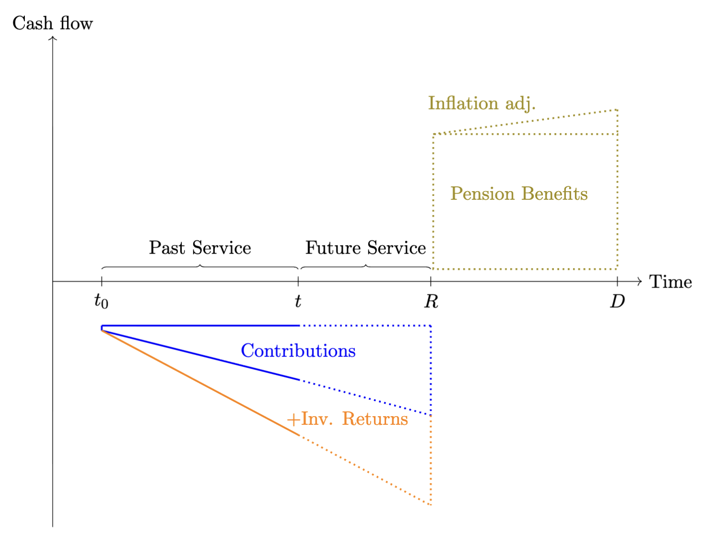

::: callout
This chapter covers the following topics:

- Basic principles of defined pension benefits.
- Key parameters, and the pension conversion factor.
- Asset and liability considerations.
- Solvency calculations.
- Early retirement factors.
- Transfers to and from the plan.
:::

This chapter examines defined benefit pension schemes. Under such arrangements, the pension provider promises to pay the pension recipient an annuity that starts at a later point in time, based on terms that are agreed upon when the agreement is made. In occupational schemes, the provider is typically the employer and the recipient an employee, whereas in market-based arrangements the provider is a financial institution and the recipient a private individual.

The funding of future pension payments is achieved through regular, typically monthly, contributions. Occasional irregular payments, known as transfer-ins, can also be made. Pension savings often benefit from a favourable tax treatment. In occupational schemes, contributions are usually deducted from the pre-tax salary, which lowers the employee's taxable income and thus the size of the immediate tax bill. Moreover, returns generated from the invested funds are exempt from taxation during the accumulation phase. Tax is only payable once the annuity payments start, allowing the funds to compound more rapidly on a larger base. At retirement, the recipient is typically in a lower tax bracket than during active employment, which further reduces the overall tax bill across the person's lifetime.

Pension analysis integrates long-term investment management, the transfer of risk between the employee (the pension recipient) and the plan sponsor (the pension provider), asset--liability matching, and comprehensive risk monitoring. It is therefore a discipline that unites several key elements of financial theory and analytical practice.

While the discussion is general, for ease of notation and narrative clarity, I will refer to the pension provider as the 'plan sponsor' and the pension recipient as the 'employee'. This terminology aligns with occupational pension schemes but is adopted here purely for convenience.

# Defined-Benefit Pensions {#sec:IntroPensions}

Defined-benefit (DB) pension plans promise employees a pre-specified stream of retirement income that is linked to salary and service, rather than to the realised performance of the underlying investments. @fig-pensionOverview illustrates the phases of pension cash flows for a single employee over the full life cycle of a DB arrangement. At time $t_0$ the employee joins the pension scheme and starts making contributions toward the funding of the pension; typically, the employer also contributes a fixed fraction of the employee's salary, as specified in the employment contract.

{#fig-pensionOverview}

Between $t_0$ and the retirement date $R$ the member accumulates service years in the pension plan. @fig-pensionOverview distinguishes between past service, from $t_0$ up to the date $t$ where it is assumed that the funding level of the plan is assessed (e.g. through an actuarial funding study or an assessment made by the employer), and future service, from $t$ to retirement at $R$. The solid blue and orange lines illustrate the build-up of pension assets due to contributions and investment returns; the dotted extensions indicate the continuation of these flows over the future-service period. At the retirement date $R$, the DB pension is paid out as an annuity that grows according to the agreed pension indexation until the time of death $D$. Geometrically, a pension plan is well funded when the area of the combined triangle formed by contributions and investment returns matches the area of the rectangle representing the pension annuity together with the triangular area capturing the annuity's indexation over time.

In a stylised but widely used formulation, the annual pension benefit at
retirement is given by 
$$
    PB = \alpha \cdot SY \cdot FS,
$$ {#eq-pb_def}
where $PB$ denotes the annual pension benefit, $\alpha$ is the accrual rate per year of service (for example $2\%$), $SY$ is the number of service years accumulated in the plan, and $FS$ is the final salary at retirement. This simple benefit formula links the length of the past-service period and the level of final pay to the height of the pension-benefit rectangle in @fig-pensionOverview . It also highlights the defining feature of DB schemes: pension payments are contractually guaranteed by the sponsor, and the financial and demographic risks required to honour @eq-pb_def are borne by the plan sponsor (employer) rather than by the individual member.

## Funding ratio and basic valuation

From a valuation perspective, the central task at time $t$ is to compare (i) the present value of all past-service contributions and accumulated investment returns to date, represented by the blue and orange areas to the left of $t$ in @fig-pensionOverview, with (ii) the present value of the accrued portion of the pension-benefit rectangle to the right of $R$. Denote by $A_t$ the market value of the pension assets at time $t$ and by $L_t$ the actuarial present value of accrued pension liabilities at the same date. The funding ratio at time $t$ is defined as
$$
    FR_t = \frac{A_t}{L_t},
$$ {#eq-FR_def}
which is the standard summary indicator of the solvency position of DB arrangements. Values of $FR_t$ below one indicate underfunding (assets are insufficient to cover the present value of accrued benefits), whereas values above one indicate a funding surplus. In equilibrium, the discounted area under the contribution and return profiles matches the discounted area of the pension-benefit block plus the inflation adjustments.

## Deterministic retirement horizon

@fig-pensionOverview labels $D$ as the expected date of death. In a basic version of the framework, one treats $R$ and $D$ as fixed, so that the member is assumed to receive benefits over a deterministic retirement horizon of length 
$$
    t_{DR} = D - R.
$$ 
The pension-benefit rectangle between $R$ and $D$ in the figure is then interpreted literally: $PB$ (indexed to inflation) is paid every year from $R$ until $D$, and no benefits are paid outside this interval.

Let $r_d$ denote the nominal discount rate and $r_{inf}$ the annual rate at which pension benefits are indexed (for example the inflation rate). The annual pension at retirement is $PB$, and it grows at the rate $r_{inf}$ each year between $R$ and $D$. Under these assumptions, the present value of the pension benefits at the retirement date $R$ can be expressed as the present value of a finite, inflation-indexed annuity:
$$
PV_{R}(PB) = PB \cdot \frac{1}{r_d - r_{inf}} \left[ 1 - \left(\frac{1 + r_{inf}}{1 + r_d}\right)^{t_{DR}} \right].
$$ {#eq-PV_R_deterministic}
If $t$ denotes the valuation date and $t_R = R - t$ the
number of years from $t$ to retirement, the present value of the
liabilities at the valuation date is obtained by discounting
@PV_R_deterministic back $t_R$ years: 
$$
    L_{t} \;=\; PV_{t}(PB) = PV_R(PB) \cdot (1 + r_d)^{-t_R}.
$$ {#eq-PV_t_deterministic}
Substituting @eq-PV_t_deterministic into @eq-FR_def yields a closed-form expression for the funding ratio when both the retirement date and the date of death are assumed deterministic. In terms of @fig-pensionOverview, the deterministic-horizon valuation discounts the entire green benefit rectangle back to the valuation date $t$ using a fixed horizon of length $t_R + t_{DR}$.

## Generalising to survival probabilities

In practice, the date of death $D$ in @fig-pensionOverview is uncertain: the height the pension-benefit block is known, but the right-hand edge, and thus the width, is random. For actuarial work it is therefore conceptually cleaner, to treat the retirement horizon as random by modelling mortality explicitly. For this, we apply the following notation and work in annual steps (a generalisation to monthly or daily steps is straight forward):

- ${}_tp_y$ is the probability that a person aged $y$ survives at least
  $t$ more years.
- $v = (1 + r_d)^{-1}$ is the annual discount factor.

Assume that the pension commences at age $y$ with an initial annual amount of $PB$ that is indexed annually at the rate of $r_{inf}$. The payment at age $y + k$ is then 
$$
    \text{Benefit at age}\; y + k = PB \cdot (1 + r_{inf})^{k}, \qquad k = 0,1,2,\dots.
$$ 
In the diagram, these payments correspond to vertical slices of the pension-benefit rectangle at successive points in time. The probability that the member is alive to receive the payment at age $y + k$ is ${}_k p_y$, and the payment is discounted back to the valuation age, denoted by $x$, using $v^{(y - x)+k}$. The actuarial present value at age $x$ of the pension benefits is therefore
$$
    L_t \;\equiv\; PV_x(PB) = v^{\,y - x} \sum_{k=0}^{\infty} PB \cdot (1 + r_{inf})^{k} \cdot v^{k} \cdot {}_k p_r.
$$ {#eq-PV_x_general}
$PB$ can be factored out, and the inner sum is therefore a growing life annuity starting at age $y$: 
$$
    PV_x(PB) = PB \cdot v^{\,y - x} \cdot \ddot{a}^{g}_y,
$$ 
where 
$$
    \ddot{a}^{g}_y = \sum_{k=0}^{\infty} (1 + r_{inf})^{k} v^{k} \, {}_k p_y
$$ 
is the expected present value, at age $y$, of a payment of one unit per year, increasing at rate $r_{inf}$, payable while the member is alive.

Substituting @eq-PV_x_general into @eq-FR_def gives the funding ratio in the general mortality framework: 
$$
    FR_t = \frac{A_t}{PV_x(PB)} \;=\; \frac{A_t}{v^{\,y - x} \displaystyle \sum_{k=0}^{\infty} PB \cdot (1 + r_{inf})^{k} \cdot v^{k} \cdot {}_k p_y }.
$$ {#eq-FR_general}
Relative to the deterministic-horizon case, the right-hand boundary of the benefit block in @fig-pensionOverview is now stochastic: each potential payment year contributes to $L_t$ with a weight equal to the probability that the member is still alive at that age.

## The deterministic horizon as a special case

The deterministic-lifespan assumption used in @eq-PV_R_deterministic -- @eq-PV_t_deterministic emerges as a special case of the more general survival-probability framework. Suppose that the member is assumed to be certain to survive from retirement until a fixed age $D$ and to die with certainty at that age. In actuarial terms this corresponds to 
$$
\begin{aligned}
    {}_k p_y &= 1, \qquad k = 0,1,\dots,t_{DR}-1, \\
    {}_k p_y &= 0, \qquad k \ge t_{DR}
\end{aligned}
$$ {#eq-survival}
where $t_{DR} = D - y$ is now a deterministic retirement horizon. Substituting these survival probabilities into @eq-PV_x_general gives 
$$
    PV_x(PB) = v^{\,y - x} \sum_{k=0}^{t_{DR}-1} PB \cdot (1 + r_{inf})^{k} \cdot v^{k},
$$ 
which is exactly the present value of a finite growing annuity with $t_{DR}$ payments, indexed at rate $r_{inf}$ and discounted at rate $r_d$. Evaluating the finite sum yields 
$$
    PV_x(PB) = v^{\,y - x} \cdot PB \cdot \frac{1}{r_d - r_{inf}} \left[1 - \left(\frac{1 + r_{inf}}{1 + r_d}\right)^{t_{DR}} \right],
$$ 
which coincides with @eq-PV_R_deterministic -- @eq-PV_t_deterministic when $x$ is interpreted as the valuation age and $y - x = t_R$. Thus, the closed-form valuation of liabilities under a fixed lifespan can be seen as the special case of a general mortality model in which the retirement horizon is degenerate rather than stochastic. In the same way, the general funding-ratio formula @eq-FR_general reduces to the deterministic-horizon expression obtained by inserting @eq-PV_t_deterministic into @eq-FR_def.

## A simple numerical illustration

To connect the geometry of @fig-pensionOverview with actual magnitudes, consider a worker aged $x = 45$ who retires at age $y = 65$ with an annual pension benefit determined by @eq-pb_def. Suppose the final salary at retirement is $FS = 65{.}000$, the accrual rate is $\alpha = 2\%$, and the worker has $SY = 35$ service years at retirement. Then the height of the pension-benefit rectangle at retirement is 
$$
    PB = 0.02 \cdot 35 \cdot 65{.}000 \;=\; 45{.}500.
$$ 
Assume a nominal discount rate of $r_d = 3\%$ and an
indexation rate of $r_{inf} = 2\%$, so $v = (1.03)^{-1}$.

#### Deterministic horizon.

If we first assume a deterministic retirement horizon of $t_{DR} = 20$ years (for example from age 65 to 85), the present value of pension benefits at retirement is 
$$
    PV_{R}(PB) = 45{.}500 \cdot \frac{1}{0.03 - 0.02} \left[ 1 - \left(\frac{1.02}{1.03}\right)^{20} \right],
$$ 
and the present value at age $45$ is $PV_{45}(PB) = PV_R(PB) \cdot (1.03)^{-20}$. If the asset value at age $45$ is $A_{45}$, the corresponding funding ratio under this deterministic horizon is $FR_{45} = A_{45} / PV_{45}(PB)$.

#### Stochastic horizon with survival probabilities.

Now replace the deterministic horizon with survival probabilities drawn from an appropriate life table. Let ${}_k p_{65}$ denote the probability that a person aged $65$ today survives at least $k$ more years. The present value at age $45$ becomes 
$$
    PV_{45}(PB)  = v^{20} \sum_{k=0}^{\infty} 45{.}500 \cdot (1.02)^{k} \cdot v^{k} \cdot {}_kp_{65},
$$ 
and the corresponding funding ratio is
$$
    FR_{45} = \frac{A_{45}}{PV_{45}(PB)}.
$$ 
For typical mortality patterns, the sum is effectively truncated at ages where ${}_k p_{65}$ becomes negligible. Relative to the deterministic case with the same maximum age, incorporating realistic survival probabilities generally reduces the liability value because some members die earlier and therefore receive fewer payments in expectation. In terms of @fig-pensionOverview, the right edge of the benefit block is now random rather than fixed, and the expected height--width area of the green rectangle shrinks once survival probabilities are taken into account.

## Early retirement penalty factors {#sec:penaltyFactors}

In many occupational pension schemes, the retirement date is to some extent discretionary, allowing employees to retire earlier than the scheme's standard retirement age. Choosing early retirement brings the start of the pension annuity forward, so payments are made over a longer period. At the same time, fewer service years have been accrued, so the benefit formula delivers a lower annual pension.

For example, if the normal retirement age is 65, employees may be permitted to retire as early as age 55. In such cases, pension benefits are typically reduced by a penalty factor---a percentage deduction applied for each year of early retirement. Under an actuarially neutral approach, the penalty is calibrated such that the present value of the early retirement pension equals the present value of the income stream beginning at the normal retirement age. With $R$ denoting the normal retirement age, and $E<R$ be an admissible early retirement age, the requirement for actuarial neutrality is that 
$$
    PV_E(PB_E) = PV_E(PB_R).
$$ {#eq-actuarialNeutralEarlyRetirement} 
Using equation @eq-pb_def early retirement benefits are given by:
$$
   PV_E(PB_E) = \alpha \cdot SY_E \cdot FS \cdot (1+\mathbb{E}\left[r_{sgr}\right])^{E-R},
$$ 
where $r_{sgr}$ is the annual salary growth rate, assumed to be constant across years. At the same time, the present value of the of the pension benefit at normal retirement, at early retirement, is: 
$$
    PV_E(PB_R) = \alpha \cdot SY_R \cdot FS \cdot v^{R-E} \cdot {}_{(R-E)}p_E.
$$ 
Using @eq-actuarialNeutralEarlyRetirement, and defining $v_{sgr}=(1+\mathbb{E}\left[r_{sgr}\right])^{-1}$ the actuarial neutral early retirement penalty factor can be expressed as: 
$$
\begin{aligned}
    P_{E\leftarrow R} &= \frac{\alpha \cdot SY_E \cdot FS \cdot v_{sgr}^{R-E}}{\alpha \cdot SY_R \cdot FS \cdot v^{R-E} \cdot {}_{(R-E)}p_E} \nonumber \\ 
    &= \frac{ SY_E \cdot v_{sgr}^{R-E}}{SY_R \cdot v^{R-E} \cdot {}_{(R-E)}p_E} \nonumber \\
    &= \frac{SY_E}{SY_R \cdot {}_{(R-E)}p_E} \left( \frac{v_{sgr}}{v} \right)^{R-E}
\end{aligned}
$$ 
This expression highlights three distinct components. First, the ratio $\frac{SY_E}{SY_R}$ captures the effect of shorter service at the early retirement age: with fewer accrual years, the pensionable salary at age $E$ is typically lower than at age $R$. Second, the term ${}_{(R-E)}p_E$ in the denominator reflects survival over the period from $E$ to $R$, so that a lower probability of reaching the normal retirement age implies a higher actuarial penalty for bringing payments forward. Finally, the factor $\left(\frac{v_{sgr}}{v}\right)^{R-E}$ isolates the interaction between expected salary growth and financial discounting over the interval $[E,R]$: if expected salary growth (embedded in $v_{sgr}$) offsets part of the pure financial discounting (captured by $v$), the overall penalty is reduced, whereas if discounting dominates expected salary growth the penalty becomes more severe.

@tbl-penaltyFactors reports example calculations for the actuarially neutral early retirement penalty factors for retirement ages $t=55,\ldots,65$, relative to the normal retirement age 65. The salary growth rate is assumed to be $r_{\text{sgr}} = 2.4\%$ per year, while the discount rate is $r_{d} = 3\%$ per year. The survival probabilities ${}_{(65-t)}p_{t}$ are based on the ICSLT 2023 mortality table and reflect the average of male and female survival probabilities. The column labelled $SY_{E}/SY_{R}$ captures the ratio of service years at the early and normal retirement ages relative to the normal retirement age of 65 years. $(v_{\text{sgr}}/v)^{65-t}$ reflects the interaction between the salary growth rate and the discounting rate. The final two columns show the resulting penalty factor as a ratio and a percentage reduction relative to the unreduced pension at age $65$.

| $t$ | ${}_{(65-t)}p_t$ | $SY_E/SY_R$ | $(v_{\text{sgr}}/v)^{65-t}$ | Penalty ratio | Penalty (%) |
| --- | ---: | ---: | ---: | ---: | ---: |
| 55 | 0.97639 | 0.71429 | 1.06016 | 0.78 | 22% |
| 56 | 0.97772 | 0.74286 | 1.05399 | 0.80 | 20% |
| 57 | 0.97921 | 0.77143 | 1.04785 | 0.83 | 17% |
| 58 | 0.98087 | 0.80000 | 1.04174 | 0.85 | 15% |
| 59 | 0.98273 | 0.82857 | 1.03568 | 0.87 | 13% |
| 60 | 0.98482 | 0.85714 | 1.02964 | 0.90 | 10% |
| 61 | 0.98716 | 0.88571 | 1.02364 | 0.92 | 8% |
| 62 | 0.98981 | 0.91429 | 1.01768 | 0.94 | 6% |
| 63 | 0.99280 | 0.94286 | 1.01175 | 0.96 | 4% |
| 64 | 0.99617 | 0.97143 | 1.00586 | 0.98 | 2% |
| 65 | 0.99617 | 1.00000 | 1.00000 | 1.00 | 0% |
: Actuarially neutral early retirement penalty factors {#tbl-penaltyFactors}

## Transfers to and from the pension scheme {#sec:transfers}

During the savings phase of an occupational pension plan, employees may have the possibility to transfer additional funds into the plan in order to purchase extra pension service years. Likewise, if an employee changes employer, it may be possible to transfer accumulated funds from one occupational pension plan to another. In defined benefit pension plans there is no direct link, at the individual level, between the amounts contributed (and their investment returns) and the benefit entitlement. Instead, employees accrue pension service years and the pension benefits are determined by a formula, see equation @eq-pb_def. It is therefore necessary to establish a consistent mapping between pension service years and monetary amounts when dealing with transfers into and out of a defined benefit occupational pension plan.

The situation is not entirely straightforward. When funds are transferred into a plan and converted into additional pension service years, the plan sponsor effectively takes over the investment risk and guarantees a future pension stream, thereby also committing to at least a minimum investment return over (potentially) many years. Likewise, when an employee leaves the plan, the accrued pension service years are converted into a cash amount at the time of exit (to be transferred to another occupational scheme) using assumptions about future investment returns and discount rates. In both directions, typically the principle of actuarial neutrality is imposed such that the value of the expected promised pension benefits is consistent with the value of the underlying funds.

To calculate actuarially neutral transfer amounts, both in and out of the plan, a pension conversion factor, $K_x$ at age $x$, is used. In its simplest form, $K_x$ links a monetary amount $C_x$ to an increment in pension benefit (or, equivalently, in pension service years) through a relation of the form 
$$
    \Delta PB_x = K_x \, C_x.
$$ 
The factor $K_x$ is chosen such that the present value of the additional pension benefit $\Delta PB_x$ equals the value of the contribution $C_x$, under the plan's economic and demographic assumptions. Writing $a_x$ for the present value at age $x$ of a life annuity of $1$ per year, actuarial neutrality requires
$$
    C_x = \Delta PB_x \, \ddot{a}_x,
$$ 

so that 
$$
    K_x = \frac{1}{\ddot{a}_x}.
$$

## The pension conversion factor {#subsec:conversionFactor}

During the savings phase, employees may transfer additional funds into the pension plan or have capital amounts transferred from other occupational schemes, in order to purchase extra pension service years or to enhance their future pension benefit. Conversely, when employees leave the plan, accrued benefits are often commuted to a capital sum and transferred out to another scheme. In both directions, it is common actuarial practice to impose actuarial neutrality such that the present value of the future pension benefit must equal the monetary value of the underlying funds.

To calculate actuarially neutral transfer amounts, a pension conversion factor, $K_x$ at age $x$, is used. In its simplest form, $K_x$ links a monetary amount $C_x$ at age $x$ to an increment in the annual pension benefit $\Delta PB_R$ at normal retirement age $R$: 
$$
    \Delta PB_R = K_x \cdot C_x.
$$ 
Intuitively, $K_x$ is the price at time $x$ of one unit of additional annual pension at time $R$, expressed per unit of capital contributed at time $x$. It reflects the time value of money, expected investment returns on the underlying assets, and survival probabilities between $x$ and retirement, as well as the conversion of accumulated wealth at $R$ into an annuity.

To formalise this intuition, let $\tilde{v}$ be a generic discount factor. For any future random cash flow $X_T$ payable at time $T$, the time--$x$ value of $X_T$ can then be written generically as
$$
    PV_x(X_T) = \mathbb{E}_x\!\left[ \tilde{v}^{\,T-x} \, X_T \right],
$$ 
In this representation, $v_z$ plays the role of the appropriate one--period pricing operator that embeds both financial and demographic effects.

Now let $K_R$ denote the pension conversion factor at the normal retirement age $R$. If $C_R$ denotes the amount of capital at time $R$ attributable to a contribution $C_x$ made at time $x$, we can write
$$
    \Delta PB_R = K_R \cdot C_R.
$$ 
From the perspective of time $x$, the capital $C_R$ is itself a random variable driven by investment returns, mortality and possibly other plan--specific features. Using the generic discount factor $v_z$, we have: 
$$
    K_x \cdot C_x = \mathbb{E}_x\!\left[ K_R \, C_R \right] = v_z^{\,R-x} \cdot K_R \cdot C_x,
$$ {#eq-Kx_as_discounted_KR}
where $\tilde{v}$ accounts for the expected growth of the capital $C_x$ to $C_R$ and discounting of $K_R$ to time-$x$. Equation @eq-Kx_as_discounted_KR states that the pension conversion factor at age $x$ is the time--$x$ expectation of the at--retirement conversion factor $K_R$, discounted back from $R$ to $x$ using the appropriate pricing operator $\tilde{v}$: 
$$
    K_x = \tilde{v}^{\,R-x} \cdot K_R.
$$

### Actuarial neutrality and the annuity value {#actuarial-neutrality-and-the-annuity-value .unnumbered}

Assume that the additional pension benefit $\Delta PB_R$ is first payable at age $R$ and continues as long as the member is alive, and is indexed at rate $r_{inf}$ per year. Recall that $v = (1 + r_d)^{-1}$ is the nominal discount factor used for valuing pension liabilities. As in Section [1](#sec:IntroPensions){reference-type="ref" reference="sec:IntroPensions"}, let ${}_t p_z$ be the probability that a person aged $z$ today survives at least $t$ more years. Under these assumptions, the additional pension stream acquired by paying $C_x$ at age $x$ can be described as follows:

- At age $R$ the member receives an additional annual pension of
  $\Delta PB_R$.
- At age $R + k$, for $k = 1, 2, \dots$, this additional pension is
  indexed at rate $r_{inf}$, so the payment becomes 
  $$
    \Delta PB_{R, R+k} = \Delta PB_R \, (1 + r_{inf})^{k}.
  $$

- The probability that the member is alive at age $R + k$ is ${}_k p_R$.
- Payments are discounted back to age $x$ using the factor $v^{(R-x) + k}$.

The actuarial present value at age $x$ of an additional pension of one unit per year, starting at age $R$ and indexed at rate $r_{inf}$ while the member is alive, is therefore determined by the growing life annuity factor 
$$
    \ddot{a}_x^{g} = v^{\,R - x} \sum_{k=0}^{\infty} (1 + r_{inf})^{k} \, v^{k} \, {}_k p_R
$$ {#eq-growingLifeAnnuity}

This expression is directly analogous to the general present‑value formula @eq-PV_x_general, but specialised to an annuity of one unit per year and with $x$ as valuation age and $R$ as retirement age.

If the member receives an additional pension $\Delta PB_x$ rather than
one unit, the present value at age $x$ is simply 
$$
    PV_x(\Delta PB_x) = \Delta PB_x \, \ddot{a}_x^{g}.
$$ 
Actuarial neutrality now requires that this present value equals the contribution paid at age $x$: 
$$
    C_x = PV_x(\Delta PB_x) \;=\; \Delta PB_x \, \ddot{a}_x^{g}.
$$ 
Solving for $\Delta PB_x$ gives 
$$
    \Delta PB_x = \frac{1}{\ddot{a}_x^{g}} \, C_x,
$$ 
so that the pension conversion factor at age $x$ is
$$
    K_x = \frac{1}{\ddot{a}_x^{g}}.
$$ {#eq-Kx_def_basic}
