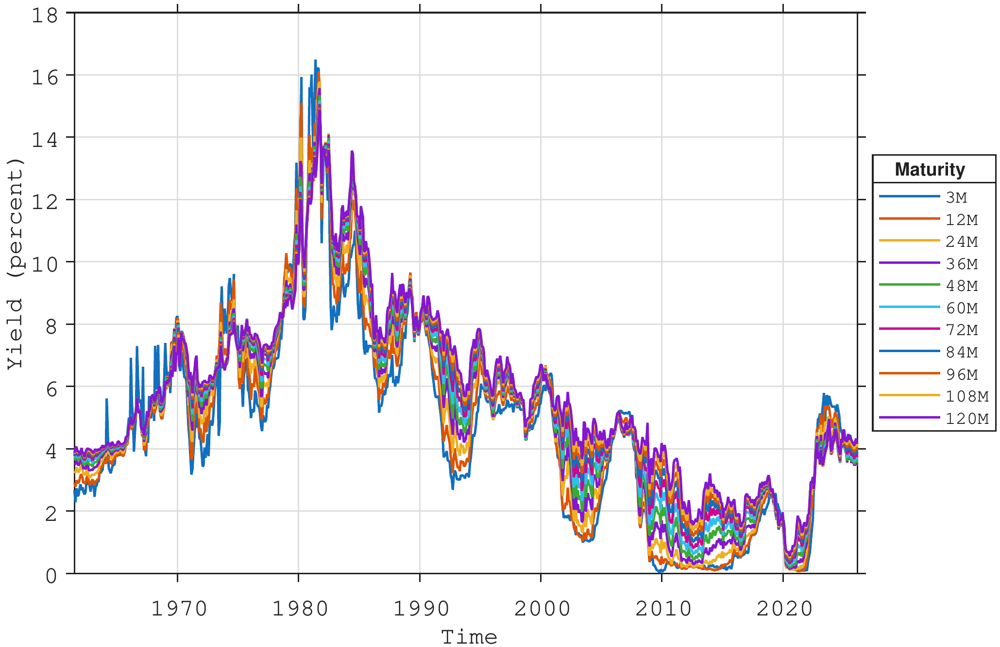
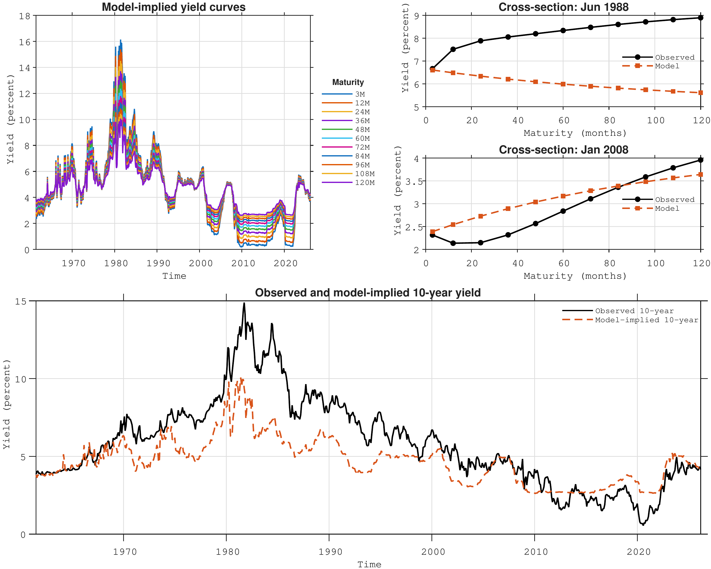
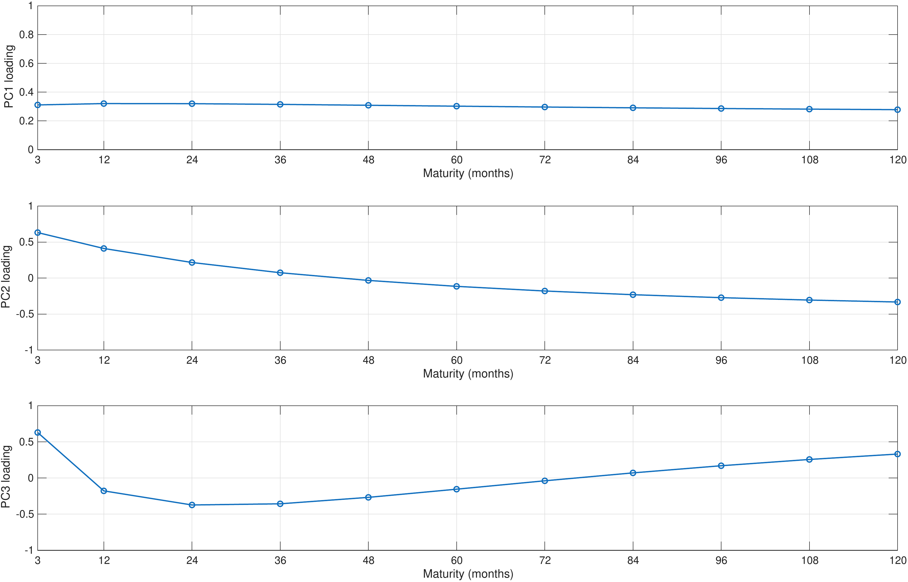
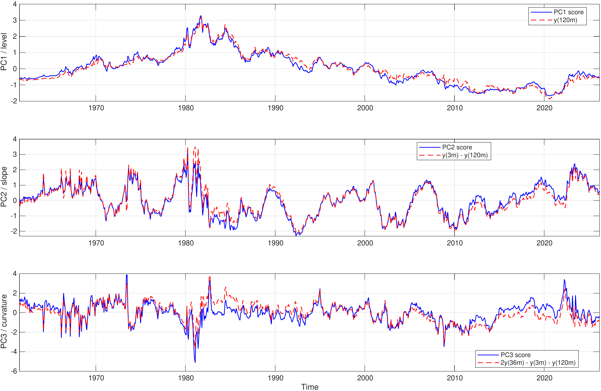
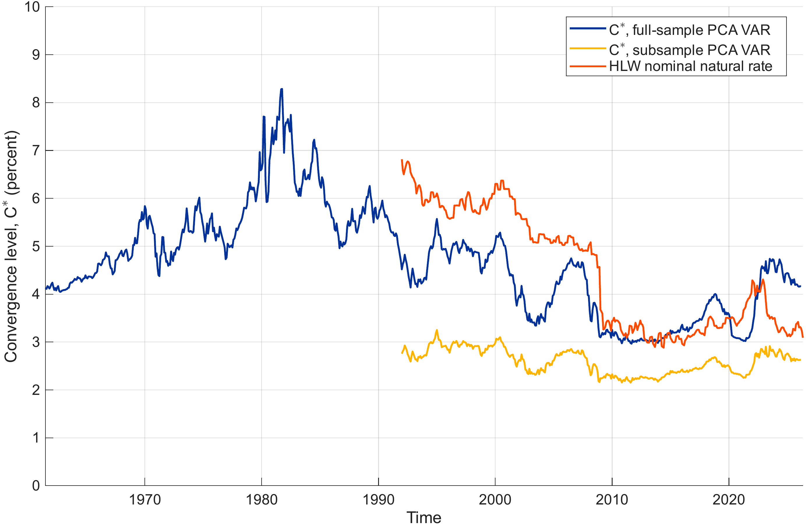
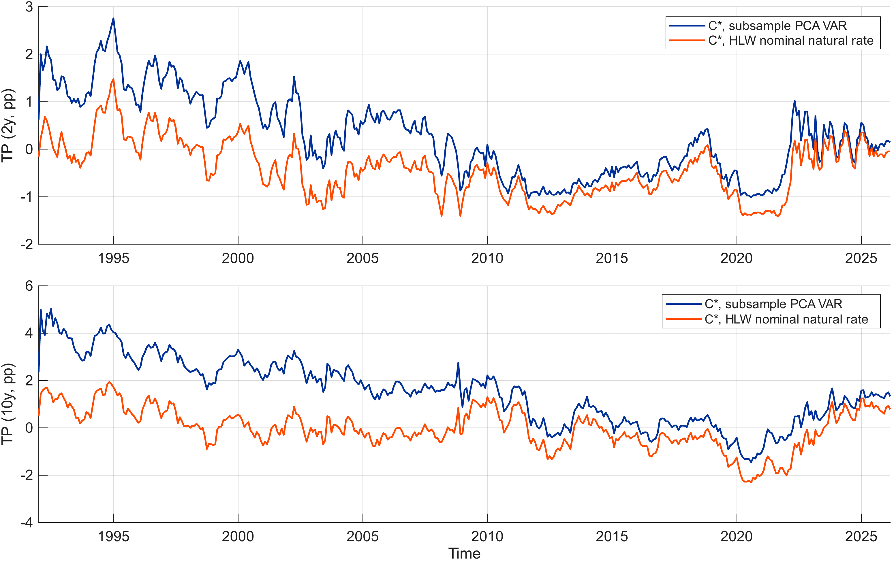

::: callout
This chapter presents:

- Introducing term-structure concepts via the short-rate
- Multi-factor models
- Bridging no-arbitrage and empirically based models
- Implementing at some models
  - Dynamic Nelson-Siegel model
  - Joslin, Singleton, Zhu
  - A terminal rate model
:::

# The short rate and the yield curve[^1] {#sec:shortRateModel}

Central banks play a key role in steering macroeconomic outcomes by setting the short-term nominal interest rate, often referred to as the policy rate. By adjusting this rate, monetary authorities seek to control inflation and anchor expectations about future inflation, thereby providing an environment of price stability that facilitates efficient decision-making among households and firms. Stable and predictable prices support optimal consumption, investment, and production decisions, and ultimately help the economy to move toward its potential level of output and employment.

While the ultimate objectives of central banks are comparable across economies, their mandates differ in scope. For example, the European Central Bank (ECB) defines price stability as its sole objective, as former ECB President Jean‑Claude Trichet[^2] used to say: the ECB has only one needle in its compass. The United States Federal Reserve, in contrast, operates under a dual mandate, seeking both price stability and maximum sustainable employment. These distinct objectives imply different sensitivities to output gaps and, in practice, to business-cycle fluctuations.

The operational implementation of monetary policy occurs through control of the policy rate corridor, typically comprising the deposit facility rate (floor), the main refinancing rate (target), and the marginal lending facility rate (ceiling). By adjusting these rates, the central bank determines the cost of short-term liquidity for commercial banks. This defines the lower boundary for interest rates in money markets and influences the entire structure of rates across maturities and risk categories, including interbank rates, government bond yields, and ultimately risk premia and credit spreads throughout the financial system.

## The Transmission Mechanism

The monetary policy transmission mechanism captures how changes in the policy rate propagate through the financial system and into the real economy. Several key channels are typically identified:

- **Interest rate channel:** Changes in the policy rate affect short-term market rates (e.g., overnight and three‑month interbank rates), which in turn influence longer-term yields through expectations of future short rates. These shifts alter borrowing costs for households and firms, thus affecting consumption and investment decisions.

- **Expectations channel:** Monetary policy actions and communication shape market expectations about future policy, influencing long-term bond yields via the expectations hypothesis of the term structure. Anchored inflation expectations reduce uncertainty and compress term premia.

- **Credit and risk-taking channels:** Lower policy rates improve borrowers' balance sheets and stimulate bank lending. They also induce shifts in investors' risk appetite, which affect asset prices and credit spreads.

- **Exchange rate channel:** Relative interest rate differentials influence capital flows and exchange rates. A lower domestic policy rate tends to depreciate the currency, which can stimulate exports and raise import prices, thereby affecting inflation dynamics.

The effectiveness of transmission depends on the responsiveness of financial markets, the credibility of the central bank, and the degree of expectation anchoring. In well‑anchored regimes, even small policy changes can have large expectation effects.

## The Taylor Rule as a Policy Benchmark

To formalise and condense the reaction function of central banks, the Taylor rule, @Taylor1993, provides a parsimonious representation of how the policy rate responds to deviations of inflation and output from their respective targets. The base-formulation is:
$$
\begin{align}
    r_t &= r^* + \pi_t + \alpha (\pi_t - \pi^*) + \beta (y_t - y^*),
\end{align}
$$
where

- $r_t$ is the short-term nominal interest rate (policy rate);
- $r^*$ is the long-run equilibrium real rate of interest;
- $\pi_t$ is the current inflation rate;
- $\pi^*$ is the inflation target;
- $y_t - y^*$ represents the output gap;
- $\alpha$ and $\beta$ are policy parameters indicating how aggressively the central bank reacts to inflation and output deviations.

The Taylor rule captures the idea that when inflation exceeds its target or when the economy operates above potential, the central bank raises the policy rate to cool demand. Conversely, if inflation runs below target or a negative output gap emerges, the central bank cuts rates to stimulate activity. Although real-world policy is more complex and sometimes constrained by non-linearities (e.g., the effective lower bound), the Taylor rule provides a convenient reference point and an empirical tool for estimating monetary policy behaviour over time.

## Modelling the Short Rate as an AR(1) Process

In macro-financial modelling, it is common to represent the short-term interest rate as a stochastic process that captures its time-series dynamics around a policy-driven mean. The simplest, but often used, specification is an autoregressive process of order one, AR(1):
$$
\begin{align}
    r_t &= \mu + \rho \, (r_{t-1} - \mu) + \varepsilon_t, \quad \varepsilon_t \sim N(0, \sigma^2),
\end{align}
$$ {#eq-ar1}

where $\mu$ is the long-run mean policy rate (often consistent with the *neutral* or *natural* rate of interest), $\rho$ measures the persistence of the rate, and $\varepsilon_t$ captures random innovations due to economic data surprises or policy shocks. When $|\rho| < 1$, the process is stationary and mean-reverting, a property consistent with the empirical observation that interest rates fluctuate around a long-term equilibrium.

The AR(1) model is valuable both theoretically and empirically. It provides a tractable structure for term-structure models such as Vasicek [@vasicek.77] or Cox--Ingersoll--Ross [@cox.ing.ross.85], and in econometric applications it allows for forecasting and simulation of the short rate's impact on other financial variables. Embedding an AR(1) process within a Taylor-rule framework can be interpreted as a reduced-form representation of policy inertia: central banks adjust interest rates gradually in response to evolving macroeconomic conditions rather than instantaneously, resulting in the observed persistence of short rates.

## Building the yield curve from the short rate evolution[^3]

As shown in Chapter 0, following @Cochrane2001, the fundamental pricing relationship is recursive, and for the risk-free zero-coupon $n$-maturity bond, there is only a single payment to price, namely: $P_{t+n}^{\, (n-n)}=1$. Applying this pricing formula gives:
$$
\begin{align}
    P_t^{(n)} &= \mathbb{E}_t\!\left( \mathcal{M}_{t+1} \, P_{t+1}^{\,n-1} \right) \nonumber \\
     &= \mathbb{E}_t\!\left( \mathcal{M}_{t+1} \, \mathcal{M}_{t+2} \, P_{t+2}^{\,n-2} \right) \nonumber \\
     &= \mathbb{E}_t\!\left( \mathcal{M}_{t+1} \, \mathcal{M}_{t+2}\, \cdots \, \mathcal{M}_{t+n} \, P_{t+n}^{\,n-n} \right) \ \\
     &= \mathbb{E}_t\!\left( \prod_{j=1}^{(n)} \mathcal{M}_{t+j} \right) \cdot 1
\end{align}
$$ {#eq-fundamentalPrice}

where $\mathcal{M}$ is the stochastic discount factor. The choice of $\mathcal{M}$ clearly impacts the price at time $t<n$. Using $\mathcal{M}_{t}=e^{-r_t\,\Delta t}$ corresponds to one such choice and therefore one particular \"type\" of expectation and price. Lets denote this choice by the letter $\mathbb{P}$, such that expectations calculated under this $\mathbb{P}$-measure are given by:
$$
\begin{align}
         \mathbb{E}_t^{\mathbb{P}} \left[P_t^{(n)}\right] = \mathbb{E}^{\mathbb{P}}_t\left[ e^{-\sum^{n}_{t=1} r_t\Delta t} \right].
\end{align}
$$ {#eq-P-P}

Assuming that $r_t$ evolves according to the AR(1) model in @eq-ar1, with $|\rho| < 1$, it is possible to derive a closed form expression for the yield at time. Letting $c = \mu \, (1-\rho)$ gives:
$$
\begin{align}
    r_t = c + \rho \, r_{t-1} + \varepsilon_t, \quad \varepsilon_t \sim N(0, \sigma^2)
\end{align}
$$ {#eq-AR1-1}

and a closed form expression for the expectation to the sum of $r_t$ can be found. First, writing out the sum for $t=\{1,2,3\}$, and then generalising to $j$ shows the basic structure as:
$$
\begin{align}
        r_1 &= c + \rho \, r_0 \nonumber \\
        r_2 &= c + \rho \, r_1 = c + \rho \, (c + \rho \, r_0) = c + \rho \, c + \rho^2 \, r_0  \nonumber \\
        r_3 &= c + \rho \, r_2 = c + \rho \, (c + \rho \, c + \rho^2 \,r_0) = c + \rho \, c + \rho^2 \, c + \rho^3 \, r_0 \nonumber \\
        \vdots \nonumber \\
        r_j &= c \, (1+\rho+\rho^2+\dots + \rho^{j-1}) + \rho^j \, r_0 = c\, \sum_{k=0}^{j-1} \rho^k + \rho^j \, r_0 \nonumber \\
        &= c\, \frac{1-\rho^j}{1-\rho} + \rho^j \, r_0,
\end{align}
$$

where the expression for the sum of a geometric series is used to find the expression in the last line. Second, having a compact expression for $r_j$ the sum can be written as:
$$
\begin{align}
    r_1+r_2+r_3 &= c\, \frac{1-\rho^1}{1-\rho} + \rho^1 \, r_0 + c\, \frac{1-\rho^2}{1-\rho} + \rho^2 \, r_0 + c\, \frac{1-\rho^3}{1-\rho} + \rho^3 \, r_0 \nonumber \\
    &= \frac{c}{1-\rho}\, \left[ (1-\rho^1)+(1-\rho^2)+(1-\rho^3) \right]+(\rho^1+\rho^2+\rho^3) \, r_0
\end{align}
$$

which generalises to :
$$
\begin{align}
    \sum_{k=1}^{(n)} r_k &= \frac{c}{1-\rho} \sum_{j=1}^{(n)} (1-\rho^j) + r_0 \, \sum_{j=1}^{n} \rho^j.
\end{align}
$$ {#eq-sum-r-k}

Given the closed form expression for the geometric sum: $\sum_{k=0}^{n-1} \rho^k =\dfrac{1-\rho^{(n)}}{1-\rho}$, the first sum in @eq-sum-r-k can be written as:
$$
\begin{align}
    \sum_{j=1}^{(n)} (1-\rho^j) &= \sum_{j=1}^{(n)} 1 - \rho \sum_{j=0}^{n-1} \rho^j \nonumber \\
    &= n - \rho \, \frac{1-\rho^{(n)}}{1-\rho},
\end{align}
$$

and the second sum as:
$$
\begin{align}
    \sum_{j=1}^{(n)} \rho^j &= \rho \sum_{j=0}^{n-1} \rho^j \nonumber \\
    &= \rho \, \frac{1-\rho^{(n)}}{1-\rho}.
\end{align}
$$

Inserting the above expressions for the sums into @eq-sum-r-k gives:
$$
\begin{align}
        \sum_{k=1}^{(n)} r_k &= \frac{c}{1-\rho} \left(n - \rho \, \frac{1-\rho^{(n)}}{1-\rho}\right) + r_0 \, \rho \, \frac{1-\rho^{(n)}}{1-\rho} \nonumber \\  
        &= \frac{c\,n}{1-\rho} - \frac{c\,(\rho-\rho^{(n+1)})}{(1-\rho)^2} + \frac{\rho-\rho^{(n+1)}}{1-\rho} \cdot r_0
\end{align}
$$

Let
$$
\begin{align}
    A_n &= \frac{c\,n}{1-\rho} - \frac{c\,(\rho-\rho^{(n+1)})}{(1-\rho)^2},
\end{align}
$$ {#eq-An}

and,
$$
\begin{align}
    B_n &= \frac{\rho-\rho^{(n+1)}}{1-\rho},
\end{align}
$$ {#eq-Bn}

where $A_n$ is a deterministic component and $B_n$ is a regression coefficient (loading) on the initial short rate $r_0$, both depending on the maturity $n$, and the expression for the sum of short rates can therefore be written as:
$$
\begin{align}
    \sum_{k=1}^{(n)} r_k &= A_n + B_n \cdot r_0.
\end{align}
$$

Looking at @eq-P-P, which is the bond price under what we labelled the $\mathbb{P}$ measure and given the reworked expression for the sum of short rates this price can now be written as:
$$
\begin{align}
    -log\left[ \mathbb{E}_t^{\mathbb{P}}(P_t^{(n)}) \right] = \mathbb{E}_t^{\mathbb{P}}\left(A_n + B_n \cdot r_t\right) \, \Delta t
\end{align}
$$ {#eq-logP1}

Recall from Chapter 0 that the yield to maturity is the constant rate that equates the present value of future cash flows to the bond price. In the case of a zero-coupon bond, there is a single payment at maturity, so we have:
$$
\begin{align}
    P_t^{(n)} = e^{-y^{(n)}_t\, n \Delta t}
\end{align}
$$ {#eq-logP2}

where $y_t^{(n)}$ is the annualised rate for maturity $n$ for a zero-coupon bond that pays 1 at maturity. Combining @eq-logP1 and @eq-logP2, we get:
$$
\begin{align}
    \mathbb{E}_t^{\mathbb{P}}(y_t^{(n)}) &= \frac{1}{n} \, \mathbb{E}_t^{\mathbb{P}}\left(A_n + B_n \cdot r_t\right) \nonumber \\
    &= \mathbb{E}_t^{\mathbb{P}}\left(a_n + b_n \cdot r_t\right),
\end{align}
$$ {#eq-sr-yieldCurve}

with $a_n = A_n/n$ and $b_n = B_n/n$. Varying $n$ provides the entire yield curve, i.e. the set of model-implied zero-coupon yields across all relevant maturities. Under the stationarity assumption ($|\rho|<1$), it follows that $\rho^{(n+1)} \to 0$ as $n \to \infty$. Hence
$$
\begin{align}
    \frac{c(\rho-\rho^{(n+1)})}{(1-\rho)^2} \; \to \; \frac{c\rho}{(1-\rho)^2}.
\end{align}
$$

and using:
$$
\begin{align}
    a_n = \frac{c}{1-\rho}
      - \frac{c(\rho-\rho^{(n+1)})}{(1-\rho)^2}\,\frac{1}{n},
\end{align}
$$

and noting that $\frac{1}{n} \to 0$ as $n \to \infty$, it follows that
$$
\begin{align}
\lim_{n\to\infty} a_n = \frac{c}{1-\rho}.
\end{align}
$$

Similarly, since
$$
\begin{align}
b_n = \frac{\rho-\rho^{(n+1)}}{1-\rho}\,\frac{1}{n},
\end{align}
$$

we obtain
$$
\begin{align}
\lim_{n\to\infty} b_n = 0.
\end{align}
$$

In summary:
$$
\begin{align}
    \lim_{n \to \infty} a_n &= \frac{c}{1-\rho} - \frac{c\,(\rho-\rho^{(n+1)})}{(1-\rho)^2} \cdot \frac{1}{n} = \frac{c}{1-\rho}, \qquad \texttt{and} \\
    \lim_{n \to \infty} b_n &= \frac{\rho-\rho^{(n+1)}}{1-\rho} \cdot \frac{1}{n} = 0.
\end{align}
$$

Recalling that the short rate is modelled as an AR(1) process, the $\mathbb{P}$‑measure yield curve converges to
$$
\begin{align}
\lim_{n \to \infty} a_n = \frac{c}{1-\rho} = \mathbb{E}[r_t],
\end{align}
$$

since the unconditional mean of an AR(1) process is $\frac{c}{1-\rho}$. Consequently, from a practitioner's perspective, the following observations can be made:

- The long-term convergence level of the $\mathbb{P}$‑measure yield curve is pinned down by the unconditional mean of the short rate, which in practice is estimated by the sample average of the short-rate time series. The speed at which the curve converges to this level depends on the initial short rate $r_t$ for the period under consideration and on the degree of persistence of the AR(1) coefficient $\rho$, which is itself determined by the sampled data.

- For each maturity, the yield is obtained by averaging over increasingly long sequences of projected short rates, generated from the estimated AR(1) dynamics. Because these are sequences of short rates, analogous to an investment strategy that is continuously rolled over at the short end, the resulting $\mathbb{P}$‑measure curve does not embed duration risk. In this sense, it can be interpreted as a (duration) risk‑free yield curve.

- It should therefore not be expected that this model will provide an especially close fit to observed market yields, which will incorporate duration risk premia in addition to credit and liquidity premia (except in the most liquid and highly rated government bond markets).

## A first look at the panel of yield curve data

The empirical analysis in this chapter is based on monthly zero‑coupon U.S. Treasury yields at standard maturities ranging from three months to ten years (3, 12, 24, 36, 48, 60, 72, 84, 96, 108 and 120 months), as shown in @fig-gsw-yieldcurve. These yields are obtained from the widely used data set constructed by @Gurkaynak.Sack.Wright.2006, who estimate a smooth term structure each day by fitting a parametric yield‑curve model to the cross‑section of outstanding Treasury coupon bonds and bills. From the estimated curve, zero‑coupon yields at fixed maturities are inferred and then aggregated to a monthly frequency. The resulting series provide an internally consistent representation of the U.S. Treasury yield curve and have become a standard benchmark for empirical work on interest rates and the term structure.

{#fig-gsw-yieldcurve width=85%}

Estimating @eq-AR1-1 for the three-month zero-coupon yield produces the parameter estimates reported in @tbl-ar1-m3. The constant term is small and only marginally significant, while the autoregressive coefficient is very close to unity, indicating a high degree of persistence in the short rate. The estimated innovation variance $\sigma_{\varepsilon}^{2}$ reflects the conditional volatility of unexpected changes in the rate. Together, the constant and autoregressive coefficient imply an unconditional mean of approximately $4.7\%$.

  Parameter                                           Estimate   Standard error
  -------------------------------------------------- ---------- ----------------
  $c$ (constant)                                       0.0723        0.0353
  $\rho$ (AR coefficient)                              0.9848        0.0062
  $\sigma_{\varepsilon}^{2}$ (innovation variance)     0.3171          --
  Implied unconditional mean                           4.7408          --

  : AR(1) estimates for the 3-month yield {#tbl-ar1-m3}

Inserting the parameter estimates from @tbl-ar1-m3 into the expression for the short-rate derived yield curve in @eq-sr-yieldCurve allows for estimating the model based yield curves. @fig-model-based-yieldcurve-estimates-ar1 compares the model based yield curves obtained from the AR(1) model for the short rate under the $\mathbb{P}$-measure.

{#fig-model-based-yieldcurve-estimates-ar1 width=85%}

*The figure shows model‑implied zero‑coupon yields for maturities from 3 months to 10 years under the $\mathbb{P}$‑measure, obtained from an AR(1) specification for the short‑rate dynamics with parameter estimates given in Table @tbl-ar1-m3. The top‑left panel shows the time‑series evolution of the model‑implied yields at all maturities contained in the original data set (Figure @fig-gsw-yieldcurve). The top‑right panel compares the observed and model‑implied $\mathbb{P}$‑measure yield curves for two selected dates. The bottom panel compares the observed and model‑implied 10‑year yield over the full sample from 1960 to 2026.*

@fig-model-based-yieldcurve-estimates-ar1 provides an illustration of how the AR(1) short‑rate model translates into yield curves at each time step covered by the data sample. As mentioned above, this yield curve surface does not embed any correction for risk premia. The wedge between the observed yields and the $\mathbb{P}$-measure yields therefore represents the existence of risk premia - and the need for integrating those in the model.

In the top‑left panel of the figure the model‑implied zero‑coupon yields for maturities ranging from 3 months to 10 years are shown. Each coloured line corresponds to a particular maturity, and all curves are generated from an AR(1) representation of the short rate using the parameter estimates reported in @tbl-ar1-m3. Several features stand out. First, since the model relies on a single factor (the short rate) the model produces curves that move in parallel over time. The level of the whole curve tracks the underlying short‑rate dynamics, with higher short‑rate regimes in the 1970s and early 1980s associated with a generally higher model‑implied term structure, and the low‑rate environment after the global financial crisis leading to persistently low model‑implied yields. Second, the dispersion across maturities is modest: long‑term yields are only slightly above short‑term yields, reflecting the fact that under the $\mathbb{P}$‑measure the curve is essentially determined by averages of expected future short rates.

The top‑right panels compare observed and model‑implied yield curves for two specific cross‑sections. These snapshots highlight the role of risk premia. In the first example, taken from a high‑rate environment, the observed yield curve is noticeably steeper than the model‑implied curve, especially at longer maturities. While the AR(1) model implies a relatively moderate upward slope -- consistent with expectations of future short‑rate mean reversion -- market yields at intermediate and long maturities lie substantially above the $\mathbb{P}$‑measure curve. The wedge between the two curves is naturally interpreted as a positive term premium: investors require extra compensation to hold long‑dated bonds when interest‑rate uncertainty is high. In the second cross‑section, taken from a low‑rate or stressed environment, the pattern may reverse or flatten, with observed long‑term yields in some cases closer to, or even below, the model‑implied values. This reflects periods in which term premia are compressed or even negative, for instance when there is strong demand for safe long‑dated assets or when monetary policy guidance anchors expectations about future short rates. These yield-curve plots make it clear that the limited flexibility of the one‑factor model prevents it from fully reproducing the shapes of the observed yield curves.

The bottom panel focuses on the 10‑year maturity and compares the full‑sample evolution of the observed yield with its model‑implied counterpart. The model‑implied 10‑year yield inherits the smoothness of the AR(1) short‑rate process: it co‑moves with the observed yield over the business cycle and correctly captures broad low‑ and high‑rate regimes, but it displays smaller peaks and shallower troughs. In the high‑inflation period of the late 1970s and early 1980s, for example, the observed 10‑year yield rises far above the model‑implied level, indicating a substantial positive term premium compensated investors for heightened inflation and interest‑rate risk. Conversely, in more recent decades the observed 10‑year yield frequently lies close to, or below, the model‑implied curve, signalling compressed or negative term premia consistent with accommodative monetary policy, quantitative easing and safe‑asset scarcity.

Overall, this highlights two key messages. First, a very parsimonious AR(1) model for the short rate (under the $\mathbb{P}$‑measure) is able to reproduce the dynamic evolution of the short rate in the time series dimension, and broad-based movements in the yield curve. Second, and more importantly for asset‑pricing applications, systematic and time‑varying deviations between observed and model‑implied yields provide direct evidence of risk premia embedded in bond prices. These risk premia are economically significant at longer maturities and vary across regimes, underscoring the need for models that go beyond pure expectations of future short rates when pricing and managing fixed‑income portfolios.

## Risk premia and the $\mathbb{P}$ and $\mathbb{Q}$ measures

To introduce risk premia in a one‑factor setting, we follow @vasicek.77. He presents a simple and tractable model where the distinction between the $\mathbb{P}$ and $\mathbb{Q}$ measure dynamics is explicit, and where the role played by risk premia is clear. In other models, as we will see later, this principle is extended to a multi-factor setting. But, for clarity, it is probably easier to start with a 1-factor model first. Although Vasicek formulates his model in continuous time, we work in discrete time to maintain consistency with the rest of the book.

Under the (historical) $\mathbb{P}$ measure, Vasicek assumes that the short rate follows a mean-reverting Gaussian autoregressive process of order 1, which is the discrete-time analogue of a mean-reverting diffusion for the short rate.
$$
\begin{align}
    r_t &= \mu^{\mathbb{P}} + \rho^{\mathbb{P}} \, (r_{t-1} - \mu^{\mathbb{P}}) + \varepsilon^{\mathbb{P}}_t, \quad \varepsilon^{\mathbb{P}}_t \sim N(0, \sigma_{\mathbb{P}}^2),
\end{align}
$$
This is the AR(1) process we looked at in the previous section in @eq-ar1; but here it is made explicit that this process evolves under the $\mathbb{P}$ measure, which is equal to the dynamics expressed by historical data. The requirements of stationarity also apply here.

In addition to the $\mathbb{P}$, also $\mathbb{Q}$ measure dynamics are assumed for the short rate:
$$
\begin{align}
    r_t &= \mu^{\mathbb{Q}} + \rho^{\mathbb{Q}} \, (r_{t-1} - \mu^{\mathbb{Q}}) + \varepsilon^{\mathbb{Q}}_t, \quad \varepsilon^{\mathbb{Q}}_t \sim N(0, \sigma_{\mathbb{Q}}^2).
\end{align}
$$
As it was the case in the previous section, where bond prices were calculated under the $\mathbb{P}$ in @eq-P-P, bond prices can similarly be calculated under the $\mathbb{Q}$ measure:
$$
\begin{align}
         \mathbb{E}_t^{\mathbb{Q}} \left[P_t^{(n)}\right] = \mathbb{E}^{\mathbb{Q}}_t\left[ e^{-\sum^{n}_{t=1} r_t\Delta t} \right].
\end{align}
$$ {#eq-P-Q}

The sum $\sum_{j=0}^{n-1} r_{t+j}$ is the discrete-time analogue of the integral of the short rate that appears in continuous-time models.

As we saw in @fig-model-based-yieldcurve-estimates-ar1, the estimated $\mathbb{P}$-dynamics do not generate bond prices (and thus zero-coupon yields) that fit the data particularly well. In contrast, the $\mathbb{Q}$-measure is constructed precisely so that the model can match the observed cross-section of bond prices and zero-coupon yields as closely as possible. However, the presence of two different measures naturally raises the question of how they are related: The $\mathbb{P}$-measure dynamics describe the statistical behaviour of the short rate (and hence yields) in the data, while the $\mathbb{Q}$-measure dynamics must be consistent with the no-arbitrage pricing of bonds. Moving from $\mathbb{P}$ to $\mathbb{Q}$ involves adjusting the short-rate process to reflect investors' compensation for bearing interest-rate risk; this adjustment amounts to the market price of risk. In this sense, the $\mathbb{P}$-measure captures the time-series evolution of yields, whereas the $\mathbb{Q}$-measure governs their cross-sectional behaviour across maturities at a given point in time (the shape and level of the yield curve). The same underlying state process is therefore described in two ways: under $\mathbb{P}$ to match the historical dynamics, and under $\mathbb{Q}$ to match observed prices.

The $\mathbb{Q}$-measure is also often referred to as the risk-neutral measure. This terminology can appear counter-intuitive, because it is exactly the change from $\mathbb{P}$ to $\mathbb{Q}$ that embeds risk premia into prices. The point, however, is that under $\mathbb{Q}$ the adjustment is made in such a way that all discounted asset prices become martingales, so that their expected excess return (above the risk-free rate) is zero and all cash flows therefore can be discounted at the risk-free rate.[^4]

Leaving the model-rigour for later, and taking a purely empirical perspective, we know that model-implied bond prices under the $\mathbb{Q}$-measure have the same exponential-affine form as the prices derived above under the $\mathbb{P}$-measure. Therefore, following @eq-sr-yieldCurve, @eq-An, and @eq-Bn we can write
$$
\begin{align}
    \mathbb{E}_t^{\mathbb{Q}}(y_t^{(n)})
    &= \frac{1}{n}\,\mathbb{E}_t^{\mathbb{Q}}\!\left(A_n + B_n r_t\right)
        \nonumber \\
    &= \mathbb{E}_t^{\mathbb{Q}}\!\left(a_n + b_n r_t\right),
\end{align}
$$ {#eq-sr-yieldCurve-Q}

which implies that
$$
\begin{align}
    A_n^{\mathbb{Q}}
    &= \frac{c^{\mathbb{Q}}\,n}{1-\rho^{\mathbb{Q}}}
        - \frac{c^{\mathbb{Q}}\big(\rho^{\mathbb{Q}}
        - \left(\rho^{\mathbb{Q}}\right)^{(n+1)}\big)}
               {\big(1-\rho^{\mathbb{Q}}\big)^2}, 
        \qquad \text{and} \\
    B_n^{\mathbb{Q}}
    &= \frac{\rho^{\mathbb{Q}}-\left(\rho^{\mathbb{Q}}\right)^{(n+1)}}
             {1-\rho^{\mathbb{Q}}}.
\end{align}
$$ {#eq-An-Bn-Q}
Similarly, under the historical measure we have
$$
\begin{align}
    \mathbb{E}_t^{\mathbb{P}}(y_t^{(n)})
    &= \frac{1}{n}\,\mathbb{E}_t^{\mathbb{P}}\!\left(A_n + B_n \, r_t\right)
        \nonumber \\
    &= \mathbb{E}_t^{\mathbb{P}}\!\left(a_n + b_n\, r_t\right),
\end{align}
$$ {#eq-sr-yieldCurve-P}
implying
$$
\begin{align}
    A_n^{\mathbb{P}}
    &= \frac{c^{\mathbb{P}}\,n}{1-\rho^{\mathbb{P}}}
        - \frac{c^{\mathbb{P}}\big(\rho^{\mathbb{P}}
        - \left(\rho^{\mathbb{P}}\right)^{(n+1)}\big)}
               {\big(1-\rho^{\mathbb{P}}\big)^2}, 
        \qquad \text{and} \\
    B_n^{\mathbb{P}}
    &= \frac{\rho^{\mathbb{P}}-\left(\rho^{\mathbb{P}}\right)^{(n+1)}}
             {1-\rho^{\mathbb{P}}}.
\end{align}
$$ {#eq-An-Bn-P}

The model-implied term premia are then given by the difference between the $\mathbb{Q}$ and $\mathbb{P}$ expected yields,
$$
\begin{align}
    \theta_t^{(n)} = \mathbb{E}_t^{\mathbb{Q}}(y_t^{(n)}) - \mathbb{E}_t^{\mathbb{P}}(y_t^{(n)})
    &= \big(a_n^{\mathbb{Q}} - a_n^{\mathbb{P}}\big)
        + \big(b_n^{\mathbb{Q}} - b_n^{\mathbb{P}}\big)\, r_t,
\end{align}
$$ {#eq-TP-def}

with $a_n^{\mathbb{Q}} = A_n^{\mathbb{Q}}/n$ and $a_n^{\mathbb{P}} = A_n^{\mathbb{P}}/n$, and similarly $b_n^{\mathbb{Q}} = B_n^{\mathbb{Q}}/n$ and $b_n^{\mathbb{P}} = B_n^{\mathbb{P}}/n$.

To ensure consistent market pricing and adherence to the no‑arbitrage principle, recall that bond prices are obtained from a single stochastic discount factor (SDF) $\mathcal{M}$, as in @eq-fundamentalPrice and repeated here:
$$
\begin{align}
    P_t^{(n)} &= \mathbb{E}_t\!\left( \mathcal{M}_{t+1} \, P_{t+1}^{\,n-1} \right). \nonumber
\end{align}
$$
A functional form has to be chosen for $\mathcal{M}$, and in Gaussian term‑structure models it is standard to work with a log‑normal one‑period pricing kernel of the form
$$
\begin{align}
   M_{t+1} &= \exp\left( -r_t - \frac{1}{2}\lambda_t^{2} - \lambda_t e_{t+1}^{\mathbb{P}} \right),
\end{align}
$$
where $e_{t+1}^{\mathbb{P}}$ is the $\mathbb{P}$‑innovation in the short‑rate process and $\lambda_t$ is the (possibly state‑dependent) market price of risk. In this specification the log SDF is affine in the short rate shock $e_{t+1}$, so $\mathcal{M}_{t+1}$ itself is log‑normally distributed.

Intuitively, the first term, $-r_t$, accounts for the time-value of money, and the two terms involving $\lambda_t$ incorporate the compensation for bearing risk: The term $-\tfrac{1}{2}\lambda_t^2$ depends only on the magnitude of the market price of risk and is always negative; it lowers the average value of $M_{t+1}$ and thus lowers bond prices.[^5] The term $-\lambda_t e_{t+1}^{\mathbb{P}}$ links the SDF directly to the short‑rate shock: when $e_{t+1}^{\mathbb{P}}$ is positive (a positive short‑rate innovation, which is typically bad for bond values), the exponent becomes more negative and $M_{t+1}$ is smaller, so pay‑offs in those states are discounted more heavily. When $e_{t+1}^{\mathbb{P}}$ is negative (a negative short‑rate innovation, which is favourable for bond values), the exponent is larger and $M_{t+1}$ increases, so pay‑offs in those states receive more weight. In this way, $\lambda_t$ governs how much extra value investors assign to pay‑offs that arrive in "bad" interest‑rate states, and the resulting state‑dependent reweighting generates coherent risk premia across all maturities and assets priced by the same SDF.

The next step is to parameterise $\lambda_t$, the market price of risk. In the term‑structure literature it is standard to assume that $\lambda_t$ is an affine function of the state variables. In the one‑factor short-rate setting, this reduces to a simple linear dependence on the short rate:
$$
\begin{align}
    \lambda_t &= \lambda_0 + \lambda_1 \, r_t,
\end{align}
$$ {#eq-marketPriceOfRisk}
where $\lambda_0$ and $\lambda_1$ are constants. The intercept $\lambda_0$ captures a level component of risk compensation that is
independent of the current interest‑rate level, while the slope coefficient $\lambda_1$ allows the market price of short‑rate risk to
vary systematically with $r_t$.

As shown above and exemplified by @eq-TP-def, the $\mathbb{P}$ and $\mathbb{Q}$ measure parameters are connected through risk adjustment performed by the market price of risk in @eq-marketPriceOfRisk. Inspecting short-rate process under the historical measure $\mathbb{P}$:
$$
\begin{align}
    r_t &= \alpha^{\mathbb{P}} + \rho^{\mathbb{P}} \, r_{t-1} 
            + \varepsilon_t^{\mathbb{P}}, \qquad
            \varepsilon_t^{\mathbb{P}} \sim N(0,\sigma^2),
\end{align}
$$ {#eq-vasicek-P-drift}
it is seen that all randomness enters through the one-period innovation $\varepsilon_t^{\mathbb{P}}$. Economically, this innovation represents the unexpected component of monetary policy and macro-financial news at each date; conditional on $r_{t-1}$, everything else in
@eq-vasicek-P-drift is deterministic. When switching to the pricing measure, $\mathbb{Q}$, the SDF injects equilibrium investor preferences (risk premia) by adjusting the economic importance on these shocks (i.e. it reweights the shocks) to obtain market prices that reflect the market's assessment of the price of risk.

It is common to assume that this risk adjustment effects the distribution of the innovation under the pricing measure $\mathbb{Q}$ by shifting the mean of the shock but leaving the variance unchanged. We can therefore define the $\mathbb{Q}$-innovation as a shifted version of the $\mathbb{P}$-innovation in the following way:
$$
\begin{align}
    \varepsilon_{t+1}^{\mathbb{Q}}
    &= \varepsilon_{t+1}^{\mathbb{P}} + \sigma \lambda_t.
\end{align}
$$ {#eq-eps-Q-def2}
Effectively, the short-rate shock under $\mathbb{Q}$ has the same variance $\sigma^2$ as under $\mathbb{P}$, but its mean is shifted by
$\sigma \lambda_t$. The scaling by $\sigma$ reflects that $\lambda_t$ is expressed as a price-per-unit-of-risk metric: a given value of $\lambda_t$ corresponds to a larger level drift correction when the innovation is more volatile. The total drift adjustment is therefore of the form: volatility-times-price-of-risk.[^6]

Substituting @eq-eps-Q-def2 into the $\mathbb{P}$-dynamics @eq-vasicek-P-drift gives
$$
\begin{align}
    r_t 
    &= \alpha^{\mathbb{P}} + \rho^{\mathbb{P}} r_{t-1} + \varepsilon_t^{\mathbb{P}} \nonumber \\
    &= \alpha^{\mathbb{P}} + \rho^{\mathbb{P}} r_{t-1} 
        + \big( \varepsilon_t^{\mathbb{Q}} - \sigma \lambda_{t-1} \big),
\end{align}
$$ {#eq-rt-sub-epsQ}
Inserting @eq-marketPriceOfRisk into @eq-rt-sub-epsQ and collecting terms yields
$$
\begin{align}
    r_t
    &= \alpha^{\mathbb{P}} + \rho^{\mathbb{P}} r_{t-1} 
        + \varepsilon_t^{\mathbb{Q}} - \sigma (\lambda_0 + \lambda_1 r_{t-1}) \nonumber \\
    &= \big(\alpha^{\mathbb{P}} - \sigma \lambda_0\big) 
        + \big(\rho^{\mathbb{P}} - \sigma \lambda_1\big) r_{t-1}
        + \varepsilon_t^{\mathbb{Q}}.
\end{align}
$$ {#eq-rt-Q-ar1}
Under the pricing measure $\mathbb{Q}$, the short rate still follows an AR(1) process, with the same innovation variance as under $\mathbb{P}$, but with risk-adjusted intercept and persistence parameters:
$$
\begin{align}
    \alpha^{\mathbb{Q}} &= \alpha^{\mathbb{P}} - \sigma \lambda_0, 
\end{align}
$$ {#eq-alphaQ-def}

$$
\begin{align}
    \rho^{\mathbb{Q}}   &= \rho^{\mathbb{P}} - \sigma \lambda_1,
\end{align}
$$ {#eq-rhoQ-def}
which gives:
$$
\begin{align}
    r_t &= \alpha^{\mathbb{Q}} + \rho^{\mathbb{Q}} r_{t-1} + \varepsilon_t^{\mathbb{Q}}.
\end{align}
$$ {#eq-vasicek-Q-drift-ar1}

Writing the historical and pricing-measure dynamics in mean-reverting form is then given by:
$$
\begin{align}
    r_t 
    &= \mu^{\mathbb{P}} + \rho^{\mathbb{P}} (r_{t-1} - \mu^{\mathbb{P}}) 
        + \varepsilon_t^{\mathbb{P}}, 
        \qquad \varepsilon_t^{\mathbb{P}} \sim N(0,\sigma^2), 
\end{align}
$$ {#eq-vasicek-P-meanrev}

$$
\begin{align}
    r_t 
    &= \mu^{\mathbb{Q}} + \rho^{\mathbb{Q}} (r_{t-1} - \mu^{\mathbb{Q}}) 
        + \varepsilon_t^{\mathbb{Q}}, 
        \qquad \varepsilon_t^{\mathbb{Q}} \sim N(0,\sigma^2).
\end{align}
$$ {#eq-vasicek-Q-meanrev}
with
$$
\begin{align}
    \mu^{\mathbb{P}} 
    = \frac{\alpha^{\mathbb{P}}}{1-\rho^{\mathbb{P}}}
    \quad \texttt{and} \quad   \mu^{\mathbb{Q}} 
    = \frac{\alpha^{\mathbb{Q}}}{1-\rho^{\mathbb{Q}}}.
\end{align}
$$ {#eq-muP-def}
Consequently, once the historical dynamics $(\mu^{\mathbb{P}},\rho^{\mathbb{P}})$ and the affine market price of risk $(\lambda_0,\lambda_1)$ are specified, the no-arbitrage SDF pins down the corresponding risk-neutral dynamics $(\mu^{\mathbb{Q}},\rho^{\mathbb{Q}})$; they can no longer be treated as free parameters. The wedge between the $\mathbb{P}$- and $\mathbb{Q}$-parameters, and hence between $\mathbb{E}_t^{\mathbb{P}}(y_t^{(n)})$ and $\mathbb{E}_t^{\mathbb{Q}}(y_t^{(n)})$, is entirely driven by the market price of risk and the volatility of the short-rate shocks. In this way the Vasicek model provides a simple one-factor illustration of how an explicit SDF simultaneously determines the historical and risk-neutral dynamics and generates affine term premia.

# Multi factor models

A dynamic yield curve model driven by a single factor provides a natural starting point for thinking about interest rate risk. Yields at all maturities move together, so that the entire term structure shifts in parallel over time. This captures the dominant level‑type variation in the data and links directly to familiar fixed income concepts such as modified duration, which measures the sensitivity of a bond's price to small, parallel changes in yields. As we will see in the PCA analysis below, this first dimension alone explains the vast majority of yield curve variability.

However, yield changes are rarely perfectly parallel, so models that allow for variations in slope and curvature are essential for asset allocation, yield‑curve scenario design, and related applications. Slope movements arise when expectations about short‑ and long‑term interest rates diverge. For example, during a period of monetary policy easing (when the policy rate is lowered), while long‑run inflation expectations and expected real growth remain broadly unchanged, the curve typically steepens as short‑term yields fall relative to long‑term yields. During a tightening cycle, higher policy rates tend to compress the short--long spread and thus generates a flatter curve. In practice, slope changes can be driven from the short end (through policy actions), from the long end (through shifts in inflation and growth expectations), or from both segments simultaneously.

Curvature movements describe how intermediate maturities behave relative to the short and long ends of the curve, affecting its concavity or convexity and giving rise to hump‑shaped or inverted shapes. These patterns are closely tied to expectations about the future path of the policy rate. When markets anticipate that the policy rate will fall, or remain low for an extended period, yields at the medium horizons can move down disproportionately, and the curve then exhibits pronounced concavity. On the other hand, expectations of a rapid and sustained tightening often push up medium‑term yields more strongly, producing a more convex curve with elevated rates in the central part of the maturity spectrum.

These considerations naturally point towards modelling the term structure within a multi‑factor framework. Principal component analysis (PCA) provides a convenient empirical starting point for this extension. Applied to a panel of yields across maturities, PCA extracts orthogonal components that capture the main directions of the variation in the data. In typical applications the first four principal components can be interpreted as level, slope, curvature at low maturities, and curvature at higher maturities. The first component preserves the interpretation of the one‑factor models and represents the dominant yield curve level movement, while the second, third and fourth components account for changes in slope and curvature.

The empirical factor structure suggested by PCA has directly influenced modern term‑structure modelling. Affine term‑structure models introduce several latent factors, often with dynamics designed to match the level, slope and curvature pattern, while maintaining consistency with no‑arbitrage restrictions. Nelson--Siegel type models and their dynamic extensions build these three factors into the parametric form of the yield curve itself, providing an economically intuitive and tractable representation. In both cases, the one‑factor perspective remains valuable as the primary driver of yield levels, but it is complemented by additional factors that capture the richer cross‑sectional and time‑series behaviour observed in the data. Modelling yields within such a multi‑factor framework therefore preserves the simplicity and intuition of the single level factor, while offering a much more realistic description of interest rate risk for practical applications.

## Empirically determining the number of yield curve factors

We begin by applying principal component analysis (PCA) to the panel of monthly US Treasury yields spanning the period from 1960 to 2026 and covering maturities from 3 to 120 months. The data are arranged in a $T\times k$ matrix $Y$, where each row contains the cross--section of $k=11$ yields observed at a given month, and each column corresponds to one maturity. Before extracting factors the column specific mean is deducted such that the sample covariance matrix of the yields is[^7]
$$
\begin{align}
    S = \frac{1}{T-1} Y^{\top}\, Y.
\end{align}
$$
Since $S$ is symmetric and positive semi--definite, it admits an eigenvalue decomposition
$$
\begin{align}
    S \;=\; L D L^{\top},
\end{align}
$$
where $L$ is the $k\times k$ orthonormal matrix whose columns are the eigenvectors of $S$, and $D$ is the diagonal matrix collecting the corresponding eigenvalues.[^8]

Ordering the eigenvalues in descending order ensures that the first few eigenvectors capture the maximal amount of cross--sectional variance in the yields. Projecting $Y$ onto the eigenvectors gives the time series of principal components. Let $F$ be the $T\times k$ matrix of factors, then:
$$
\begin{align}
    Y = F\, L^{\top},
\end{align}
$$ {#eq-PCA-projection}
where each column of $F$ is the time series of one principal component. Because $L$ is orthonormal, such that $(L^{\top}L\big)^{-1}=I$, this representation can be viewed as a multivariate regression of $Y$ on the loadings $L$, in which the least--squares estimator of $F$ is particularly simple:
$$
\begin{align}
    \widehat{F} = Y\, L \big(L^{\top}L\big)^{-1} \;=\; Y L.
\end{align}
$$ {#eq-PCA-Fhat}
Substituting this expression back into the reconstruction equation shows that PCA delivers an exact factorisation of the de--meaned data,
$$
\begin{align}
    Y \;=\; \widehat{F} L^{\top}.
\end{align}
$$ {#eq-PCA-exact-recon}
In other words, the observed yield curve at each point in time can be written as a linear combination of $k$ orthogonal factors, with time--varying coefficients collected in $\widehat{F}$ and fixed cross--sectional loadings given by the columns of $L$.

The empirical importance of each principal component is summarised in @tbl-PCA-eigenvalues. For component $j$ the associated eigenvalue $d_j$ equals the variance of that component, and the fraction
of total variance explained is
$$
\begin{align}
    \text{Explained}_j \;=\; \frac{d_j}{\sum_{\ell=1}^k d_\ell}\times 100 .
\end{align}
$$
The last column of the table reports the cumulative percentage explained when successively adding more components.
 
    PC  Eigenvalue   Explained (%)   Cumulative (%)
  ---- ------------ --------------- ----------------
     1    99.485        97.667           97.667
     2    2.1538         2.114           99.781
     3   0.18937         0.186           99.967
     4   0.030505        0.030           99.997
     5   0.002513        0.002          100.000
     6   0.000178        0.000          100.000
     7   0.000009        0.000          100.000
     8   0.000000        0.000          100.000
     9   0.000000        0.000          100.000
    10   0.000000        0.000          100.000
    11   0.000000        0.000          100.000

  : PCA eigenvalues and explained variance for monthly US Treasury
  yields. {#tbl-PCA-eigenvalues}

@tbl-PCA-eigenvalues shows that the first principal component alone explains about $97.7\%$ of the cross--sectional variance in monthly yields, while the second component adds roughly $2.1\%$, taking the cumulative share to $99.8\%$. The third component contributes only an additional $0.2\%$, and from the fourth component onwards the marginal contribution of each factor is economically negligible. This pattern is very typical for yield curve data and strongly suggests that a three--factor representation is more than sufficient to capture the salient movements in the term structure data we work with here. Of course, this results depends on the data used.

### Cross--sectional factor loadings

Let $y_t$ denote the $k\times 1$ vector of (de--meaned) yields at time $t$, stacked across maturities, and collect the PCA loadings in the $k\times k$ matrix:
$$
\begin{align}
\Lambda = \big[\,\ell_1 \ \ell_2 \ \cdots \ \ell_k\,\big],
\end{align}
$$
where the $j$th column $\ell_j$ is the loading vector associated with principal component $j$. Likewise, let
$$
\begin{align}
    f_t \;=\;
    \begin{bmatrix}
        f_{t,1} \\
        \vdots   \\
        f_{t,k}
    \end{bmatrix}
\end{align}
$$
be the $k\times 1$ vector of factor observations (scores) at time $t$. The fitted yield vector at time $t$ can then be written compactly as:
$$
\begin{align}
y_t &= \Lambda f_t.
\end{align}
$$
This shows that each cross--section of yields is obtained as a linear combination of the principal components with time--varying coefficients collected in $f_t$ and fixed cross--sectional loadings given by the columns of $\Lambda$.

@fig-PCA-loadings plots the loadings of the first three principal components across maturities from 3 to 120 months. Loadings for the first component are virtually constant across the maturity spectrum implying that this component shifts the entire yield curve up and down by the same amount, and therefore has a naturally interpreted as a level factor. The second panel shows that the loading of the second component declines monotonically with maturity, implying that this factor raises short--term yields while lowering long--term yields (or vice versa); this principal component therefore captures changes in the slope of the yield curve between short and long maturities. The third loading shows a hump--shaped pattern that is aligns which the characteristic of a curvature factor that steepens or flattens the curve around its medium--term segment.

Together, these three components form the familiar level--slope--curvature trio that underlies most modern dynamic yield curve models. The fact that they emerge here purely from an unsupervised statistical decomposition, without imposing any economic structure, provides strong evidence that the main drivers of yield curve dynamics are indeed low--dimensional and have a clear geometric interpretation.

{#fig-PCA-loadings width=85%}

*The figure shows the loadings of the first three principal components extracted from monthly US Treasury yields across maturities from 3 to 120 months. The first component loads roughly equally on all maturities, the second loads more strongly on short maturities than on long ones, and the third exhibits a hump–shaped pattern.*

### Time--series behaviour of the PCA factors

While the loadings describe how each factor affects the cross--section of yields at a given point in time, the factor scores trace out the temporal evolution of these effects. @fig-PCA-factors plots the time series of the first three principal components extracted from the monthly US Treasury yield data over the sample period.

{#fig-PCA-factors width=85%}

*The figure shows the time series of the first three principal components extracted from monthly US Treasury yields across maturities from 3 to 120 months over the period 1960–2026, overlaid with simple empirical proxies. In each panel the solid blue line shows the standardised PCA score (factor), while the dashed red line shows its empirical counterpart: the 10‑year yield (level) in the top panel, the spread between the 3‑month and 10‑year yields (slope) in the middle panel, and the curvature proxy $2y(36m) − y(3m) − y(120m)$ in the bottom panel.*

@fig-PCA-factors shows the time--series behaviour of the first three principal components extracted from the panel of monthly US Treasury yields together with simple, economically motivated yield--curve measures. Each panel plots a standardised PCA score (solid blue line) and the empirical counterpart constructed directly from the yields (dashed red line). The purpose of this comparison is to show that the statistically extracted components have a very natural interpretation as observable quantities.

In the top panel the first principal component is overlaid with the 10‑year yield, taken as a proxy for the overall level of the term structure. The close co--movement of the two series confirms that the first component primarily tracks the general interest rate environment: both spike during the high‑inflation episode of the late 1970s and early
1980s, decline during the subsequent disinflation, and remain low in the post‑crisis period. This visual evidence reinforces the interpretation of the first component as a level factor.

The middle panel compares the second principal component with the spread between the 3‑month and 10‑year yields. This spread is a standard measure of yield--curve slope and encapsulates the relative pricing of short‑ and long‑term interest rates. The fact that the PCA score and the empirical slope proxy move almost one--for--one, including during
episodes of curve steepening and inversion, indicates that the second component captures slope movements in the term structure. It therefore refines the purely parallel picture suggested by the level factor by allowing for differential shifts between the front and the back end of the curve.

The bottom panel shows the third principal component together with a curvature proxy defined as
$$
\begin{align}
2 \cdot y(36\text{m}) - y(3\text{m}) - y(120\text{m}), \nonumber
\end{align}
$$
which measures the extent to which medium‑term yields deviate from the average of short‑ and long‑term yields. Periods in which this proxy is high correspond to yield curves that are relatively elevated at intermediate maturities (hump--shaped), whereas low values indicate curves that are depressed in the middle (inverse hump). The strong alignment between the third PCA score and this curvature measure shows that the third component captures precisely these curvature fluctuations.

### PCA as a static factor model and its state--space representation

The PCA decomposition can be viewed as a static factor model for the yield curve. Let $y_t$ denote the $k\times 1$ vector of de--meaned yields at time $t$, stacked across maturities. Collecting the first $r$ principal components in the $k\times r$ loading matrix $\Lambda$ (consisting of the first $r$ columns of $L$), and the corresponding factor scores in the $r\times 1$ vector $f_t$, the PCA representation for $y_t$ can be written as
$$
\begin{align}
    y_t &= \Lambda f_t + \varepsilon_t,
\end{align}
$$ {#eq-PCA-obs-equation}
where $\varepsilon_t$ is a $k\times 1$ vector of idiosyncratic residuals that are orthogonal to the factors by construction. In the exact reconstruction case discussed above the model is estimated with $r=k$ and $\varepsilon_t\equiv 0$; in practice one typically retains only the first $r\ll k$ components (for example $r=3$), in which case $\varepsilon_t$ collects the small amount of variation not explained by the retained factors.

To move towards a dynamic term--structure model, we now endow the factor vector $f_t$ with its own stochastic law of motion. The simplest and most widely used specification is a first--order vector autoregression,
$$
\begin{align}
    f_{t+1} &= \Phi f_t + \eta_{t+1},
\end{align}
$$ {#eq-PCA-state-equation}
where $\Phi$ is an $r\times r$ coefficient matrix and $\eta_{t+1}$ is an $r\times 1$ innovation with zero mean and covariance matrix $Q$. Together, the observation equation @eq-PCA-obs-equation and the state equation @eq-PCA-state-equation define a linear Gaussian state--space model for the yield curve, with the principal components serving as latent state variables.

This state--space representation provides a natural bridge from static PCA to fully dynamic yield--curve models. The PCA step identifies the dominant cross--sectional factors and their loadings, while the state
equation specifies how these factors evolve over time. In subsequent chapters we will replace the reduced--form dynamics above by more structured specifications motivated by no--arbitrage and macro--financial considerations, but the underlying level--slope--curvature factor structure revealed by PCA will remain at the core of those models.

## A recipe for building term-structure models[^9]

Virtually all Gaussian dynamic term-structure models can be built by following a relatively mechanical sequence of steps that has emerged from the affine term-structure literature, see, for example, @duffie.kan.96, @dai.singleton.00, and @ang.piazzesi.03. In this section, we stay with discrete-time models, which means that the factor dynamics are specified as vector autoregressions rather than continuous-time diffusions, and that sums, instead of integrals, are used in all pricing expressions.

Let $X_t$ denote the vector of the modelled yield curve factors, at time $t$, and let the dynamics of $X_t$ be governed by vector autoregressive (VAR) processes of order one, under both the empirical measure, $\mathbb{P}$, and the pricing measure, $\mathbb{Q}$:
$$
\begin{align}
    X_{t} &= k^\mathbb{P}+\Phi^\mathbb{P} \cdot X_{t-1} + \Sigma^{\mathbb{P}} \epsilon^\mathbb{P}_{t}, \hspace{1cm} \epsilon^\mathbb{P}_{t} \sim N(0,1)  
\end{align}
$$ {#eq-factorVarP}

$$
\begin{align}
    X_{t} &= k^\mathbb{Q}+\Phi^\mathbb{Q} \cdot X_{t-1} +\Sigma^{\mathbb{Q}} \epsilon^\mathbb{Q}_{t}, \hspace{1cm} \epsilon^\mathbb{Q}_{t} \sim N(0,1).
\end{align}
$$ {#eq-factorVarQ}
with $\Sigma \Sigma^{\top}=\Omega$ being the variance of the residuals, and it is assumed that $\Sigma^{\mathbb{P}}=\Sigma^{\mathbb{Q}}$. $\Phi^{\mathbb{Q}}$ is a core element since it is responsible for the mapping of unobserved factors into observed yields. In the PCA section above, $\Phi^{\mathbb{Q}}$ corresponds to the matrix of loadings $\Lambda$ in @eq-PCA-obs-equation. If a closed form expression for the loading structure is desirable, and if a certain economic interpretation should be imposed on the factors in the model, then this is done through the parametrisation of $\Phi^{\mathbb{Q}}$. For example, to obtain the loadings for the dynamic Nelson-Siegel model (see, @christensen.diebold.rudebusch.2011) the following specification is used:
$$
\begin{align}
    \Phi^{\mathbb{Q}} = \begin{bmatrix}  0 & 0 & 0\\
                                          0 & \lambda & -\lambda \\
                                            0 & 0 & \lambda  \end{bmatrix}
\end{align}
$$
For the pricing of assets (here bonds) we need an expression for the one-period short rate. It is assumed that the short rate is found as a linear combination of the yield curve factors collected in $X_t$, so we have that:
$$
\begin{align}
    r_t = \rho_0 + \rho^{\top}_1 X_t.
\end{align}
$$ {#eq-shortRate}

To impose absence of arbitrage we impose the unique pricing mechanism, that governs all traded assets:
$$
\begin{align}
    P_{t,n} = \mathbb{E}_t \left[ M_{t+1}\cdot P_{t+1,n-1} \right]
\end{align}
$$ {#eq-noArbitrage}
The idea here is that when the bond matures at time $T$, its value is known with certainty, since it is default-free: the bond pays its principal value on that day, so $P_{T,0}=1$. At any time $t+j$ before maturity, the price of the bond can therefore be found as the one-period discounted-value of the price at time $t+j+1$, all the way back to time $t$. Discounting is done using the stochastic discount factor (also called the pricing kernel), which is denoted by $M_t$, and this quantity is assumed to be given by:
$$
\begin{align} 
    M_{t+1} = \text{exp}\left( -r_t -\frac{1}{2} \lambda^{\top}_t \lambda_t - \lambda^{\top}_t \epsilon^\mathbb{P}_{t+1} \right)
\end{align}
$$ {#eq-kernel}
with the market price of risk (as above) given by:
$$
\begin{align}
    \lambda_t = \lambda_0 + \lambda_1 \cdot X_t,
\end{align}
$$

It is recalled that:
$$
\begin{align}
    y_{t,n} = -\frac{1}{n}\text{log}(P_{t,n}),
\end{align}
$$
and that we can write the yield curve expression as an affine function (note that contrary to Chapter 0, here we define the yield equation with $-A_n$ and $-B_n$, as this is common in the literature, i.e. a minus-sign is included for $A$ and $B$):
$$
\begin{align}
    y_{t,n} = -\frac{A_{n}}{n} - \frac{B^{\top}_{n}}{n} X_t.
\end{align}
$$ {#eq-yield}
The bond price is therefore exponential affine in terms of $A_{n}$ and $B_{n}$:
$$
\begin{align}
    P_{t,n} = \text{exp} \left( A_{n} + B^{\top}_{n} X_t \right).
\end{align}
$$ {#eq-Pt1}
To derive closed-form expressions for $A_{n}$ and $B_{n}$, the fundamental pricing equation is invoked @eq-kernel:
$$
\begin{align}
    P_{t,n} &= \mathbb{E}_t\left[ M_{t+1} \cdot P_{t+1,n-1} \right] \\
               &= \mathbb{E}_t \left[ \text{exp}\left( -r_t -\frac{1}{2} \lambda^{\top}_t\lambda_t - \lambda^{\top}_t \epsilon^\mathbb{P}_{t+1} \right) \cdot \text{exp}\left( A_{n-1} + B^{\top}_{n-1} X_{t+1} \right) \right].
\end{align}
$$
The expression for $X_{t+1}$ (see equation @eq-factorVarP) is substituted:
$$
\begin{align}
    P_{t,n} = \mathbb{E}_t \left[ \text{exp}\left( -r_t -\frac{1}{2} \lambda^{\top}_t \lambda_t - \lambda^{\top}_t \epsilon^\mathbb{P}_{t+1} \right) \cdot \text{exp}\left( A_{n-1} + B^{\top}_{n-1} \left( k^\mathbb{P}+\Phi^\mathbb{P} X_{t} + \Sigma \epsilon^\mathbb{P}_{t+1} \right) \right) \right],
\end{align}
$$
and, the terms are then separated into two groups: one to which the expectations operator should be applied, i.e. $t+1$ terms, and another group, which are known at time $t$:
$$
\begin{align}
    P_{t,n} = &\text{exp}\left( -r_t - \frac{1}{2} \lambda^{\top}_t \lambda_t + A_{n-1} + B^{\top}_{n-1} k^{\mathbb{P}} +B^{\top}_{n-1} \Phi^\mathbb{P} X_{t} \right) \nonumber \\ 
    \cdot &\mathbb{E}_t\left[ \text{exp}\left( -\lambda^{\top}_t \epsilon^{\mathbb{P}}_{t+1} + B^{\top}_{n-1} \Sigma \epsilon^\mathbb{P}_{t+1} \right)  \right].
\end{align}
$$ {#eq-PtIntermed}
The question is then, how can we calculate the expectations part of @eq-PtIntermed:
$$
\begin{align}
    \mathbb{E}_t \left[ \text{exp}\left( -\lambda^{\top}_t + B^{\top}_{n-1} \Sigma \right) \epsilon^\mathbb{P}_{t+1}  \right].
\end{align}
$$
To this end, the moment generating function of the multivariate normal distribution is used. Since $\epsilon^\mathbb{P} \sim N(0,I)$, it is known that:
$$
\begin{align}
    \mathbb{E}[\text{exp}(a^{\top}\epsilon^\mathbb{P})] = \text{exp}\left( \frac{1}{2} a^{\top} \cdot I \cdot a  \right),
\end{align}
$$
so, the expectation in @eq-PtIntermed can be calculated, using $a^{\top}=( -\lambda^{\top}_t + B^{\top}_{n-1} \Sigma )$, as:
$$
\begin{align}
     &\text{exp} \left[ \frac{1}{2} ( -\lambda^{\top}_t + B^{\top}_{n-1} \Sigma ) \cdot I \cdot ( -\lambda^{\top}_t + B^{\top}_{n-1} \Sigma )^{\top}  \right] \nonumber \\
    = &\text{exp} \left[ \frac{1}{2} ( -\lambda^{\top}_t + B^{\top}_{n-1} \Sigma ) \cdot I \cdot ( -\lambda_t + \Sigma^{\top} B_{n-1} ) \right] \nonumber \\
    = &\text{exp} \left[ \frac{1}{2} \left( \lambda^{\top}_t \lambda_t - \lambda^{\top}_t\Sigma^{\top} B_{n-1} - B^{\top}_{n-1} \Sigma \lambda_t + B^{\top}_{n-1} \Sigma \Sigma^{\top} B_{n-1} \right) \right],
\end{align}
$$
and, since $B^{\top}_{n-1} \Sigma \lambda_t$ is a scalar, and for a scalar $h$, we know that $h=h^{\top}$, so $B^{\top}_{n-1} \Sigma \lambda_t = \lambda^{\top}_t \Sigma^{\top} B_{n-1}$. We can then write:
$$
\begin{align}
    &\mathbb{E}_t \left[ \text{exp}\left( -\lambda^{\top}_t + B^{\top}_{n-1} \Sigma  \right)   \epsilon^\mathbb{P}_{t+1}  \right] \nonumber \\ 
    = &\text{exp}\left[  \left( \frac{1}{2} \lambda^{\top}_t \lambda_t - B^{\top}_{n-1} \Sigma \lambda_t + \frac{1}{2} B^{\top}_{n-1} \Sigma \Sigma^{\top} B^{\top}_{n-1} \right) \right].
\end{align}
$$
This term is then reinserted into @eq-PtIntermed, giving:
$$
\begin{align}
    P_{t,n} = \text{exp}\left( -r_t + A_{n-1} + B^{\top}_{n-1} k^\mathbb{P} +B^{\top}_{n-1} \Phi^\mathbb{P} X_{t} - B^{\top}_{n-1} \Sigma \lambda_t + \frac{1}{2} B^{\top}_{n-1} \Sigma \Sigma^{\top} B^{\top}_{n-1} \right).
\end{align}
$$ {#eq-Pt2}
It is recalled that $r_t=\rho^{\top}_1 X_t$, and that $\lambda_t = \lambda_0 + \lambda_1 X_t$. Inserting these expressions into @eq-Pt2, gives:
$$
\begin{align}
    P_{t,n} = \text{exp} \Big( -&\rho^{\top}_1 X_t + A_{n-1} + B^{\top}_{n-1} k^\mathbb{P} +B^{\top}_{n-1} \Phi^\mathbb{P} X_{t} \nonumber \\
     - &B^{\top}_{n-1} \Sigma \left(\lambda_0 + \lambda_1 X_t \right) + \frac{1}{2} B^{\top}_{n-1} \Sigma \Sigma^{\top} B^{\top}_{n-1} \Big).
\end{align}
$$
Reorganising this expression into terms that load on $X_t$ and terms that do not, help matching coefficients with respect to equation @eq-Pt1:
$$
\begin{align}
    P_{t,n} = \text{exp}\Big( A_{n-1} + B^{\top}_{n-1} \left( k^\mathbb{P} - \Sigma \lambda_0 \right) + \frac{1}{2} B^{\top}_{n-1} \Sigma \Sigma^{\top} B^{\top}_{n-1} \nonumber  \\ 
      +  B^{\top}_{n-1} \Phi^\mathbb{P} X_{t} -\rho^{\top}_1 X_t - B^{\top}_{n-1} \Sigma \lambda_1 X_t \Big),
\end{align}
$$
which is:
$$
\begin{align}
    P_{t,n} = \text{exp}\Bigg( A_{n-1} + B^{\top}_{n-1} \left( k^\mathbb{P} - \Sigma \lambda_0 \right) + \frac{1}{2} B^{\top}_{n-1} \Sigma \Sigma^{\top} B^{\top}_{n-1} \nonumber  \\ 
      +  \left[ B^{\top}_{n-1} \left( \Phi^\mathbb{P}- \Sigma \lambda_1 \right) - \rho^{\top}_1 \right] X_t \Bigg).
\end{align}
$$ {#eq-PtFinal}
Matching the coefficients of @eq-PtFinal with those of @eq-Pt1 establishes the recursive formulas for $A_{n}$ and $B_{n}$:
$$
\begin{align}
    A_n  &= A_{n-1} + B^{\top}_{n-1} k^\mathbb{Q} +\frac{1}{2} B^{\top}_{n-1} \Sigma \Sigma^{\top} B^{\top}_{n-1} \\
    B^{\top}_n &= B^{\top}_{n-1} \Phi^\mathbb{Q} - \rho^{\top}_1
\end{align}
$$ {#eq-Bfin}
with $k^\mathbb{Q} = k^\mathbb{P} - \Sigma \lambda_0$, and $\Phi^\mathbb{Q} =  \Phi^\mathbb{P}- \Sigma \lambda_1$. Using recursive substitution, we realise that the expression for $B^{\top}_n$ also can be written in the following way:[^10]
$$
\begin{align}
    B^{\top}_{n} = -\rho^{\top}_1 \, \left[ \sum_{k=0}^{n-1}\left( \Phi^\mathbb{Q} \right)^k \right].
\end{align}
$$ {#eq-Bn-recur-final}
The sum in the expression for $B_n$ in @eq-Bn-recur-final is the multivariate analogue of the scalar geometric sum in @eq-Bn. In matrix form, and whenever the corresponding geometric matrix series is well defined, we have:
$$
\begin{align}
    B_n^{\top} = -\rho_1^{\top} \left[ \sum_{k=0}^{n-1} \left( \Phi^{\mathbb{Q}} \right)^k \right] 
               = -\rho_1^{\top} \left[ \left( I - \left( \Phi^{\mathbb{Q}} \right)^n \right) \left( I - \Phi^{\mathbb{Q}} \right)^{-1} \right],
\end{align}
$$ {#eq-Bn-final}
which is the matrix version of the finite geometric sum. This naturally only holds when $I - \Phi^{\mathbb{Q}}$ is invertible.

If $I - \Phi^{\mathbb{Q}}$ is not invertible, the geometric-series cannot be used directly, and we can instead rely on the Jordan decomposition (as $\Phi^{\mathbb{Q}}$ is guaranteed to be a square matrix):
$$
\begin{align}
    \Phi^{\mathbb{Q}} = S J S^{-1},
\end{align}
$$
with $J$ in Jordan normal form, and powers given by:
$$
\begin{align}
    \left(\Phi^{\mathbb{Q}}\right)^n = S J^n S^{-1}.
\end{align}
$$
which leads to:
$$
\begin{align}
    \sum_{k=0}^{n-1} \left( \Phi^{\mathbb{Q}} \right)^{k}
        = S \left( \sum_{k=0}^{n-1} J^{k} \right) S^{-1}
\end{align}
$$
and finally to:
$$
\begin{align}
B_n^{\top}
= -\rho_1^{\top} S \left( \sum_{k=0}^{n-1} J^{k} \right) S^{-1}.
\end{align}
$$

The constant term in the exponential-affine bond price is determined by the recursion for $A_n$,
$$
\begin{align}
A_n = A_{n-1} + B_{n-1}^{\top} k^{\mathbb{Q}} 
      + \frac{1}{2} B_{n-1}^{\top} \Sigma \Sigma^{\top} B_{n-1},
\end{align}
$$
which aggregates contributions from the risk-neutral drift $k^{\mathbb{Q}}$ and the conditional variance $\Sigma \Sigma^{\top}$ over the maturity dimension. This demonstrate that the real difference between models that exclude arbitrage by construction, and those that do not, for example the dynamic Nelson-Siegel models, is whether the constant $A_n$ is included in the model or not.

# Implementation and estimation

In this section we move from model construction to model implementation and estimation.
Up to this point, the focus has been on specifying factor dynamics and enforcing absence
of arbitrage in a general affine setting. For estimation, however, it is useful to be
explicit about how we parameterise the relationship between factors, bond prices and
yields. Two equivalent but notationally distinct conventions will be used throughout
this chapter: a *price--affine* representation and a *yield--affine*
representation.

In the **price--affine** convention, zero--coupon bond prices are written as
exponential--affine functions of the state vector,
$$
\begin{align}
P_{t,n} &= \exp\!\big( A_n^{(P)} + B_n^{(P)\prime} X_t \big),
\end{align}
$$
and yields are defined from prices via
$$
\begin{align}
y_{t,n}
&= - \frac{1}{n} \log P_{t,n}
 \;=\; -\frac{1}{n}\big( A_n^{(P)} + B_n^{(P)\prime} X_t \big).
\end{align}
$$
In this parametrisation the affine recursions derived earlier directly deliver the
*price* coefficients $A_n^{(P)}$ and $B_n^{(P)}$, while the minus sign in the mapping
from prices to yields is carried explicitly in the yield equation. This convention is
standard in the affine term--structure literature and provides a convenient starting
point for linking factor dynamics under the pricing measure $\mathbb{Q}$ to
no--arbitrage restrictions on bond prices.

In the **yield--affine** convention, we instead parameterise yields directly as
affine functions of the state,
$$
\begin{align}
y_{t,n}
&= \frac{1}{n}\big( A_n^{(Y)} + B_n^{(Y)\prime} X_t \big),
\end{align}
$$
so that bond prices are obtained as
$$
\begin{align}
P_{t,n}
&= \exp\!\big( - A_n^{(Y)} - B_n^{(Y)\prime} X_t \big).
\end{align}
$$
Here $A_n^{(Y)}$ and $B_n^{(Y)}$ can be interpreted directly as yield loadings and are
often more transparent from an economic point of view, especially in models such as
Nelson--Siegel or the terminal rate specification, where the factor loadings are
designed to have a particular shape across maturities.

As shown in the previous section, these two parametrisations are algebraically
equivalent. Matching prices and yields for all states $X_t$ implies the simple mapping
$$
\begin{align}
A_n^{(Y)} &= - A_n^{(P)}, \\
B_n^{(Y)} &= - B_n^{(P)}.
\end{align}
$$
The choice between them is therefore purely a matter of convenience and interpretation:
the underlying model, its dynamics under $\mathbb{P}$ and $\mathbb{Q}$, and its implied
prices and yields are unchanged.

In what follows, this equivalence will be exploited in a systematic way. For the *implementation and estimation* of the Joslin--Singleton--Zhu (JSZ) [@JSZ.2011] canonical framework we work primarily with the price--affine representation, since it aligns naturally with their decomposition of the $\mathbb{Q}$--dynamics and with the separation of cross--sectional and time--series parameters. For the affine Nelson--Siegel (AFNS) and terminal rate (TRM) models, by contrast, we will report both the price--affine coefficients produced by the general recursion and the corresponding yield--affine loadings that connect directly to the familiar level--slope--curvature and terminal--rate interpretations. Throughout this section, references back to the general derivations in the previous section will make explicit when we are working in the price--affine or yield--affine convention, and how to move between them when estimating and comparing models.

## Dynamic Nelson-Siegel

The affine Nelson--Siegel (AFNS) model of @christensen.diebold.rudebusch.2011 provides an arbitrage--free counterpart to the dynamic Nelson--Siegel (DNS) model [@diebold.li.2006] while preserving its familiar level--slope--curvature interpretation. In this section we formulate AFNS in the discrete--time Gaussian framework introduced above and show how it fits into the general "recipe" of Section 2.2.

### Yield representation and state vector {#yield-representation-and-state-vector .unnumbered}

The starting point is the Nelson--Siegel yield representation for a given maturity
$n$ (or, equivalently, maturity $\tau_n = n \Delta t$):
$$
\begin{align}
y_{t,n}
&= L_t
+ S_t \, f_2(\tau_n)
+ C_t \, f_3(\tau_n),
\end{align}
$$
where
$$
\begin{align}
f_2(\tau) &= \frac{1 - e^{-\lambda \tau}}{\lambda \tau}, \\
f_3(\tau) &= \frac{1 - e^{-\lambda \tau}}{\lambda \tau}
            - e^{-\lambda \tau},
\end{align}
$$
and the latent factors $L_t$, $S_t$, $C_t$ are interpreted as level, slope, and curvature.
Let
$$
\begin{align}
X_t
&=
\left[
\begin{array}{c}
L_t \\
S_t \\
C_t
\end{array}
\right],
\end{align}
$$
and define the maturity--specific loading vector
$$
\begin{align}
B_n^{(Y)}
&=
\left[
\begin{array}{c}
\tau_n \\
\tau_n f_2(\tau_n) \\
\tau_n f_3(\tau_n)
\end{array}
\right].
\end{align}
$$
Then the yield at time $t$ and maturity $n$ can be written compactly as
$$
\begin{align}
y_{t,n}
&= \frac{1}{\tau_n} \, B_n^{(Y)\prime} X_t.
\end{align}
$$ {#eq-AFNS-yield}
This is a *yield--affine* representation: the loadings $B_n^{(Y)}$ are directly the
Nelson--Siegel factor--loading functions multiplied by maturity, and they carry the
intuitive level--slope--curvature signs.

### Risk--neutral dynamics and short rate {#riskneutral-dynamics-and-short-rate .unnumbered}

To embed this representation in an arbitrage--free affine term--structure model, we
specify discrete--time $Q$--measure dynamics for the factors as a first--order VAR:
$$
\begin{align}
X_t &= k^Q + \Phi^Q X_{t-1} + \Sigma \varepsilon_t^Q,
\qquad \varepsilon_t^Q \sim N(0,I_3),
\end{align}
$$ {#eq-AFNS-Q-VAR}
with the AFNS choice
$$
\begin{align}
\Phi^Q
&=
\left[
\begin{array}{ccc}
0 & 0       & 0      \\
0 & \lambda & -\lambda \\
0 & 0       & \lambda
\end{array}
\right].
\end{align}
$$ {#eq-AFNS-PhiQ}
Under this specification, the level factor is a pure random walk under $Q$, while the
slope and curvature factors follow a bivariate AR(1) system that reproduces the
Nelson--Siegel loading structure in the cross--section.

Following the general recipe, the one--period short rate is assumed to be an affine
function of the factors,
$$
\begin{align}
r_t &= \rho_0 + \rho_1^\prime X_t.
\end{align}
$$
In AFNS it is natural to identify the short rate with the instantaneous (or
shortest--maturity) yield, which, in the Nelson--Siegel limit $\tau \to 0$, depends
only on level and slope. In the discrete--time set--up we implement this by setting
$$
\begin{align}
\rho_0 &= 0, \\
\rho_1
&=
\left[
\begin{array}{c}
1 \\
1 \\
0
\end{array}
\right],
\end{align}
$$
so that
$$
\begin{align}
r_t &= L_t + S_t.
\end{align}
$$ {#eq-AFNS-short-rate}
This choice ensures that for very short maturities the yield curve coincides with
the short rate, while the curvature factor affects only medium and longer maturities
through the Nelson--Siegel hump.

### Exponential--affine bond prices {#exponentialaffine-bond-prices .unnumbered}

As in Section 2.2, we assume that zero--coupon bond prices take the exponential--affine
form
$$
\begin{align}
P_{t,n}
&= \exp \left( A_n^{(P)} + B_n^{(P)\prime} X_t \right),
\end{align}
$$ {#eq-AFNS-price}
with $A_0^{(P)} = 0$ and $B_0^{(P)} = 0$. Yields are defined by
$P_{t,n} = \exp(- y_{t,n} \tau_n)$, and hence
$$
\begin{align}
y_{t,n}
&= -\frac{1}{\tau_n} \left( A_n^{(P)} + B_n^{(P)\prime} X_t \right).
\end{align}
$$ {#eq-AFNS-yield-from-price}
Comparing with the desired Nelson--Siegel representation
@eq-AFNS-yield, we see that the AFNS model must satisfy
$$
\begin{align}
B_n^{(Y)} &= - B_n^{(P)}, \\
A_n^{(Y)} &= - A_n^{(P)},
\end{align}
$$
where $A_n^{(Y)}$ is the constant term in the yield representation. That is, the
*price--affine* coefficients $A_n^{(P)}$, $B_n^{(P)}$ produced by the affine
recursion are simply the negative of the *yield--affine* Nelson--Siegel coefficients.
The minus sign resides in the mapping from prices to yields rather than in the NS
loadings themselves.

Given the short--rate specification @eq-AFNS-short-rate and the $Q$--VAR
@eq-AFNS-Q-VAR, the affine pricing recursion of Section 2.2 applies directly:
$$
\begin{align}
A_n^{(P)}
&= A_{n-1}^{(P)} + B_{n-1}^{(P)\prime} k^Q
    + \frac{1}{2} B_{n-1}^{(P)\prime} \Sigma \Sigma^\prime B_{n-1}^{(P)},
\end{align}
$$ {#eq-AFNS-A-recursion}

$$
\begin{align}
B_n^{(P)\prime}
&= B_{n-1}^{(P)\prime} \Phi^Q - \rho_1^\prime,
\end{align}
$$ {#eq-AFNS-B-recursion}
with $A_0^{(P)} = 0$ and $B_0^{(P)} = 0$. In matrix form, using $\Phi^Q$ from
@eq-AFNS-PhiQ, these recursions can be iterated or solved in closed form using
the geometric--series expressions discussed in Section 2.2.

For implementation and interpretation, it is often more convenient to work with the
yield--affine NS loadings $B_n^{(Y)}$. These are obtained simply as
$$
\begin{align}
B_n^{(Y)} &= - B_n^{(P)},
\end{align}
$$ {#eq-AFNS-Byield}
and enter the yield equation as
$$
\begin{align}
y_{t,n}
&= \frac{1}{\tau_n} B_n^{(Y)\prime} X_t
= \frac{1}{\tau_n} \left(- B_n^{(P)\prime}\right) X_t.
\end{align}
$$
In other words, the recursive solution from the affine pricing recipe naturally produces
the Nelson--Siegel loadings with the correct sign structure once we interpret
$B_n^{(Y)} = - B_n^{(P)}$ as the economically meaningful yield coefficients.

### Implementation {#implementation .unnumbered}

From a computational perspective, AFNS is implemented by:

1.  Specifying the risk--neutral dynamics under
    @eq-AFNS-Q-VAR with the AFNS matrix $\Phi^Q$ in
    @eq-AFNS-PhiQ.

2.  Setting the short--rate coefficients $\rho_0$, $\rho_1$
    according to @eq-AFNS-short-rate.

3.  Iterating the recursions
    @eq-AFNS-A-recursion--@eq-AFNS-B-recursion
    up to the maximum maturity of interest to obtain
    $A_n^{(P)}$, $B_n^{(P)}$ for all $n$.

4.  Constructing the NS yield loadings via
    @eq-AFNS-Byield and forming model--implied yields
    using the yield--affine representation
    $y_{t,n} = \tau_n^{-1} B_n^{(Y)\prime} X_t$.

## Joslin, Singleton, Zhu

The Gaussian dynamic term structure framework of plays a central
role in the modern affine literature. They show that a wide range of existing model
parametrisations are observationally equivalent---in fact identical up to a rotation of the
state vector---and they provide a canonical representation in which the estimation of
$\mathbb{P}$-- and $\mathbb{Q}$--measure parameters becomes particularly transparent.

From the perspective of these notes, the main insights from can be
summarised as follows:

1.  Gaussian dynamic term structure models (GDTSMs) can be parameterised such that
    the parameters governing the $\mathbb{P}$--measure dynamics of the factors $X_t$
    do not appear in the measurement--error density. This implies that
    $\mathbb{P}$-- and $\mathbb{Q}$--measure parameters can be estimated separately.

2.  No--arbitrage restrictions imposed under $\mathbb{Q}$ do not feed back into
    the $\mathbb{P}$--dynamics of $X_t$ in this parametrisation. Therefore such
    constraints improve cross--sectional fit but, in general, do not improve the
    forecasting performance of GDTSMs.

3.  For an $N$--factor GDTSM, the canonical JSZ representation is fully characterised
    by a small set of economically interpretable objects:

    1.  $r^{\mathbb{Q}}_{\infty}$, the long--run mean of the short rate under
        the risk--neutral measure;

    2.  the $N$ eigenvalues gathered in $\gamma^{\mathbb{Q}}$, which determine
        the mean--reversion speeds of the factors under $\mathbb{Q}$;

    3.  the conditional covariance matrix $\Sigma^{\mathbb{P}}$ governing the
        VAR dynamics of the factors under $\mathbb{P}$.

4.  The JSZ characterisation is based on the notion of *similar* matrices from
    linear algebra. If the $\mathbb{Q}$--dynamics of a given GDTSM can be written in
    Jordan form with ordered eigenvalues, then the model is identical (up to a
    rotation of the state vector) to the JSZ canonical form.

### Canonical $\mathbb{Q}$--dynamics and rotation {#canonical-mathbbqdynamics-and-rotation .unnumbered}

As in , we consider yield curve factors that are linear combinations
of observed yields. Let $y_t$ denote the $k\times 1$ vector of yields at time $t$, and
define
$$
\begin{align}
X_t &= W y_t,
\end{align}
$$ {#eq-JSZ-portfolio-factors}
for some $N\times k$ weighting matrix $W$. JSZ refer to $X_t$ as a vector of
"portfolios of yields". This construction encompasses, for example, principal components,
level--slope--curvature factors, or any other set of linear yield portfolios.

Under the risk--neutral measure $\mathbb{Q}$, the factors follow a VAR(1) in levels,
in line with the general recipe of Section 2.2:
$$
\begin{align}
X_t &= k^{\mathbb{Q}} + \Phi^{\mathbb{Q}} X_{t-1}
        + \Sigma^{\mathbb{Q}} u_t, \qquad u_t \sim N(0,I).
\end{align}
$$ {#eq-JSZ-coreVAR}
The matrix $\Phi^{\mathbb{Q}}$ governs the persistence and mutual interactions of the
factors under $\mathbb{Q}$ and therefore determines the shape of the yield loadings
$b_n$ and the constants $a_n$ in the exponential--affine pricing representation.

JSZ express GDTSMs "in their purest form" by using the Jordan decomposition of
$\Phi^{\mathbb{Q}}$. Let $J$ denote the Jordan form and $V$ an associated similarity
matrix such that
$$
\begin{align}
\Phi^{\mathbb{Q}} &= V J V^{-1}.
\end{align}
$$ {#eq-JSZ-Jordan}
The Jordan matrix is block diagonal,
$$
\begin{align}
J &=
\begin{bmatrix}
J_1    & 0      & \cdots & 0      \\
0      & J_2    & \cdots & 0      \\
\vdots & \vdots & \ddots & \vdots \\
0      & 0      & \cdots & J_m
\end{bmatrix},
\end{align}
$$
where each Jordan block $J_i$ associated with eigenvalue $\gamma_i$ has the form
$$
\begin{align}
J_i
&=
\begin{bmatrix}
\gamma_i & 1       & 0       & \cdots & 0      \\
0        & \gamma_i & 1      & \cdots & 0      \\
0        & 0       & \gamma_i & \cdots & 0      \\
\vdots   & \vdots  & \vdots  & \ddots & \vdots \\
0        & 0       & 0       & \cdots & \gamma_i
\end{bmatrix}.
\end{align}
$$
In this representation, the eigenvalues $\gamma_i$ encode the mean--reversion speeds of
the factors under $\mathbb{Q}$, while the Jordan structure handles the possibility of
repeated eigenvalues.

The associated "canonical" VAR in the Jordan basis is
$$
\begin{align}
X_t^{J} &= k^{J} + J X_{t-1}^{J} + \Sigma^{J} e_t^{J},
\end{align}
$$
where $X_t^{J}$ denotes the factors expressed in the Jordan coordinate system. Any other
observationally equivalent GDTSM can then be obtained by an affine rotation of the state
vector,
$$
\begin{align}
X_t &= N + M X_t^{J},
\end{align}
$$
with $M$ non--singular and $N$ a constant vector. Substituting $X_t^{J} = M^{-1}(X_t-N)$
into the Jordan VAR yields
$$
\begin{align}
X_t
&= N + M k^{J} + M J M^{-1} (X_{t-1} - N) + M \Sigma^{J} e_t^{J} \nonumber \\
&= \underbrace{\left( I - M J M^{-1} \right)N + M k^{J}}_{k^{\mathbb{Q}}}
    + \underbrace{M J M^{-1}}_{\Phi^{\mathbb{Q}}} X_{t-1}
    + \underbrace{M \Sigma^{J}}_{\Sigma^{\mathbb{Q}}} e_t^{J}.
\end{align}
$$
Thus any GDTSM with $\mathbb{Q}$--dynamics $(k^{\mathbb{Q}},\Phi^{\mathbb{Q}},\Sigma^{\mathbb{Q}})$
can be viewed as a rotated version of a canonical Jordan model; conversely, any rotated
model remains within the same JSZ equivalence class.

### Short rate and affine term structure {#short-rate-and-affine-term-structure .unnumbered}

The short rate is specified as an affine function of the factors,
$$
\begin{align}
r_t &= \rho_0 + \rho_1^{\top} X_t,
\end{align}
$$
and this relation transforms consistently under rotations of the state space. If
$r_t = \rho_0^{J} + \rho_1^{J} X_t^{J}$ in the Jordan basis, then substituting
$X_t^{J} = M^{-1}(X_t - N)$ gives
$$
\begin{align}
r_t
&= \underbrace{\rho_0^{J} - \rho_1^{J} M^{-1} N}_{\rho_0}
  + \underbrace{\rho_1^{J} M^{-1}}_{\rho_1} X_t,
\end{align}
$$
so the parameters $(\rho_0,\rho_1)$ in the rotated representation are fully determined
by $(\rho_0^{J},\rho_1^{J})$ and the transformation $(N,M)$. This ensures that the
short rate equation remains compatible with the VAR dynamics under $\mathbb{Q}$ in any
JSZ--equivalent specification.

Given $(k^{\mathbb{Q}},\Phi^{\mathbb{Q}},\Sigma^{\mathbb{Q}},\rho_0,\rho_1)$, the
exponential--affine bond pricing formulas and the recursions for $(A_n,B_n)$ derived in
Section 2.2 apply verbatim. The JSZ contribution is to provide a canonical way of
normalising $\Phi^{\mathbb{Q}}$ (via its Jordan form and ordered eigenvalues) and to show
how familiar models---such as AFNS, Svensson--Söderlind--type specifications, and the
SRB/terminal rate models discussed above---can all be viewed as constrained members of this
general JSZ family.

## A terminal rate model

Following @KraemerNyholm2025, the terminal rate model (TRM) is specified such that the underlying yield curve factors $X_t$ have the following interpretations:

- the short rate, $r_t$;
- the long--run (terminal) convergence level of the short rate (exogenously
  determined), denoted by $C^{*}$;
- the slope of the term structure of term premia;
- the curvature of the term structure of term premia.

We collect these four factors in
$$
\begin{align}
X_t
&=
\left[
\begin{array}{c}
r_t \\
C^{*}_t \\
\text{slope}_t \\
\text{curv}_t
\end{array}
\right].
\end{align}
$$

This structure is implemented by specifying the risk--neutral transition matrix
$\Phi^{\mathbb{Q}}$ as
$$
\begin{align}
\Phi^{\mathbb{Q}}
&=
\begin{bmatrix}
1-a & a & 1-\gamma & 1-\gamma \\
0   & 1 & 1-\gamma & 1-\gamma \\
0   & 0 & \gamma   & \gamma-1 \\
0   & 0 & 0        & \gamma
\end{bmatrix}.
\end{align}
$$ {#eq-trm-PhiQ}
As the first element of $X_t$ is defined to be the one--period short rate, we have
$$
\begin{align}
r_t &= \rho_0 + \rho_1^{\top} X_t,
\end{align}
$$ {#eq-shortRate-2}
with the constraints
$$
\begin{align}
\rho_0 &= 0, \qquad
\rho_1 =
\left[
\begin{array}{c}
1 \\ 0 \\ 0 \\ 0
\end{array}
\right],
\end{align}
$$
so that $r_t$ coincides with the first factor.

The dynamics of the factors under both the empirical measure $\mathbb{P}$ and the
pricing measure $\mathbb{Q}$ follow the general recipe of Section 2.2:
$$
\begin{align}
X_t &= k^{\mathbb{P}} + \Phi^{\mathbb{P}} X_{t-1}
        + \Sigma^{\mathbb{P}} \varepsilon_t^{\mathbb{P}},
        \qquad \varepsilon_t^{\mathbb{P}} \sim N(0,I), 
\end{align}
$$ {#eq-factorVarP-2}

$$
\begin{align}
X_t &= k^{\mathbb{Q}} + \Phi^{\mathbb{Q}} X_{t-1}
        + \Sigma^{\mathbb{Q}} \varepsilon_t^{\mathbb{Q}},
        \qquad \varepsilon_t^{\mathbb{Q}} \sim N(0,I),
\end{align}
$$ {#eq-factorVarQ-2}
with $\Sigma \Sigma^{\top} = \Omega$ denoting the covariance matrix of the innovations and
$\Sigma^{\mathbb{P}} = \Sigma^{\mathbb{Q}} = \Sigma$.

Zero--coupon bond prices are assumed to be exponential--affine in the state vector,
$$
\begin{align}
P_{t,n}
&= \exp\!\left( A_n^{(P)} + B_n^{(P)\top} X_t \right),
\end{align}
$$
so that the corresponding yields are
$$
\begin{align}
y_{t,n}
&= -\frac{1}{n} \left( A_n^{(P)} + B_n^{(P)\top} X_t \right).
\end{align}
$$ {#eq-TRM-yield-price-convention}
The affine recursions for $A_n^{(P)}$ and $B_n^{(P)}$ under $\mathbb{Q}$ are given by
$$
\begin{align}
A_n^{(P)}
&= A_{n-1}^{(P)} + B_{n-1}^{(P)\top} k^{\mathbb{Q}}
    + \frac{1}{2} B_{n-1}^{(P)\top} \Sigma \Sigma^{\top} B_{n-1}^{(P)}, 
\end{align}
$$ {#eq-TRM-A-recursion}

$$
\begin{align}
B_n^{(P)\top}
&= B_{n-1}^{(P)\top} \Phi^{\mathbb{Q}} - \rho_1^{\top},
\quad \text{with } A_0^{(P)} = 0, \; B_0^{(P)} = 0.
\end{align}
$$ {#eq-TRM-B-recursion}

**Closed--form expression for $B_n^{(P)}$.**
Inspecting $\Phi^{\mathbb{Q}}$ in @eq-trm-PhiQ reveals that it has an eigenvalue
equal to $1$, so we use the Jordan decomposition. Using MATLAB's symbolic toolbox
(or any other symbolic algebra software)[^11] we obtain
$$
\begin{align}
\Phi^{\mathbb{Q}} &= S J S^{-1},
\end{align}
$$
with
$$
\begin{align}
J &=
\begin{bmatrix}
1 & 0     & 0 & 0 \\
0 & 1-a   & 0 & 0 \\
0 & 0     & g & 1 \\
0 & 0     & 0 & g
\end{bmatrix},
\end{align}
$$
where $g$ is a shorthand for $\gamma$. Using the general solution
$$
\begin{align}
B_n^{(P)\top}
&= -\rho_1^{\top} \sum_{k=0}^{n-1} \left(\Phi^{\mathbb{Q}}\right)^k
 = -\rho_1^{\top} S \left( \sum_{k=0}^{n-1} J^k \right) S^{-1},
\end{align}
$$
we arrive at the explicit expression
$$
\begin{align}
B_n^{(P)}
&=
\begin{bmatrix}
-\dfrac{(1-a)^n - 1}{a} \\[0.25cm]
 n + \dfrac{(1-a)^n - 1}{a} \\[0.25cm]
 n - \dfrac{g^n - 1}{g - 1} \\[0.25cm]
 \dfrac{g^{\,n-1}\big(g + n - g n\big)}{g - 1} - \dfrac{1}{g - 1}
\end{bmatrix}
=
\begin{bmatrix}
 \dfrac{1-(1-a)^n}{a} \\[0.25cm]
 n - \dfrac{1-(1-a)^n}{a} \\[0.25cm]
 n - \dfrac{1-g^n}{1-g} \\[0.25cm]
 \dfrac{1-g^n}{1-g} - g^{\,n-1} n
\end{bmatrix}.
\end{align}
$$ {#eq-TRM-Bn-closed-form}

**Constant term $A_n^{(P)}$ and the exogenous terminal rate.**
The constant term in the exponential--affine bond price is determined by the recursion
$$
\begin{align}
A_n^{(P)}
&= A_{n-1}^{(P)} + B_{n-1}^{(P)\top} k^{\mathbb{Q}}
    + \frac{1}{2} B_{n-1}^{(P)\top} \Sigma \Sigma^{\top} B_{n-1}^{(P)}.
\end{align}
$$
The exogenous terminal rate $C^{*}$ enters through the specification of $k^{\mathbb{Q}}$
and the second factor of $X_t$, which controls the long--run convergence level of the
short rate under $\mathbb{Q}$. In practice, $C^{*}$ can be calibrated to survey data
on long--run policy expectations or imposed as a policy benchmark.

**Yield representation.**
In the *price--affine* convention used above, the arbitrage--free TRM yields are given by
@eq-TRM-yield-price-convention:
$$
\begin{align}
y_{t,n}
&= -\frac{A_n^{(P)}}{n} - \frac{B_n^{(P)\top}}{n} X_t.
\end{align}
$$

For many applications it is convenient to work instead with a *yield--affine*
representation in which the factor loadings enter with a positive sign, analogously to
the Nelson--Siegel model. Defining
$$
\begin{align}
A_n^{(Y)} &= -A_n^{(P)}, \qquad
B_n^{(Y)} = -B_n^{(P)},
\end{align}
$$

we can equivalently write
$$
\begin{align}
y_{t,n}
&= \frac{A_n^{(Y)}}{n} + \frac{B_n^{(Y)\top}}{n} X_t.
\end{align}
$$

If we abstract from the constant term and focus only on the factor loadings, the
non--arbitrage--enforcing version of the TRM can thus be written as
$$
\begin{align}
y_{t,n}
&= \frac{B_n^{(Y)\top}}{n} X_t,
\end{align}
$$ {#eq-TRM-yield-reduced-form}

with $B_n^{(Y)}$ given by the closed--form expression
@eq-TRM-Bn-closed-form multiplied by $-1$.

**Estimating the Terminal Rate Model.**

A central feature of the Terminal Rate Model (TRM) is that it explicitly separates the short-rate convergence point, which pins down the long end of the risk-free term structure and, in turn, the level and shape of term premia. In conventional term-structure models, this convergence point is determined implicitly by the estimated $\mathbb{P}$-measure dynamics and is rarely discussed, even though it is a crucial element of the model. In economic and asset-allocation applications, such as decomposing yield changes into expectations and term-premium components, the endpoint of the risk-free curve uniquely fixes this decomposition, yet it is typically left unexamined.

To make this issue transparent, the TRM is estimated under three alternative specifications for the nominal convergence point of the short rate (under the $\mathbb{P}$ measure). First, to approximate what a traditional yield-curve model would imply, a VAR is estimated for the first three principal components of the yield curve (closely mirroring a JSZ/DNS specification), using yields from 1961--2026. The VAR is then re-estimated on a shorter sample, 1991--2026, to show how the inferred convergence point depends on the estimation window. As a third approach, an economically motivated series for $C^{\ast}$ is used. This series is constructed from the real natural rate $r^{\ast}$ of , converted to a nominal rate by adding 10-year inflation expectations from the Philadelphia Fed. This is just one simple example; in practice, one could build a richer economic model that delivers $C^{\ast}$ as a function of macroeconomic aggregates and other variables thought to drive the long-run neutral nominal rate.[^12]

{#fig-Cstar width=80.0%}

*The figure plots three alternative estimates of the nominal short-rate convergence level, $C^{\ast}$, in percent. The blue line shows $C^{\ast}$ implied by a VAR(1) estimated on the first three principal components of Treasury yields using the full sample from 1961 to 2026. The orange line shows the corresponding $C^{\ast}$ estimate when the VAR is re-estimated on the subsample starting in 1991. The yellow line shows the nominal natural rate obtained by adding 10-year inflation expectations from the Philadelphia Fed to the real $r^{\ast}$ estimates of @holston_etal.17. All series are monthly and are plotted over the period shown on the horizontal axis.*

@fig-Cstar compares three time series for the nominal short-rate convergence level $C^{\ast}$, estimated over nearly six decades of US data. The blue line shows the convergence level implied by a VAR(1) fitted to the first three principal components of Treasury yields over the full sample from the early 1960s to 2026. This series displays a pronounced rise through the high-inflation 1970s, peaking in the early 1980s, followed by a gradual secular decline that brings $C^{\ast}$ down to around 3--4 percent by the 2010s. The orange line shows the corresponding VAR-based estimate when the model is re-estimated on a shorter sample starting in 1991. While it largely tracks the full-sample estimate over the overlapping period, it places $C^{\ast}$ noticeably higher during the late 1990s and early 2000s, and somewhat higher again after the global financial crisis. This highlights the sensitivity of the implied terminal rate to the estimation window and, by implication, to assumptions about which historical episodes are informative for current long-run expectations.

The yellow line shows the nominal natural rate, $C^{\ast}$ constructed by adding 10-year inflation expectations from the Philadelphia Fed to the real $r^{\ast}$ estimates of . This series is smoother and lies below the two VAR-based estimates for most of the sample, particularly in the 1970s and early 1980s. From the mid-1990s onwards, the HLW-based series remains in a relatively narrow range around 2.5--3 percent, suggesting that the long-run neutral nominal rate has been considerably more stable than the terminal short-rate levels implied by purely yield-based VARs. The gap between the VAR-implied $C^{\ast}$ and the HLW nominal natural rate therefore measures the extent to which the yield curve embeds additional information---whether about risk premia, perceived regime shifts, or other factors---that is not captured by macro-based neutral-rate estimates. This comparison underscores the key message of the Terminal Rate Model: the long-run anchor of the risk-free term structure is both quantitatively important and model-dependent, and alternative ways of pinning down $C^{\ast}$ can lead to materially different interpretations of yield curve movements and term premia.

The outcome is that that term premia estimates are significantly different. To focus on these differences the $2$ and $10$ year term premia are plotted in @fig-termpremia below.

{#fig-termpremia width="80.0%"}

*The figure plots term premia at the 2-year maturity (top panel) and the 10-year maturity (bottom panel), both in percentage points, estimated from the Terminal Rate Model over the period 1991–2026. The blue line corresponds to the model estimated with $C^{\ast}$ set equal to the subsample PCA VAR convergence level, and the orange line corresponds to $C^{\ast}$ set equal to the nominal natural rate of to which $10$-year inflation expectations from the Philadelphia Fed’s survey of professional forecasters is added. All series are monthly.*

The consequences of the two alternative $C^{\ast}$ specifications are immediately apparent in @fig-termpremia, which plots the implied term premia at the 2- and 10-year maturities. The most striking feature of both panels is the persistent and substantial gap between the two series throughout much of the sample. Since a higher $C^*$ implies that the market is compensating investors for a future short rate converging to a higher long-run level, it compresses the term premium: a larger share of the observed yield is attributed to rate expectations rather than to risk compensation. Conversely, a lower $C^{\ast}$ leaves more of the yield to be explained by the term premium component. This is exactly the pattern visible in the figure: in periods where the HLW-based $C^*$ lies below the VAR-based estimate---as it does throughout most of the sample---the orange series registers higher term premia than the blue.

At the 2-year horizon, the difference between the two series is already economically meaningful, with gaps frequently exceeding 100 basis points and, in some episodes, approaching 200 basis points. Crucially, the two series at times assign opposite signs to the 2-year term premium: the VAR-based estimate dips firmly into negative territory during the post-GFC easing cycle and again in the years around 2015--2019, whereas the HLW-based estimate remains positive or close to zero over these same periods. The sign of the term premium has a direct bearing on how one interprets yield curve dynamics and monetary policy transmission, so this disagreement is not merely quantitative but qualitative.

The 10-year panel tells a broadly similar story, but with greater absolute magnitudes and a more pronounced secular trend. Both series decline over the sample, consistent with the well-documented compression of long-term risk premia following the Greenspan era and during the period of unconventional monetary policy. The VAR-based estimate falls more steeply, reaching negative values after the GFC and remaining subdued until the post-pandemic inflation shock of 2022--2023, when both series surge sharply upward as the Federal Reserve tightened aggressively. The HLW-based estimate tracks this broad narrative as well but at a consistently higher level, suggesting that an economically anchored $C^{\ast}$ attributes a greater fraction of any given long yield to a positive risk compensation, and a smaller fraction to mere rate expectations.

Two further observations are worth highlighting. First, the co-movement between the two series---while far from perfect---is sufficiently positive to confirm that they are capturing the same underlying risk-premium dynamics to a meaningful degree; the divergence is therefore a level shift rather than noise. Second, the spread between the two estimates narrows considerably in the post-2022 episode, when the aggressive and broadly anticipated hiking cycle brought $C^*$ estimates derived from market yields and from macro fundamentals into closer alignment. This convergence is itself informative: it suggests that, in regimes where the market's long-run anchor is well pinned by actual policy expectations, the identification uncertainty around $C^*$ diminishes, and the different specifications produce more concordant term premium estimates.

Taken together, @fig-termpremia illustrates the central practical message of the Terminal Rate Model: term premium estimates are not model-free quantities, and the long-run convergence level $C^{\ast}$ is not a minor technical detail but a first-order determinant of the resulting decomposition. Practitioners and researchers who compare term premia across models or datasets must therefore be alert to differences in the implicit or explicit $C^{\ast}$ assumption embedded in each.

[^1]: The MATLAB code relevant for this section is: the_short_rate_and_the_yield_curve.m

[^2]: Jean‑Claude Trichet served as President of the ECB from November 1, 2003, to October 31, 2011.

[^3]: In the affine term-structure literature there are two common, but equivalent, sign conventions. Some authors (e.g. Joslin, Singleton and Zhu) define bond prices as $P_t^{(n)} = \exp(A_n + B_n^\top X_t)$, which implies $y_t^{(n)} = -\tfrac{1}{n}(A_n + B_n^\top X_t)$ and hence $a_n = -A_n/n$, $b_n = -B_n/n$. Here, we instead start from the pricing relation $P_t^{(n)} = \exp\!\big(-\sum_{j=0}^{(n-1)} r_{t+j}\Delta t\big)$ and use the definition $y=-\tfrac{1}{n}log(P)$, such that $E_t(y_t^{(n)}) = \tfrac{1}{n}E_t(A_n + B_n^\top X_t)$ and $a_n = A_n/n$, $b_n = B_n/n$. Both conventions are algebraically equivalent; only the placement of the minus sign differs.

[^4]: This is an example of the general idea of certainty-equivalent cash flows: the risk adjustment is moved into the pricing kernel (or, equivalently, into the probability measure under which prices are computed), so that the resulting cash flows can be discounted at the risk-free rate. More broadly, it reflects the fundamental principle that the riskiness of cash flows and the discount rate must be aligned.

[^5]: Formally, this term ensures that, after the change of measure to $\mathbb{Q}$, discounted asset prices are martingales.

[^6]: Formally, the change of measure from $\mathbb{P}$ to $\mathbb{Q}$ is implemented via the Radon--Nikodym derivative, which expresses how probabilities under $\mathbb{Q}$ are obtained by reweighting probabilities under $\mathbb{P}$. In the Gaussian, log-normal SDF case considered, this Radon--Nikodym derivative is exponential in $e_{t+1}^{\mathbb{P}}$, and the standard result of exponential tilting of normal distributions implies exactly the mean shift in @eq-eps-Q-def2.

[^7]: Note that this is done automatically the MATLAB's pca function.

[^8]: See also Chapter 0.

[^9]: See also @Nyholm2021

[^10]: We see this through an example. For $n=3$, we have:
$$
\begin{align}
        B^{\top}_1 &= -\rho^{\top}_1 \nonumber \\
        B^{\top}_2 &= B^{\top}_1 \Phi^\mathbb{Q} - \rho^{\top}_1 = -\rho^{\top}_1 \Phi^\mathbb{Q} - \rho^{\top}_1 \nonumber \\
        B^{\top}_3 &= B^{\top}_2 \Phi^\mathbb{Q} - \rho^{\top}_1 = (-\rho^{\top}_1 \Phi^\mathbb{Q} - \rho^{\top}_1) \Phi^\mathbb{Q} - \rho^{\top}_1 \nonumber \\
         &= -\rho^{\top}_1 \left(\Phi^\mathbb{Q}\right)^2 - \rho^{\top}_1 \Phi^\mathbb{Q} - \rho^{\top}_1 \nonumber \\
         &= -\rho^{\top}_1 \left(  \left(\Phi^\mathbb{Q}\right)^2 + \left(\Phi^\mathbb{Q}\right)^1 + \left(\Phi^\mathbb{Q}\right)^0    \right) \nonumber \\
         &= -\rho^{\top}_1 \left[  \sum_{k=0}^2\left( \Phi^\mathbb{Q} \right)^k \right] \nonumber
         %      \text{so,} \nonumber \\
        %  B_3&= -\left[  \sum_{k=0}^2\left( \Phi^\mathbb{Q} \right)^k \right]^{\top} \rho_1, \nonumber
\end{align}
$$
    which generalises to equation @eq-Bn-recur-final.

[^11]: The necessary calculations are
    shown in the script `closed_form_Bn.m`.

[^12]: The $r^{\ast}$ time series is obtained here: <https://www.newyorkfed.org/research/policy/rstar> and inflation expectations are obtained here: <https://www.philadelphiafed.org/surveys-and-data/real-time-data-research/inflation-forecasts>
