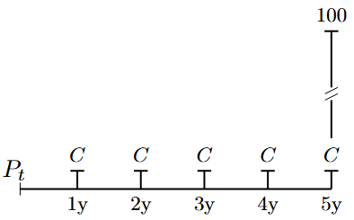
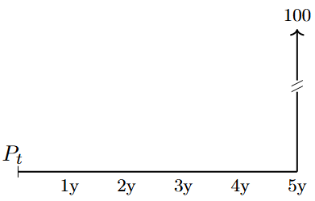
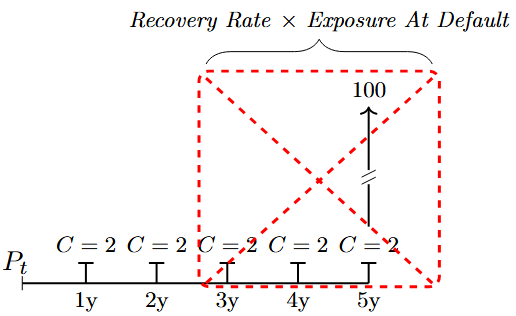
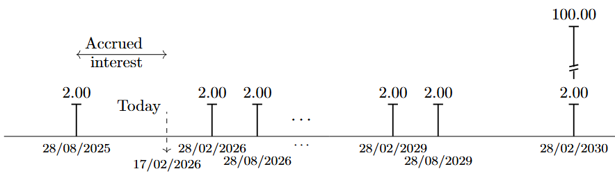
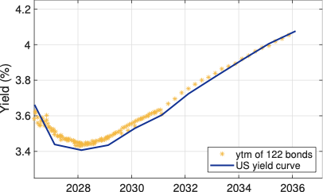
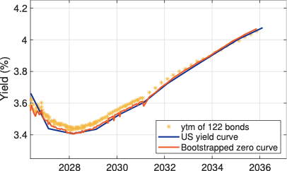
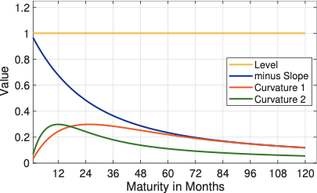
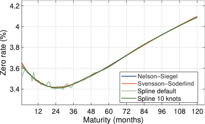

::: callout
This chapter presents an analytical toolkit that helps digest the materials in this book. It:

- Serves as a reference for notation, tools, and techniques.
- Presents basic pricing concepts.
- Introduces relevant mathematical conventions.
- Outlines the needed background in linear algebra.
- Accompanying MATLAB code is found in: toolbox.m
:::

The chapter is designed as a practical reference guide rather than material to be read and mastered upfront. There is no need to work through every detail before proceeding - instead, get familiar with the overall concepts and notation, and return to specific sections when needed. Think of this chapter as a reference manual, not for cover-to-cover reading.

# Notation

The following notation is used throughout the book:

  ----------------------------------------------- -----------------------------------------------------------------------------------------------------------------------------------------------------------------
  $t$                                             denotes the time dimension of the observations, typically calendar days.
  $n\in \mathbb{N}$                               measures the maturity, typically in months.
  $\Delta>0$                                      is the size of a unit time step, e.g. if $t$ is semi-annual then $\Delta=1/2$, similarly, if $t$ is monthly, then $\Delta=1/12$.
  $\mathcal{M}_{t+j}$                             denotes the stochastic discount factor between $t$ and $t+j$.
  $\mathbb{E}$                                    The expectations operator
  $P_t(n)$                                        is the price at time $t$ of a default-free zero-coupon bond maturing in $t+n\Delta$ years.
  $p_t(n)$                                        is $log\left[P_t(n)\right]$
  $D(t) = (1 + r\Delta)^{-t/\Delta}$              discrete compounding, where $D(t)$ is the discount factor for maturity $t$ and $r$ is the annual discount rate (in decimals).
  $D(t) = e^{-rt}$                                continuous compounding, where $D(t)$ is the discount factor for maturity $t$ and $r$ is the annual continuously compounded rate (in decimals)
  $x \sim N(m, \sigma^2)$                         the variable $x$ is normally distributed, $m$ is the mean (expected value), and $\sigma$ is the standard deviation.
  $x \sim N(m, \Sigma)$                           the vector $x$ is normally distributed, $m=[m_1, m_2, \ldots, m_j]$ is the vector of means (expected values), and $\Sigma$ is the $j$-by-$j$ covariance matrix.
  $r_t=p_{t+h}-p_{t}$                             is the holding period return for horizon $h$ in decimals, at time $t$.
  $x_t$                                           is the scalar observation of a variable at time $t$.
  $\mathbf{x}_t$                                  is a vector of observations seen until time $t$, for a variable $\mathbf{x}_t=\{x_1,x_2,\ldots,x_t \}$.
  $\mathbf{X}_t$                                  is a matrix of observations seen until time $t$, for a set of variables $\mathbf{X}_t=\{\mathbf{a}_t,\mathbf{b}_t,\ldots \}$.
  $\mathbf{A},\mathbf{B},\mathbf{C},\mathbf{D}$   are used to denote the parameter matrices in state-space models.
  ----------------------------------------------- -----------------------------------------------------------------------------------------------------------------------------------------------------------------

# The Time Value of Money {#sec:time_value_money}

A core building block in finance is the time value of money: a euro today is worth more than a euro tomorrow, because the euro today can be invested and will earn a return. Discounting makes payoffs at different dates comparable by expressing them as present values.

Let $r$ denote an annual interest rate (in decimals), and let $t$ measure time in years.
Under discrete compounding, the discount factor for maturity $t$ is
$$
\begin{align}
    D(t) = \frac{1}{(1 + r)^t},
\end{align}
$$ {#eq-discount-factor-discrete}

while under continuous compounding it is
$$
\begin{align}
    D(t) = e^{-rt}.
\end{align}
$$ {#eq-discount-factor-continuous}

More generally, if there are $m$ compounding periods per year and the per-period rate is $r/m$, then the relevant discount factor for $t$ years is
$$
\begin{align}
    D(t) = \big(1 + r/m\big)^{-mt}.
\end{align}
$$ {#eq-discount-factor-general}

The present value of a deterministic cash flow $C_t$ paid at time $t$ is then simply $D(t) C_t$.

::: callout-note
Let $r$ denote an annual interest rate (in decimals) and $t$ the time in years. Under discrete compounding, the discount factor and present value are
$$
\begin{align}
    D(t) &= \frac{1}{(1 + r)^t},\\[1ex] 
    PV   &= D(t)\,C_t,
\end{align}
$$ {#eq-discount-factor_discrete_and_pv}

where $C_t$ is a deterministic cash flow paid at time $t$.
:::

## Perpetuities and annuities {#perpetuities-and-annuities .unnumbered}

A perpetuity is a constant cash flow stream $C$ paid at regular intervals forever. With a constant discount rate $r$ and payments once per year, the present value at time $0$ of a perpetuity starting at $t=1$ is
$$
\begin{align}
    PV_{\text{perp}} = \sum_{j=1}^{\infty} \frac{C}{(1 + r)^j} = \frac{C}{r}.
\end{align}
$$ {#eq-perpetuity}

An annuity is a constant cash flow stream $C$ paid for a finite number of periods, say $T$ years, rather than forever. One convenient way to derive the present value of an annuity is to express it as the difference between two perpetuities: one starting at $t=1$, and one starting at $t = T+1$ whose cash flows we subtract away. The present value of the annuity is therefore
$$
\begin{align}
    PV_{\text{annuity}}
    &= \sum_{j=1}^{T} \frac{C}{(1 + r)^j} \\
    &= \underbrace{\sum_{j=1}^{\infty} \frac{C}{(1 + r)^j}}_{\text{perpetuity from } t=1}
        - \underbrace{\sum_{j=T+1}^{\infty} \frac{C}{(1 + r)^j}}_{\text{subtract perpetuity from } t=T+1}.
\end{align}
$$ {#eq-annuity}

Using the perpetuity formula and the fact that
$$
\begin{align}
    \sum_{j=T+1}^{\infty} \frac{C}{(1 + r)^j}
    = \frac{C}{(1 + r)^T} \sum_{k=1}^{\infty} \frac{1}{(1 + r)^k}
    \,=\, \frac{C}{(1 + r)^T} \cdot \frac{1}{r},
\end{align}
$$ {#eq-perpetuity-shifted}

we obtain
$$
\begin{align}
    PV_{\text{annuity}} = \frac{C}{r} - \frac{C}{r(1 + r)^T} \;=\; \frac{C}{r} \Big(1 - (1 + r)^{-T}\Big).
\end{align}
$$ {#eq-annuity-value}

Thus the present value of an annuity with constant payment $C$, maturity $T$, and discount rate $r$ can be viewed as the value of a perpetuity starting at $t=1$ minus the value of an identical perpetuity that only starts at $t=T+1$. In practice, the same logic applies when payments occur $m$ times per year: one replaces $r$ by $r/m$, $T$ by $mT$, and interprets each period in the formula as $1/m$ years.

::: callout-note
For a level annuity paying $C$ once per year for $T$ years at discount rate $r$, the present value can be expressed as the difference between two perpetuities and is
$$
\begin{align}
    PV_{\text{annuity}}
    = \sum_{j=1}^{T} \frac{C}{(1 + r)^j}
     \;=\; \frac{C}{r}\Big(1 - (1 + r)^{-T}\Big).
\end{align}
$$  {#eq-gen-0001}
:::

## Annuity factors and growing annuities {#annuity-factors-and-growing-annuities .unnumbered}

It is convenient to separate the shape of the cash flow from its monetary scale by
defining an annuity factor. Let
$$
\begin{align}
    a_{\overline{T}\,|r}
    = \sum_{j=1}^{T} \frac{1}{(1 + r)^j}
     \;=\; \frac{1}{r}\Big(1 - (1 + r)^{-T}\Big)
\end{align}
$$  {#eq-gen-0002}

denote the present value at time $0$ of a level annuity that pays 1 unit per year for $T$ years at discount rate $r$. The present value of any level annuity with payment $C$ can then be written compactly as
$$
\begin{align}
    PV_{\text{annuity}} = C \, a_{\overline{T}\,|r}.
\end{align}
$$  {#eq-gen-0003}

In actuarial notation, $a_{\overline{T}\,|r}$ is the annuity factor for a temporary annuity-immediate of term $T$ and interest rate $r$.

In many pension applications, benefits are not level but increase over time, for example through indexation with inflation or a fixed cost-of-living adjustment. Suppose the annual payment grows at constant rate $g$ per year, so that the cash flow at time $j$ is
$$
\begin{align}
    C_j = C \,(1 + g)^{j-1}, \qquad j = 1,\dots,T,
\end{align}
$$  {#eq-gen-0004}

and assume $g < r$ so that the present value remains finite. The present value of this
growing annuity is
$$
\begin{align}
    PV_{\text{grow}}  = \sum_{j=1}^{T} \frac{C (1 + g)^{j-1}}{(1 + r)^j}
     \;=\; \frac{C}{1 + r} \sum_{j=0}^{T-1}
            \left(\frac{1 + g}{1 + r}\right)^{\!j}.
\end{align}
$$  {#eq-gen-0005}

The inner sum is a finite geometric series with ratio
$$
\begin{align}
    q = \frac{1 + g}{1 + r},
\end{align}
$$  {#eq-gen-0006}

so that
$$
\begin{align}
    \sum_{j=0}^{T-1} q^j &= \frac{1 - q^{T}}{1 - q}
    \;=\; \frac{1 - \left(\frac{1 + g}{1 + r}\right)^{\!T}}{1 - \frac{1 + g}{1 + r}}.
\end{align}
$$  {#eq-gen-0007}

After simplification,
$$
\begin{align}
    PV_{\text{grow}}
    = \frac{C}{r - g}  \left[1 - \left(\frac{1 + g}{1 + r}\right)^{\!T}\right].
\end{align}
$$  {#eq-gen-0008}

This motivates the growing annuity factor
$$
\begin{align}
    a_{\overline{T}\,|r,g}
    &= \sum_{j=1}^{T} \frac{(1 + g)^{j-1}}{(1 + r)^j}
     \;=\; \frac{1}{r - g}
        \left[1 - \left(\frac{1 + g}{1 + r}\right)^{\!T}\, \right],
\end{align}
$$  {#eq-gen-0009}

so that $PV_{\text{grow}} = C \, a_{\overline{T}|r,g}$.

::: callout-note
For an annuity paying $C$ in the first year and growing at rate $g$ per year for $T$ years, discounted at rate $r > g$, the present value is
$$
\begin{align}
    PV_{\text{grow}}
    &= \sum_{j=1}^{T} \frac{C (1 + g)^{j-1}}{(1 + r)^j}
     \;=\; C \, a_{\overline{T}\,|r,g}, \\
    a_{\overline{T}\,|r,g}
    &= \frac{1}{r - g} \left[1 - \left(\frac{1 + g}{1 + r}\right)^{T}\right].
\end{align}
$$  {#eq-gen-0010}
:::

## Life annuities and annuity factors {#life-annuities-and-annuity-factors .unnumbered}

The annuities considered so far have a fixed term $T$: payments are made for $T$ years and then stop with certainty. In pension applications, by contrast, retirement income is typically paid for life, so the length of the payment stream is random. To handle this, we introduce survival probabilities and define life annuity factors.

Let $x$ denote the current age of an individual and $r_d$ the annual discount rate. As before, write 
$$
\begin{align}
    v &= (1 + r_d)^{-1}
\end{align}
$$ {#eq-gen-0011}

for the annual discount factor. Let ${}_t p_x$ denote the probability that a person aged $x$ today survives at least $t$ more years, based on an appropriate mortality table.

Consider a life annuity that pays 1 unit at the end of each year, as long as the individual is alive. The payment at time $j$ (i.e. at age $x+j$) is conditional on survival to that time, which occurs with probability ${}_j p_x$. The actuarial present value at age $x$ of this annuity is
$$  
\begin{align}
    a_x = \sum_{j=1}^{\infty} v^{\,j} \, {}_j p_x.
\end{align}
$$ {#eq-gen-0012}

This is the life annuity factor for a unit payment at the end of each year (an annuity-immediate). If the annual payment is $C$ instead of 1, the present value is simply $C \, a_x$.

If payments are made at the beginning rather than at the end of each year (an annuity-due), the first payment is received immediately at age $x$, and the present value at age $x$ is
$$  
\begin{align}
    \ddot{a}_x = 1 + \sum_{j=1}^{\infty} v^{\,j} \, {}_j p_x
     \;=\; \sum_{j=0}^{\infty} v^{\,j} \, {}_j p_x.
\end{align}
$$  {#eq-gen-0013}
In actuarial notation, $\ddot{a}_x$ denotes the present value of a life annuity of 1 per year, payable in advance, while $a_x$ denotes the corresponding annuity payable in arrears.[^1]

## Growing life annuities {#growing-life-annuities .unnumbered}
Pension benefits are often indexed after retirement, for example to inflation at rate $r_{inf}$ per year or to a fixed cost-of-living adjustment. In this case, the annual pension is not level but increases over time, and the relevant valuation object is a growing life annuity.

Suppose that at some retirement age $y$ the pension commences with an initial annual amount of 1, and that this amount is increased each year at the constant rate $r_{inf}$. The payment at age $y + k$ is then
$$ 
\begin{align}
    \text{Payment at age } \, y + k = (1 + r_{inf})^{k}, \qquad k = 0,1,2,\dots.
\end{align}
$$ {#eq-gen-0014}

Let $x$ denote the valuation age (with $x \le y$), and write $t_R = y - x$ for the number of years from age $x$ to retirement. The probability of being alive at age $y + k$ is ${}_k p_y$, and the discount factor from age $x$ to age $y + k$ is $v^{\,t_R + k}$. The actuarial present value at age $x$ of this growing life annuity is therefore
$$  
\begin{align}
    \ddot{a}_x^{g} &= v^{\,t_R} \sum_{k=0}^{\infty} (1 + r_{inf})^{k} \, v^{\,k} \, {}_k p_y.
\end{align}
$$ {#eq-growing-life-annuity-factor}

In words, $\ddot{a}_x^{g}$ is the expected present value, at age $x$, of a unit pension starting at age $y$ that is indexed at rate $r_{inf}$ and payable while the member is alive. If the initial annual pension at age $y$ is $PB$ rather than 1, the present value at age $x$ is simply $PB \cdot \ddot{a}_x^{g}$.
Equation @eq-growing-life-annuity-factor is the life-contingent analogue of the finite growing-annuity factor $a_{\overline{T}\,|r,g}$ introduced above. The key difference is that, instead of truncating the series at a fixed maturity $T$, each potential payment year contributes with a weight equal to the probability that the member is still alive at that age. In the special case where we assume a deterministic retirement horizon of length $T$ years (certain survival until $T$ and certain death thereafter), the survival probabilities satisfy
$$  
\begin{align}
    {}_k p_y &= 1, \qquad k = 0,1,\dots,T-1, \\
    {}_k p_y &= 0, \qquad k \ge T,
\end{align}
$$ {#eq-gen-0015}
and the growing life annuity factor reduces to
$$  
\begin{align}
    \ddot{a}_x^{g}
    &= v^{\,t_R} \sum_{k=0}^{T-1} (1 + r_{inf})^{k} v^{\,k}
     \;=\; v^{\,t_R} \, a_{\overline{T}\,|r_d,r_{inf}},
\end{align}
$$ {#eq-gen-0016}

which is exactly the finite growing-annuity factor discounted back from the retirement date $y$ to the valuation age $x$.

# Measuring Returns {#sec:measuring_returns}
Throughout this book, returns are used to summarise how asset values evolve over time and to link prices across dates. It is therefore useful to fix notation and conventions for how returns are measured.

Let $P_t$ denote the (dirty) price of an asset at time $t$, and let $D_t$ denote any cash flow paid between $t-1$ and $t$ (for example a coupon or dividend). The simple gross return from $t-1$ to $t$ is
$$  
\begin{align}
    R_t &= \frac{P_t + D_t}{P_{t-1}},
\end{align}
$$ {#eq-gen-0017}
and the corresponding simple (net) return is
$$  
\begin{align}
    r_t &= R_t - 1 \;=\; \frac{P_t + D_t - P_{t-1}}{P_{t-1}}.
\end{align}
$$ {#eq-gen-0018}

If there are no intermediate cash flows ($D_t = 0$), this reduces to the familiar price return $r_t = (P_t - P_{t-1})/P_{t-1}$.

For many purposes it is convenient to work with log returns, defined as
$$  
\begin{align}
    \tilde{r}_t &= \log R_t \;=\; \log\!\left(\frac{P_t + D_t}{P_{t-1}}\right),
\end{align}
$$ {#eq-gen-0019}

where $\log(\cdot)$ denotes the natural logarithm. When returns are small in absolute value, the log return and the simple net return are numerically close:
$$  
\begin{align}
    \tilde{r}_t \approx r_t.
\end{align}
$$ {#eq-gen-0020}

A key practical advantage of log returns is that they aggregate additively over time. If an asset is held from $0$ to $T$ with intermediate holdings at $1, 2, \ldots, T-1$, the cumulative gross return is the product of one-period gross returns, 
$$  
\begin{align}
    R_{0 \rightarrow T} = \prod_{t=1}^{T} R_t,
\end{align}
$$ {#eq-gen-0021}

which implies that the cumulative log return is the sum of one-period log returns:
$$  
\begin{align}
    \tilde{r}_{0 \rightarrow T}  &= \log R_{0 \rightarrow T}
     \;=\; \sum_{t=1}^{T} \log R_t
     \;=\; \sum_{t=1}^{T} \tilde{r}_t.
\end{align}
$$ {#eq-gen-0022}

This additivity is particularly convenient in econometric modelling and when linking returns to continuously compounded interest rates and discount factors.

::: callout-note
Let $P_t$ be the (dirty) price at time $t$ and $D_t$ the cash flow between $t-1$ and $t$.
Then the gross and net simple returns are
$$  
\begin{align}
    R_t &= \frac{P_t + D_t}{P_{t-1}},\\
    r_t &= R_t - 1,
\end{align}
$$ {#eq-gen-0023}
and the corresponding log return is
$$  
\begin{align}
    \tilde{r}_t &= \log R_t.
\end{align}
$$ {#eq-gen-0024}
For small returns, $\tilde{r}_t \approx r_t$, and cumulative log returns add over time:
$\tilde{r}_{0\to T} = \sum_{t=1}^T \tilde{r}_t$.
:::

# Bonds

Bonds are often referred to as fixed income instruments because their coupon structure is specified at issuance and remains unchanged thereafter. In this sense, the future payments are fixed, in contrast to the cash flows from equities, where the dividend stream is typically uncertain and determined at the discretion of the issuing company. However, even though the promised cash flows are contractually fixed at issuance, there is no guarantee that the bondholder will actually receive them all: if the issuer defaults, any payments due after the default date will be missed, and the investor must instead participate in default proceedings, usually recovering only a fraction of the remaining claim.

Bonds are used by governments, private companies, and in some countries also individual households, as a means to obtain funds. Governments cover their finance needs originating from building roads and bridges, from financing defence, social security and education for its citizens, and from its other activities, not covered by tax revenues, through the issuance of government bonds. Companies use corporate bonds to finance their investment needs, typically originating from purchasing new production equipment, buildings, and other materials that help the company materialise its business plan. In some countries house financing is catered for by the issuance of bonds: certain credit institutions in these countries issue bonds on behalf of households, such that the households obtain loans on fair financial market conditions, while the credit institution gets a fee from facilitating the bond issuance programme.

Graphical representations of the cash flows associated with traditional bonds are shown in @fig-bond-cf-1, @fig-bond-cf-2, and @fig-bond-cf-3.

{#fig-bond-cf-1}

*The figure shows the stylised payments associated with a fixed-coupon paying bond. In this example, an annual coupon frequency is used. The coupon payments are denoted by $C$, and the face (notional) value is $100$ EUR.*

{#fig-bond-cf-2}

*The figure shows the stylised payments associated with a zero-coupon bond, i.e. a bond that does not pay any coupons during its lifetime. The notional value is $100$ EUR.*

{#fig-bond-cf-3}

*The figure shows the stylised payments associated with a fixed-coupon paying bond. In this example, an annual coupon frequency is used. The coupons are denoted by $C$, and the notional value is $100$ EUR. The issuer of the bond defaults between year $2$ and year $3$, and the cash flows that are due after the date of default will not be paid to the bond holder; these foregone cash flows are marked in the red box. Instead, the bond holder enters into the bankruptcy proceedings and recovers $RR\%$ of the exposure at default (EAD). \textit{RR} is the recovery rate; sometimes \textit{loss given default} (LGD) is used: $RR=1-LGD$.*

A bond is a marketable debt security. An investor who buys a bond at issuance (when it is first offered for sale in the market) effectively extends a loan to the issuer. However, the investor does not need to hold the bond until it matured. At any time, the bond can be sold to another investor, either on the organised securities exchange where it is listed, or over the counter (i.e. outside a formal exchange). The ease and speed with which an investor can find a willing counterparty depend on how attractive the bond is, i.e. how liquid it is. Highly liquid bonds trade readily, whereas less liquid bonds are more difficult to buy or sell.

## Money market instruments {#money-market-instruments .unnumbered}

The money market makes up the short-maturity end of the bond market: instruments having maturities less than one year, at the time of issuance, is typically categorised as belonging to the money market. This market clears the short term borrowing and lending needs of banks and companies.

From a monetary policy perspective, the money market constitutes the traditional transmission channel for ECB's policy.[^2] By requiring banks to hold deposits with the ECB, via the minimum reserve requirements, a liquidity deficit is created at the aggregate level, and banks therefore need to borrow from each other, and ultimately from the ECB. By steering the rate at which banks borrow funds at, at the ECB, the short term (one-weeks) interest rate is under the control of the ECB and steered for policy purposes. In fact, the ECB sets three key interest rates:

- The policy rate (mentioned above), also called the rate on the main refinancing operations (MRO rate), is the rate that the ECB charges to the banks who obtain fund in these weekly operations. Banks have to provide the ECB with security in the form of collateral when obtaining funding.
- The deposit facility rate, is the rate afforded to banks if they place funds in overnight deposits with the ECB. This rate is lower than the MRO rate.
- The marginal lending facility rate, is the rate charged to the banks who need overnight credit; for example, if they were not able to obtain funding from other banks. This rate is above the MRO rate.

Short term lending and borrowing is of course also taking place directly between banks; this *interbank market* is enveloped by the deposit facility and the rate on the marginal lending facility. These two rates define a corridor for the interbank overnight-market rate, where the deposit facility rate acts as the floor and the marginal lending facility acts as the ceiling.

Collateralised lending performed by the ECB takes the form of reverse-repurchase agreements. A repurchase agreement (repo) is an product where the initiator exchanges collateral (bonds and other eligible assets) for liquidity (i.e. for a loan); a reverse-repo is the same operation, but seen from the perspective of the party that issues the loan (and thus receives the collateral). Therefore, the traditional liquidity providing operations of the ECB are reverse repos: the ECB receives collateral in exchange for loans given to banks (counterparties).

The money markets are relevant for other ECB activities as well. In the management of the own funds and the foreign reserve portfolios, liquidity from maturing instruments and received coupon payments need to be place until they can be reinvested at the next monthly rebalancing dates. The instruments typically used for these purposes are:

::: {#tab:MoneyMarketInstruments}
  Instrument             Comment
  ---------------------- ----------------------------------------------------------------------------------------------------------------------------------------------------------------------------------------------------------------------------------------------
  Central Bank Deposit   Although generally restricted, other central banks and Commercial and other eligible banks can place deposits with the domestic central bank, typically at rates that are lower than comparable market rates
  Government Bills       Are tradable instruments with a maturity up to one year, issued by a sovereign
  Deposits               Excess cash can be placed with counterparties, as unsecured deposits whereby a fixed or variable rate is earned during the time the cash is placed with the counterparty
  Repos                  Excess cash can be placed with a counterparty via a repo, this gives safety to the depositor against the default of the counterparty via the collateral embedded in the repo transaction
  FIXBIS                 Are tradable fixed-rate instruments issued by the Bank for International Settlements (BIS), that are available for maturities between one week and one year, and that can be bought by central banks and official international institutions

  : Money Market Instruments
:::

# Bond Prices and Yields

In equilibrium, all asset prices are determined by a common pricing mechanism that values future payoffs after adjusting for their risk. Following @Cochrane2001, the fundamental pricing relation is:
$$  
\begin{align}
    P_t = \mathbb{E}_t\!\left( \mathcal{M}_{t+1} x_{t+1}\right),
\end{align}
$${#eq-fundamentalPrice}

where $x_{t+1}$ denotes the payoff (cash flow) at time $t+1$, and $\mathcal{M}_{t+1}$ is the (stochastic) risk‑adjusted discount factor, which can vary over time. Although @eq-fundamentalPrice is written for a single period, it extends to multiple periods by applying it iteratively. For example, the price at time $t$ of a standard $T$-period coupon bond with coupon $C$ each period and notional $N$ at maturity, can be written as
$$  
\begin{align}
P_t 
  &= \mathbb{E}_t\!\left( \mathcal{M}_{t+1} C 
    + \mathcal{M}_{t+2} C 
    + \cdots 
    + \mathcal{M}_{t+T} (C + N) \right) \\
  &= \mathbb{E}_t\!\left( \sum_{j=1}^{T} \mathcal{M}_{t+j} \, x_{t+j} \right),
\end{align}
$$ {#eq-gen-0026}

where $x_{t+j} = C$ for $j=(1,\ldots,T-1)$ and $x_{t+T} = C+N$. The bond price therefore equals the conditional expectation of the sum of all future cash flows, each multiplied by the appropriate time-specific discount factor.

Applied to a credit-risk free (default free) coupon paying bond, the pricing equation becomes:

::: callout-note
$$  
\begin{align}
P_t = \sum_{j=1}^{N} \left(1 + y_{t+j}\Delta \right)^{\,-(j-1+w)} x_j,
\end{align}
$$ {#eq-gen-0027}

$y_t$ denotes the annualised $t$-specific yield (in decimals), $m$ is the number of coupon payments per year, implying that $\Delta =\dfrac{1}{m}$, $x_j$ denotes the $j$th cash flow, $N$ is the number of remaining cash flows, and $w \in (0,1]$ is the fraction of the current coupon period from the settlement date to the next coupon date, and
$$  
\begin{align}
 \mathcal{M}_{t+j} = \left(1 + y_{t+j}\Delta \right)^{\,-(j-1+w)}
\end{align}
$$ {#eq-gen-0028}

is the corresponding (discrete-time) discount factor.
:::

::: callout-note
$$  
\begin{align}
P_t &= \sum_{j=1}^{N} e^{-y_{t+j}\,\tau_{t,j}}\,x_j,
\end{align}
$$ {#eq-gen-0029}

where $y_{t+j}$ denotes the continuously compounded yield (in decimals) applicable to the $j$th cash flow, $\tau_{t,j}$ is the (year-fraction) time from settlement $t$ to the payment date of cash flow $x_j$, $N$ is the number of remaining cash flows, and
$$  
\begin{align}
\mathcal{M}_{t+j} = e^{-y_{t+j}\,\tau_{t,j}}
\end{align}
$$ {#eq-gen-0030}

is the corresponding (continuous-time) discount factor.
:::

## Bond characteristics {#subsec:bondCharacteristics}

Lets start with an example to frame ideas. Say today is 17 February 2026, and we sample the most liquid US government bonds from Bloomberg by choosing ISINs that have more than USD 60 bn outstanding, a maturity between $10$ days and 15 years form now, fixed coupons, bullet repayment (i.e. that the principal is repaid in full at the maturity of the bond), and a Bloomberg liquidity score of $100\%$. This results in 122 bonds that are stored in the Excel file named \"Liquid_US_Bonds.xlsx\". To illustrate, @tbl-bonds shows 3 of these bonds.

  ----------------------------- -------------- -------------- --------------
  ISIN                          US91282CKY65   US91282CMV09   US91282CGQ87
  Amount Outstanding (USD bn)   69.717         70.776         119.635
  Liquidity Score               100            100            100
  Coupon                        4.625          3.875          4
  Coupon Type                   FIXED          FIXED          FIXED
  Coupons per year              2              2              2
  Dirty/Clean price             CLEAN          CLEAN          CLEAN
  Last Price (clean)            100.38         100.47         101.80
  Bid Price (clean)             100.32         100.42         101.75
  Ask Price (clean)             100.43         100.46         101.79
  Accrued Interest              0.63           1.50           1.89
  Bid Price (dirty)             100.95         101.93         103.63
  Ask Price (dirty)             101.04         101.97         103.68
  Issue date                    01/07/2024     31/03/2025     28/02/2023
  Maturity date                 30/06/2026     31/03/2027     28/02/2030
  Security Type                 US GOVT        US GOVT        US GOV
  Bullet payment                Y              Y              Y
  Day count convention          ACT/ACT        ACT/ACT        ACT/ACT
  Par amount (USD)              100            100            100
  ----------------------------- -------------- -------------- --------------

  : US Treasury bonds on $17$ February 2026 {#tbl-bonds}

The entries in @tbl-bonds are briefly described below:

- ISIN: International Securities Identification Number that uniquely identifies each bond.
- Amount Outstanding (USD bn): Total nominal value of the bond issue currently in the market, measured in billions of US dollars.
- Liquidity Score: Indicator of how easily the bond can be traded without moving the price (higher values typically mean better liquidity, depending on the vendor scale).
- Coupon: Annual coupon rate in percent, i.e. the yearly interest payment as a percentage of face value.
- Coupon Type: Specifies whether the coupon is fixed, floating, or another structure; here all bonds have a fixed coupon.
- Coupons per year: Number of coupon payments made per year (e.g. 2 for semi‑annual payments).
- Dirty/Clean price: Indicates whether the quoted price is a clean price (excluding accrued interest) or a dirty price (including accrued interest).
- Last Price: Most recent traded or quoted clean price of the bond.
- Bid Price: Price at which dealers are willing to buy the bond (clean price).
- Ask Price: Price at which dealers are willing to sell the bond (clean price).
- Accrued Interest: Interest that has accumulated since the last coupon payment, payable by the buyer to the seller on settlement.
- Bid Price (Dirty): Bid price including accrued interest, i.e. the full amount a seller would receive per 100 of face value.
- Ask Price (Dirty): Ask price including accrued interest, i.e. the full amount a buyer would pay per 100 of face value.
- Issue date: Date on which the bond was first issued and began accruing interest.
- Maturity date: Date on which the bond principal is scheduled to be repaid and regular coupon payments stop.
- Security Type: Classification of the instrument; here it denotes that these are US government securities.
- Bullet payment: Indicates that the principal is repaid in a single lump sum at maturity (no amortisation).
- Day count convention: Rule (e.g. ACT/ACT) used to compute year fractions for interest accrual and yield calculations.
- Par Amount: Nominal principal value of the bond that will be repaid at maturity, and on which coupon payments are calculated (typically 100 or 1,000 per bond, independent of its market price).

As an example consider the bond in the last column of @tbl-bonds. This bons has semi-annual coupon payments, the annual coupon rate is $4\%$ so the size of the semi-annual coupons is USD $2.00$, given that the par amount is USD $100$. The bond specific cash flows are shown in @fig-bondexample.

{#fig-bondexample}

The date of $17$ February 2026 is marked as \"today\". Say we hold the depicted bond and we want to sell it today, and that the prices referred in Table @tbl-bonds represent actual tradeable market prices. Since we want to sell the bond, the relevant price is the clean bid price, $P_{bid,clean}=101.75$. When trading government bonds in the US market, the bond and the payment changes hands $1$ day after the trade is agreed upon. This is \"called settlement at $T+1$\". The accrued interest corresponds to the proportion of the coming coupon payment (on $28$ February $2026$) that has been earned so far, i.e. since the last coupon payment on $28$ August $2025$. To calculate the relevant fraction it is observed that the day count convention is ACT/ACT which means that the actual number of calendar days are use (other conventions are e.g. ACT/360 and ACT/365). Hence, there are $173$ days from last coupon payment to $17$ February $2026$, so the fraction of the coming coupon that we have earned by holding the bond until now is: $173/365 \cdot 4\% \cdot USD 100=USD 1.89$. This means that on the settlement day, we will receive: $P_{bid,clean}+\text{Accrued Interest}=103.63=P_{bid,dirty}$.

@fig-bondexample also shows that if we are interested in calculating the yield-to-maturity of a bond, it is the dirty price that should be matched up with the cash flows. The dirty price is the economic value of the bond at settlement, and this is precisely what we obtain when we calculate the present value of the future expected cash flows. Although this point is standard in practice, it is not always made explicit in textbooks and online resources.

The yield-to-maturity is defined as the single discount rate that equates the present value of all remaining cash flows to the price of the bond on the settlement date. When we discount the future cash flows back to the settlement date (here 18/02/2026, i.e. $T+1$), the resulting present value naturally includes compensation for the interest that has accrued since the last coupon date (28/08/2025). In other words, the discounting operation is agnostic to any split between "clean" and "accrued": it simply collapses every future cash flow into a single lump-sum value as of today. That lump sum is, by construction, the dirty price (also called the invoice or full price), i.e. the amount of money that actually changes hands at settlement. The relationship between the bond price and the yield-to-maturity is given by:

::: callout-note
[]{#eqn:ytm label="eqn:ytm"}
$$  
\begin{align}
        P_{dirty} = \sum_{j=1}^{N} \left(1 + ytm\Delta \right)^{\,j-1+w} x_j,
\end{align}
$$ {#eq-ytm}

where $ytm$ is the annualised yield-to-maturity (with $m$ coupon payments per year, and $\Delta =\dfrac{1}{m}$), $x_j$ denotes the $j$th future cash flow, $N$ is the number of remaining cash flows, and $w \in (0,1]$ is the fraction of the current coupon period from the settlement date to the next coupon date.
:::

It is important to recognise that the $ytm$ is derived from the price of the bond and from the future cash flows; it is not metric that, as such, is fundamental to the bond. If the price changes, the $ytm$ changes - not the other way around.

It is shown in the accompanying MATLAB live script how an iterative technique can be used to find the yield-to-maturity for the bond with ISIN: US91282CGQ87, and how MATLAB's build in function can be used to find the yield-to-maturity for all the sampled US government bonds. The result for ISIN: US91282CGQ87 is $3.53\%$ using the home-composed iterative approach, and $3.57\%$ using MATLABs bndyield function (which also relies on an iterative approach) - the difference of 4 bps is well within the uncertainty that is embedded in the data, e.g. when in the day the observations are recorded.

## Yield curves

The yield curve is a fundamental object in fixed income and macro‑financial analysis. It summarises the relationship between interest rates (or bond yields) and their time to maturity for a given currency and credit quality, and thus provides a term structure of discount rates for valuing cash flows across horizons.

In practice, the yield curve is used extensively for pricing. It helps identify mispriced securities relative to a benchmark term structure, provides valuation inputs for assets that trade infrequently, and underpins the setting of lending rates by banks on products such as mortgages and corporate loans through appropriate spreads over the relevant benchmark curve.

The yield curve also plays a central role in economic and policy analysis. Because bond prices and yields embed market participants' expectations about future short‑term interest rates, inflation and growth, as well as risk premia, the shape and dynamics of the curve convey information about the expected future path of monetary policy and the broader macroeconomic outlook. For this reason, policymakers, investors and researchers closely monitor changes in the slope and curvature of the yield curve as high‑frequency indicators of evolving economic conditions.

::: callout-note
The yield curve is a graphical representation of how the yield to maturity on comparable bonds vary with their time to maturity.
:::

Starting with the yield-to-maturity of the $122$ liquid US bonds introduced above, e @fig-yields-ytm shows the resulting relationship between $ytm$ and the maturity date of each bond in the data sample. Each bond's $ytm$ is marked by a yellow dot, while the blue line in the figure is the yield curve estimated by Bloomberg for the same day. This is the so‑called zero‑coupon yield curve (or spot rate curve), which shows the yield on hypothetical default‑free zero‑coupon bonds, at standard maturities $n\in\{3,12,24,\ldots,120\}$ months.

{#fig-yields-ytm width=85%}

As shown in (@eq-ytm), the yield‑to‑maturity of a coupon bond is the single discount rate that makes the present value of all promised cash flows (coupons plus principal) exactly equal to the observed (dirty) market price; it is therefore the rate of return earned by an investor who buys the bond at this price and holds it to maturity, assuming all payments are made as scheduled and can be reinvested at the same rate. As a concept, $ytm$ is identical to the internal rate of return familiar from microeconomics and corporate‑finance textbooks. Because the actual market discounting is done with maturity‑specific zero‑coupon (spot) rates, the $ytm$ can be interpreted as a cash‑flow‑weighted average of these underlying spot rates. It follows that $ytm$ will lie above the zero‑coupon yield curve when the spot curve is downward sloping, and below it when the spot curve is monotonically upward sloping.

Zero‑coupon yields themselves are directly linked to the stochastic discount factors that price default‑free government bonds: for each maturity, the zero‑coupon price is the conditional expectation of the corresponding discount factor, and the associated spot rate is the continuously (or discretely) compounded return that equates this price. In this sense, the zero‑coupon yield curve summarises how the market discounts risk‑adjusted future pay‑offs at different horizons, and serves as the basic building block on top of which various term premia and credit‑risk premia are added to price other fixed‑income instruments, equities, and derivatives.

Another concept is the par yield curve. For each maturity it shows the yield‑to‑maturity on a hypothetical bond that trades exactly at its par value, i.e. where the present value of all coupon and principal payments equals the bond's face value rather than its (dirty) market price as in (@eq-ytm). The par yield curve therefore traces the maturity dependent coupon rates consistent with par pricing. It is therefore particularly relevant for bond issuers, who are primarily interested in the coupon (and thus average funding cost) that the market is willing to support for new issuance at different tenors. From the viewpoint of a financial analyst focused on valuation and risk, however, the par curve is mainly a convenient way to summarise issuance conditions and market borrowing costs at standard maturities, rather than a primary object of analysis.

By contrast, the zero‑coupon yield curve is the fundamental object for in fixed‑income analysis. It is the spot curve that enters no‑arbitrage valuation formulas, underlies the extraction of forward rates, and provides the natural platform for modelling term premia and other risk adjustments that connect observed bond prices to expectations about future short‑term interest rates and macroeconomic developments.

In practice the zero‑coupon yield curve itself is not directly observable, because most government bonds pay coupons. Instead, it is estimated from traded bond prices. There are basically two ways to do this: (1) bootstrapping, and (2) functional approaches.

### Bootstrapping the zero-coupon curve

Bootstrapping proceeds recursively from the shortest to the longest maturity. For example, using the bonds sampled on $17$-FEB-$2026$ the cross‑section of prices and coupons are directly observed. Let ${P^{(k)}_t}$ be the price for the $k=\{1,2,\ldots,K\}$ bonds, where $K=122$ for our sample, coupon rates are denoted by ${c^{(k)}}$, and maturities by ${T^{(k)}}$. For the shortest‑maturity bond, which has only a single cash flow at $T^{(1)}$, the spot rate $s_{t+1}$ is found directly from the standard pricing equation:

$$  
\begin{align}
    P^{(1)}_t = \frac{1 + c^{(1)}\Delta}{\bigl(1+s_{t+1}\Delta\bigr)^{1}} .
\end{align}
$$ {#eq-gen-0032}

For the next bond in the maturity ordering, the price equation involves both the already‑identified short‑maturity discount factor and the unknown discount factor at the new maturity. Proceeding like this, the price of bond $k$ can be written as:
$$  
\begin{align}
    P^{(k)}_t &= \sum_{j=1}^{N^{(k)}-1} \frac{c^{(k)}\Delta}{\bigl(1+s_{t+j}\Delta\bigr)^{j}}
    + \frac{1 + c^{(k)}\Delta} {\bigl(1+s_{t+N^{(k)}}\Delta\bigr)^{N^{(k)}}},
\end{align}
$$ {#eq-gen-0033}

with all discount factors up to maturity $T^{(k-1)}$ are already known from earlier steps, so this equation can be solved for the new spot rate $s_{t+N^{(k)}}$ at maturity $T^{(k)}$.

Repeating this forward‑substitution step across the ordered set of bond maturities yields a full discrete set of zero‑coupon yields.

::: callout-note
**Input:** Prices $P_t^{(k)}$, coupons $c^{(k)}$, maturities $T^{(k)}$,
common coupon interval $\Delta$, ordered so that $T^{(1)}<T^{(2)}<\dots<T^{(K)}$.

**Step 1 (shortest maturity).**
If bond $1$ has only one cash flow at $T^{(1)}$, solve
$$  
\begin{align}
    P_t^{(1)}  &= \frac{1 + c^{(1)}\Delta}{\bigl(1+s_{t+1}\Delta\bigr)}
\end{align}
$$ {#eq-gen-0034}

for the first spot rate $s_{t+1}$.

**Step 2 (for $k=2,\dots,K$).**
For bond $k$ with $N^{(k)} = T^{(k)}/\Delta$ coupon dates, write its price as
$$  
\begin{align}
    P_t^{(k)}
      &= \sum_{j=1}^{N^{(k)}-1} 
          \frac{c^{(k)}\Delta}{\bigl(1+s_{t+j}\Delta\bigr)^{j}}
          + \frac{1 + c^{(k)}\Delta}
                 {\bigl(1+s_{t+N^{(k)}}\Delta\bigr)^{N^{(k)}}}.
\end{align}
$$ {#eq-gen-0035}

All spot rates $s_{t+1},\dots,s_{t+N^{(k)}-1}$ are known from earlier steps,
so this equation can be solved for the new spot rate $s_{t+N^{(k)}}$.
:::

MATLAB provides a built‑in routine in the Econometrics Toolbox, $zbtprice$, which implements the bootstrapping procedure for coupon bonds. The accompanying MATLAB live script illustrates how this function is applied to the US Treasury sample, and the resulting zero‑coupon yield curve is reported in @fig-yields-ytm-zcc alongside the curves already shown in @fig-yields-ytm for comparison.

{#fig-yields-ytm-zcc width=85%}

Because of the sequential design of the bootstrapping technique, each bond's contribution to the zero-curve is unique and the resulting zero coupon curve will therefore reflect any idiosyncrasies pertaining to the bonds in the sample. This is seen in the curve by its jagged movements through-out the maturity spectrum.

Because the bootstrap procedure constructs discount factors sequentially, each bond affects a distinct segment of the term structure, and the calculated zero‑coupon curve inevitably inherits any bond‑specific noise or illiquidity effects. This is visible in @fig-yields-ytm-zcc as small, jagged oscillations of the curve across maturities, rather than a perfectly smooth profile.

In an arbitrage‑free market, zero‑coupon rates for nearby maturities should evolve smoothly, since they are all derived from trading the same underlying risk‑free asset over only slightly different horizons. Pronounced kinks or local reversals in the zero‑coupon curve signal that some bonds are priced inconsistently with others, so that appropriately designed long--short portfolios could, at least in principle, exploit these discrepancies by borrowing at relatively "cheap" maturities and lending at relatively "expensive" ones.[^3] The jagged behaviour in @fig-yields-ytm-zcc therefore represents bond‑specific noise and market frictions embedded in the observed prices. To avoid such undesirable curve features, a functional form for the zero-curve can be imposed.

### Parametric Estimation of the Zero‑Coupon Yield Curve

Typical parametric specifications used to impose a smoothness on the zero‑coupon spot rate include:

- Nelson-Siegel:
- Svensson-Soderlind:
- Splines: and

The Nelson-Siegel model uses $4$ parameters, $\theta_{NS}=\{ \beta_0, \beta_1, \beta_2, \lambda\}$ and specifies the continuously compounded spot rate as:
$$  
\begin{align}
    z_{NS}(n) = \beta_0 + \beta_1 \left(\frac{1-e^{-\lambda n}}{\lambda n}\right) + \beta_2 \left(\frac{1-e^{-\lambda n}}{\lambda n} - e^{-\lambda n}\right).
\end{align}
$$ {#eq-gen-0036}

In the original formulation the exponential term is written as $e^{-n/\tau}$; here $\lambda = 1/\tau$ is used for notational convenience. The Svensson-Soderlind model extends the Nelson-Siegel model with an additional curvature term, uses $6$ parameters, $\theta_{SS}=\{ \beta_0, \beta_1, \beta_2, \beta_3, \lambda_1, \lambda_2\}$, and is given by:
$$ 
\begin{align}
    z_{SS}(n) = \beta_0 + \beta_1 \left(\frac{1-e^{-\lambda_1 n}}{\lambda_1 n}\right) &+& \beta_2 \left(\frac{1-e^{-\lambda_1 n}}{\lambda_1 n} - e^{-\lambda_1 n}\right) \nonumber \\
    &+& \beta_3 \left(\frac{1-e^{-\lambda_2 n}}{\lambda_2 n} - e^{-\lambda_2 n}\right)
\end{align}
$$  {#eq-gen-0037}

Both models are built from a small set of generic yield‑curve components. The parameter $\beta_0$ governs the long‑run level of the curve: changing $\beta_0$ shifts the entire zero‑coupon term structure up or down, and with only $\beta_0$ active the curve would be flat across all maturities, moving only in parallel. The parameter $\beta_1$ controls (minus) the slope of the curve, mainly affecting short maturities relative to the long end, while $\beta_2$ and, in the Svensson--Söderlind extension, $\beta_3$ introduce one or two curvature components that allow for humps or troughs at intermediate maturities. The maturity‑dependent functions multiplying these parameters (the loading functions) are plotted in @fig-NN-SS-loadings; they can be interpreted as the sensitivity of the spot rate at each maturity to a marginal change in the corresponding parameter.

{#fig-NN-SS-loadings width=85%}

Spline methods approximate the zero‑coupon curve by combining basis functions, for example low‑degree polynomials, across maturity segments, while enforcing smoothness where the segments meet. To illustrate, a cubic spline defined a set of knot maturities $0<\kappa_1<\dots<\kappa_J$ leads to this functional form for the discount function $D(n)$:
$$  
\begin{align}
    D(n) = \alpha_0 + \alpha_1 n + \alpha_2 n^2 + \alpha_3 n^3
    + \sum_{j=1}^{J} \gamma_j (n-\kappa_j)_+^3,
\end{align}
$$ {#eq-gen-0038}

where $(\cdot)_+ = \max\{\cdot,0\}$ and the coefficients $\theta_{Cspline}=\{\alpha_0,\alpha_1,\alpha_2,\alpha_3,\gamma_j\}$ are estimated from the available bond prices. The zero‑coupon (continuously compounded) spot rate then follows from the definition
$$  
\begin{align}
z_{\texttt{spline}}(n)
= -\frac{1}{n}\log\left[ D(n) \right]
= -\frac{1}{n}\log\!\left[
\alpha_0 + \alpha_1 n + \alpha_2 n^2 + \alpha_3 n^3
+ \sum_{j=1}^{J} \gamma_j (n-\kappa_j)_+^3
\right].
\end{align}
$$ {#eq-gen-0039}

The three first terms of the discount function are active across all maturities, while each cubic basis function $(n-\kappa_j)_+^3$ is zero before its knot and then gradually "switches on" after $\kappa_j$, so adjusting $\gamma_j$ affects the local shape of the curve beyond that maturity without affecting shorter maturities. By estimating the coefficients to fit observed bond prices (often with an additional smoothness penalty), spline‑based methods balance cross‑sectional fit and smoothness: they can track complex term‑structure shapes more closely than parsimonious models such as Nelson--Siegel and Svensson-Soderlind, at the cost of estimating a larger number of parameters and choosing knot locations.

Intuitively, fitting a spline model to the zero‑coupon curve can be viewed as walking along the maturity spectrum and, at each step, layering maturity‑specific behaviour extracted from observed bond prices on top of an underlying global polynomial of chosen order; in the example above, this baseline is a cubic (third‑degree) polynomial.

Another important distinction between parametric and spline‑based models concerns their alignment with financial theory. A central tenet is internal model consistency, in the sense that the model explicitly rules out arbitrage opportunities in line with equation @eq-fundamentalPrice, i.e. that it implies a unique stochastic discount factor. Nelson--Siegel type models satisfy this requirement for all practical purposes,[^4] whereas spline‑based specifications are essentially statistical devices that balance flexibility of the functional form against cross‑sectional fit. If the observed bond prices are themselves arbitrage‑free, then a spline fitted to those prices will inherit the no‑arbitrage property at the calibrated point in time, but this is a consequence of the data rather than a structural feature of the model. In equilibrium, this would implicitly require that prices are determined by traders using internally consistent valuation models, while the spline user is merely a marginal observer of those prices. In that sense, spline‑based term‑structure models are descriptive rather than structural and are not, by themselves, natural candidates for modelling equilibrium pricing.

The accompanying MATLAB live script demonstrates how the Nelson--Siegel, Svensson--Soderlind, and spline‑based frameworks can be implemented in practice using the sample of $122$ US government bonds.

{#fig-zc-NS-SS-Spline width=85%}

::: callout-note
Input: Observed bond prices $P_t^{(k)}$, coupons $c^{(k)}$, maturities $T^{(k)}$, common coupon interval $\Delta$, $k=1,\dots,K$.
Choose a parametric specification for the spot rate curve, $s$, at maturity $n$:
$$  
\begin{align}
      s(n;\theta) = s\big(n;\theta_1,\dots,\theta_M\big),
\end{align}
$$ {#eq-gen-0040}

with parameter vector $\theta = (\theta_1,\dots,\theta_M)^{\top}$ of dimension $M \ll K$.

**Step 1 (discount factors implied by the spot curve).**
Given $\theta$, the discount factor for maturity $n$ is:
$$  
\begin{align}
      D(n;\theta) = \exp\!\left(-n\,s(n;\theta)\right),
\end{align}
$$ {#eq-gen-0041}

For bond $k$ with coupon dates $T^{(k)}_j = j\Delta$ and
$N^{(k)} = T^{(k)}/\Delta$ payments, the model price is:
$$  
\begin{align}
      P^{(k)}_{\text{model}}(\theta)
      = \sum_{j=1}^{N^{(k)}} c^{(k)}\Delta\,D(T^{(k)}_j;\theta)
      + 100 \cdot D(T^{(k)};\theta),
\end{align}
$$ {#eq-gen-0042}

**Step 2 (parameter estimation).**
Choose $\theta$ to make model prices as close as possible to observed prices.
A standard choice is the least-squares criterion, possibly including weights, $w_k$:
$$  
\begin{align}
      \widehat{\theta}
      = \arg\min_{\theta} \sum_{k=1}^{K} w_k  \big(P_t^{(k)} - P^{(k)}_{\text{model}}(\theta)\big)^2,
\end{align}
$$ {#eq-gen-0043}

where $w_k$ are user-chosen weights (for example based on duration or liquidity).

**Output (fitted zero-coupon curve).**
The estimated parameter vector $\widehat{\theta}$ defines a smooth
spot-rate function $s(n;\widehat{\theta})$.
:::

@fig-zc-NS-SS-Spline plots zero‑coupon yield curves estimated on 17 February 2026 using three different approaches: the parametric Nelson--Siegel and Svensson--Soderlind specifications, and two spline‑based curves. The MATLAB default spline fit produces a very flexible curve that closely tracks short‑maturity quotation noise and displays several small oscillations in the 6--36 month segment, illustrating how a highly parameterised spline can overfit idiosyncratic features of the data. When the spline is restricted to only $10$ knot points, the fitted curve becomes much smoother and its shape essentially coincides with that of the Nelson--Siegel and Svensson--Soderlind term‑structure models over the entire maturity range. This highlights a certain degree of arbitrariness and data dependence inherent in spline‑based yield‑curve estimation: changing the knot structure, while leaving the underlying bond prices unchanged, can lead to noticeably different zero‑coupon curves at the short end, whereas more parsimonious specifications deliver shapes that are much closer to those implied by standard parametric models.

# Matrix Algebra

The objective of this section is to give a concise overview of how matrix operations can be applied to solve financial problems and models of relevance for the material presented in this book. A more comprehensive and detailed treatment of matrix algebra can be found, for example, in The Matrix Cookbook ().[^5]

## Vectors and matrices

A column vector is an ordered collection of numbers written
vertically as
$$  
\begin{align}
    \mathbf{x} = \begin{bmatrix}
        x_{1} \\ x_{2} \\ \vdots \\ x_{k}
\end{bmatrix},
\end{align}
$$ {#eq-gen-0044}

where $x_{j} \in \mathbb{R}$ denotes the $j$th element and $k$ is the
dimension of the vector.

A row vector is written horizontally as
$$  
\begin{align}
    \mathbf{x}^{\top} = \begin{bmatrix}
    x_{1} & x_{2} & \cdots & x_{k}
\end{bmatrix}.
\end{align}
$$ {#eq-gen-0045}

An $m \times k$ matrix $\mathbf{A}$ is a rectangular array of
numbers with $m$ rows and $k$ columns,
$$  
\begin{align}
\mathbf{A}
=
\begin{bmatrix}
a_{11} & a_{12} & \cdots & a_{1k} \\
a_{21} & a_{22} & \cdots & a_{2k} \\
\vdots & \vdots & \ddots & \vdots \\
a_{m1} & a_{m2} & \cdots & a_{mk}
\end{bmatrix}.
\end{align}
$$ {#eq-gen-0046}

The element in row $i$ and column $j$ is denoted $a_{ij}$.
Square matrices have $m = k$.

## Transpose

The transpose of an $m \times k$ matrix $\mathbf{A}$ is the
$k \times m$ matrix obtained by turning rows into columns,
$$ 
\begin{align}
\mathbf{A}^{\top}
=
\begin{bmatrix}
a_{11} & a_{21} & \cdots & a_{m1} \\
a_{12} & a_{22} & \cdots & a_{m2} \\
\vdots & \vdots & \ddots & \vdots \\
a_{1k} & a_{2k} & \cdots & a_{mk}
\end{bmatrix}.
\end{align}
$$  {#eq-gen-0047}

For vectors this implies that the transpose of a column vector is a row
vector and vice versa.

Transposition is linear and reverses the order of matrix products:
$$  
\begin{align}
(\mathbf{A} + \mathbf{B})^{\top} &= \mathbf{A}^{\top} + \mathbf{B}^{\top}, \\
(c\,\mathbf{A})^{\top}           &= c\,\mathbf{A}^{\top}, \\
(\mathbf{A}\mathbf{B})^{\top}    &= \mathbf{B}^{\top}\mathbf{A}^{\top}, \\
(\mathbf{A}\mathbf{B}\mathbf{C})^{\top}
                                   &= \mathbf{C}^{\top}\mathbf{B}^{\top}\mathbf{A}^{\top},
\end{align}
$$ {#eq-gen-0048}

whenever the products are well defined and $c$ is a scalar.

## Matrix multiplication

If $\mathbf{A}$ is $m \times k$ and $\mathbf{B}$ is $k \times r$,
then the product $\mathbf{C}=\mathbf{A}\mathbf{B}$ is the $m \times r$
matrix with elements
$$  
\begin{align}
c_{ij} = \sum_{\ell=1}^{k} a_{i\ell} b_{\ell j}.
\end{align}
$$ {#eq-gen-0049}

In finance this operation appears, for example, when computing the
values of several portfolios from a vector of asset prices and a matrix
of portfolio weights.

Matrix multiplication is associative and distributive, but not
commutative in general:
$$  
\begin{align}
\mathbf{A}(\mathbf{B}\mathbf{C}) &= (\mathbf{A}\mathbf{B})\mathbf{C}, \\
\mathbf{A}(\mathbf{B}+\mathbf{C}) &= \mathbf{A}\mathbf{B} + \mathbf{A}\mathbf{C}, \\
\mathbf{A}\mathbf{B} &\neq \mathbf{B}\mathbf{A} \quad \text{in general}.
\end{align}
$$ {#eq-gen-0050}

## Identity matrix and inverse

The $k \times k$ identity matrix, denoted $\mathbf{I}_{k}$ or
simply $\mathbf{I}$, has ones on the diagonal and zeros elsewhere,
$$  
\begin{align}
\mathbf{I}_{k}
=
\begin{bmatrix}
1 & 0 & \cdots & 0 \\
0 & 1 & \cdots & 0 \\
\vdots & \vdots & \ddots & \vdots \\
0 & 0 & \cdots & 1
\end{bmatrix}.
\end{align}
$$ {#eq-gen-0051}

It acts as a multiplicative neutral element:
$\mathbf{I}_{k}\mathbf{A}=\mathbf{A}$ and
$\mathbf{A}\mathbf{I}_{k}=\mathbf{A}$ whenever the products are defined.

A square matrix $\mathbf{A}$ is invertible (or
nonsingular) if there exists a matrix $\mathbf{A}^{-1}$ such that
$$  
\begin{align}
\mathbf{A}^{-1}\mathbf{A} = \mathbf{I}
\quad\text{and}\quad
\mathbf{A}\mathbf{A}^{-1} = \mathbf{I}.
\end{align}
$$ {#eq-gen-0052}

The matrix $\mathbf{A}^{-1}$ is called the inverse of
$\mathbf{A}$.

A necessary and sufficient condition for a square matrix to be
invertible is that its determinant is non‑zero. Equivalently, the
columns (or rows) of $\mathbf{A}$ must be linearly independent. In
terms of linear systems, $\mathbf{A}$ is invertible if and only if the
system
$$  
\begin{align}
\mathbf{A}\mathbf{x} = \mathbf{b}
\end{align}
$$ {#eq-gen-0053}

has a unique solution $\mathbf{x}$ for every right‑hand side
$\mathbf{b}$.

Inverse and transpose interact with products in a way that mirrors the
rules for scalars:
$$  
\begin{align}
(\mathbf{A}\mathbf{B})^{-1} &= \mathbf{B}^{-1}\mathbf{A}^{-1},
\quad\text{if $\mathbf{A}$ and $\mathbf{B}$ are invertible}, \\
(\mathbf{A}^{\top})^{-1} &= (\mathbf{A}^{-1})^{\top},
\quad\text{if $\mathbf{A}$ is invertible}.
\end{align}
$$ {#eq-gen-0054}

## Eigenvalue decomposition

The eigenvalue decomposition of a matrix is closely related to principal component analysis (PCA). In financial modelling, PCA is often used to reduce the dimensionality of complex datasets, helping to summarise large amounts of information with a few key components. This aligns with many financial models, which seek to explain observable variables through a small number of underlying drivers; for example, the Capital Asset Pricing Model (CAPM) assumes that equity returns are primarily driven by a single market factor, and dynamic yield-curve models typically assume that movements in the term structure of interest rates can be well approximated by a few latent factors, often interpreted as level, slope, and curvature.

Let $\mathbf{S}$ be a symmetric positive semi-definite $k\times k$ matrix, for example a covariance matrix. Its eigenvalue decomposition is
$$  
\begin{align}
    \mathbf{S} = \mathbf{L}\mathbf{D}\mathbf{L}^{-1} = \mathbf{L}\mathbf{D}\mathbf{L}^{\top},
\end{align}
$$ {#eq-gen-0055}

where the second equality uses the fact that the columns of $\mathbf{L}$ form an orthonormal set, such that
$$  
\begin{align}
    \mathbf{L}^{\top}\mathbf{L} = \mathbf{I}_k \quad \Leftrightarrow \quad \mathbf{L}^{-1} = \mathbf{L}^{\top}.
\end{align}
$$ {#eq-gen-0056}

Here $\mathbf{L}$ is a $k\times k$ matrix collecting the eigenvectors as columns, and $\mathbf{D}$ is a $k\times k$ diagonal matrix containing the corresponding eigenvalues.

Now let $\mathbf{Y}$ be a $T\times k$ time-series data matrix, with each column representing a variable and each row a time observation. Projecting $\mathbf{Y}$ onto the eigenvectors yields the time series of principal components:
$$  
\begin{align}
    \mathbf{Y} = \mathbf{F}\mathbf{L}^{\top},
\end{align}
$$ {#eq-gen-0057}

where $\mathbf{F}$ is a $T\times k$ matrix of factor scores (principal components). Because $\mathbf{L}$ is orthonormal, this can be viewed as a linear regression of $\mathbf{Y}$ on the loadings $\mathbf{L}$; the least-squares estimator of $\mathbf{F}$ is
$$  
\begin{align}
    \hat{\mathbf{F}} 
    = \mathbf{Y}\mathbf{L}\left(\mathbf{L}^{\top}\mathbf{L}\right)^{-1} 
    = \mathbf{Y}\mathbf{L},
\end{align}
$$ {#eq-gen-0058}

using $\mathbf{L}^{\top}\mathbf{L} = \mathbf{I}_k$. Substituting back gives the exact reconstruction
$$  
\begin{align}
    \mathbf{Y} = \hat{\mathbf{F}}\mathbf{L}^{\top}.
\end{align}
$$ {#eq-gen-0059}

To reduce the data dimensionality, order the eigenvalues in $\mathbf{D}$ from largest to smallest and partition
$$  
\begin{align}
    \mathbf{L} = \left[\;\mathbf{L}_{1:l}\ \ \mathbf{L}_{l+1:k}\;\right], 
    \quad
    \hat{\mathbf{F}} = \left[\;\hat{\mathbf{F}}_{1:l}\ \ \hat{\mathbf{F}}_{l+1:k}\;\right],
\end{align}
$$ {#eq-gen-0060}

where $\mathbf{L}_{1:l}$ is $k\times l$ and $\hat{\mathbf{F}}_{1:l}$ is $T\times l$. The exact decomposition can then be written as
$$  
\begin{align}
    \mathbf{Y} = \hat{\mathbf{F}}_{1:l}\mathbf{L}_{1:l}^{\top} 
      \;+\; \hat{\mathbf{F}}_{l+1:k}\mathbf{L}_{l+1:k}^{\top}.
\end{align}
$$ {#eq-gen-0061}

Dimensionality reduction is achieved by retaining only the first $l<k$ components and discarding the remainder. In that case, $\mathbf{Y}$ is approximated as
$$  
\begin{align}
    \mathbf{Y} \approx \hat{\mathbf{F}}_{1:l}\mathbf{L}_{1:l}^{\top},
\end{align}
$$ {#eq-gen-0062}

or, equivalently,
$$  
\begin{align}
    \mathbf{Y} = \hat{\mathbf{F}}_{1:l}\mathbf{L}_{1:l}^{\top} + \mathbf{E},
\end{align}
$$ {#eq-gen-0063}

where $\mathbf{E}$ is a $T\times k$ approximation error capturing the contribution of the discarded components.

## Matrix rotation

Consider a nonsingular matrix $\mathbf{R}$ that satisfies
$$  
\begin{align}
    \mathbf{I} = \mathbf{R}^{-1} \mathbf{R}.
\end{align}
$$ {#eq-gen-0064}

The matrix $\mathbf{R}$ can be interpreted as a rotation matrix that can alter the orientation of factors, e.g. extracted using principal component analysis, without changing the overall explanatory content of a model.
Starting from the generic factor representation:
$$  
\begin{align}
    \mathbf{Y} &= \mathbf{F} \, \mathbf{L}^{\top} + \mathbf{E} \nonumber \\
    &= \mathbf{F} \, \mathbf{I} \, \mathbf{L}^{\top} + \mathbf{E} \nonumber \\
    &= \mathbf{F} \, \mathbf{R}^{-1}\mathbf{R} \,\mathbf{L}^{\top} + \mathbf{E} \nonumber \\   
    &= \underbrace{\mathbf{F} \, \mathbf{R}^{-1}}_{\tilde{\mathbf{F}}}
        \underbrace{(\mathbf{R} \, \mathbf{L}^{\top})}_{\tilde{\mathbf{L}}^{\top}} + \mathbf{E}
\end{align}
$$ {#eq-gen-0065}

gives the rotated representation:
$$  
\begin{align}
    \mathbf{Y} = \tilde{\mathbf{F}}\, \tilde{\mathbf{L}}^{\top} + \mathbf{E},
\end{align}
$$ {#eq-gen-0066}

where $\tilde{\mathbf{F}} = \mathbf{F}\mathbf{R}^{-1}$ and $\tilde{\mathbf{L}}^{\top} = \mathbf{R}\mathbf{L}^{\top}$ are rotated versions of $\mathbf{F}$ and $\mathbf{L}^{\top}$, respectively.

This transformation leaves the fitted values $\mathbf{Y}$ unchanged but redistributes the variation among the factors and loadings.

# The normal distribution, value at Risk, and expected Shortfall

In many applications in finance, (log-)returns on assets or portfolios are modelled using the normal distribution. Let $x$ denote the (random) portfolio return over a fixed horizon, and assume that
$$  
\begin{align}
    x \sim N(m,\sigma^{2}),
\end{align}
$$ {#eq-gen-0067}

where $m$ is the mean return and $\sigma>0$ is the standard deviation (volatility) of returns.

### Quantiles of the normal distribution {#quantiles-of-the-normal-distribution .unnumbered}

For a given probability level $0<\alpha<1$, the $\alpha$--quantile of $x$ is the value $q_{\alpha}$ such that
$$  
\begin{align}
    \mathbb{P}(x \leq q_{\alpha}) = \alpha.
\end{align}
$$ {#eq-gen-0068}

If $\Phi(\cdot)$ denotes the cumulative distribution function (cdf) of a standard normal variable $z\sim N(0,1)$, then the $\alpha$--quantile of $x$ has the closed form:
$$  
\begin{align}
    q_{\alpha} = m + \sigma\,\Phi^{-1}(\alpha)
\end{align}
$$ {#eq-gen-0069}

where $\Phi^{-1}(\cdot)$ is the quantile function of the standard normal distribution.

### Value at Risk {#value-at-risk .unnumbered}

Value at Risk (VaR) is a widely used summary measure of downside risk. For a given confidence level $0<\alpha<1$, the $\alpha$--level VaR is the loss threshold that will not be exceeded with probability $\alpha$ over the given horizon. If we work with returns and define losses as $L=-X$, the VaR at level $\alpha$ is the $\alpha$--quantile of $L$,
$$  
\begin{align}
    \mathrm{VaR}_{\alpha} &= q^{L}_{\alpha} \\
                          &= -\mu + \sigma\,\Phi^{-1}(\alpha),
\end{align}
$$ {#eq-gen-0070}

because $L=-X \sim \mathcal{N}(-\mu,\sigma^{2})$ has quantiles $q^{L}_{\alpha}=-\mu+\sigma\Phi^{-1}(\alpha)$. Equivalently, in return-space one may express the VaR as the negative of a low return quantile,
$$ 
\begin{align}
    \mathrm{VaR}_{\alpha} = -q^{X}_{1-\alpha}
                         = -\mu + \sigma\,\Phi^{-1}(1-\alpha),
\end{align}
$$  {#eq-gen-0071}

corresponding, for example, to the $1\%$ worst daily return at a $99\%$ confidence level.

### Expected Shortfall {#expected-shortfall .unnumbered}

Expected Shortfall (ES), also known as Tail Conditional Expectation or Conditional Value at Risk, refines VaR by taking into account not only the quantile at the VaR level, but also the average size of losses beyond this threshold. For the loss variable $L=-X$, the Expected Shortfall at level $\alpha$ is defined as
$$  
\begin{align}
    \mathrm{ES}_{\alpha}  &= \mathbb{E}\big[L \;\big|\; L \geq \mathrm{VaR}_{\alpha}\big],
\end{align}
$$ {#eq-gen-0072}

that is, the conditional expectation of the loss, given that it lies in the worst $(1-\alpha)$ fraction of the loss distribution.

Under the normality assumption $X\sim\mathcal{N}(\mu,\sigma^{2})$ and hence $L=-X\sim\mathcal{N}(-\mu,\sigma^{2})$, the Expected Shortfall has a closed form. Let $z_{\alpha}=\Phi^{-1}(\alpha)$ denote the standard normal $\alpha$--quantile, and let $\varphi(\cdot)$ denote the standard normal density. Then
$$ 
\begin{align}
    \mathrm{VaR}_{\alpha} &= -\mu + \sigma\,z_{\alpha}, \\
    \mathrm{ES}_{\alpha}  &= -\mu + \sigma\,\frac{\varphi(z_{\alpha})}{1-\alpha},
\end{align}
$$  {#eq-gen-0073}

so that the Expected Shortfall exceeds the VaR by an amount proportional to the normal density evaluated at the VaR quantile.

These expressions are often referred to as "parametric" or "delta--normal" formulas for VaR and Expected Shortfall, and are widely used in practice when the normality assumption for (linear) portfolios is judged to be a reasonable approximation.

  ------------------ ------------------ ---------------- -----------------------------------------
  Confidence level    Tail probability   VaR multiplier                ES multiplier
  $\alpha$               $1-\alpha$       $z_{\alpha}$    $\dfrac{\varphi(z_{\alpha})}{1-\alpha}$
  90%                       10%              1.2816                        1.755
  95%                        5%              1.6449                        2.062
  97.5%                     2.5%             1.9600                        2.338
  99%                        1%              2.3263                        2.665
  99.5%                     0.5%             2.5758                        2.917
  99.9%                     0.1%             3.0902                        3.372
  ------------------ ------------------ ---------------- -----------------------------------------

  : Scaling factors for VaR and ES based from the Normal distribution

# Covariance and Correlation {#sec:cov_corr}

When modelling asset returns it is rarely enough to know the risk of each asset in isolation. What matters for portfolios is how returns move together. This co-movement is summarised by covariance and correlation.

Let $x$ and $y$ denote two random variables, for example one-period returns on two
assets, with means $m_x = \mathbb{E}(x)$ and $m_y = \mathbb{E}(y)$. Their covariance is defined as
$$  
\begin{align}
    \mathrm{Cov}(x,y)  = \mathbb{E}\big[(x - m_x)(y - m_y)\big].
\end{align}
$$ {#eq-gen-0074}

A positive covariance means that $x$ and $y$ tend to be above or below their means at
the same time; a negative covariance means that when one is above its mean, the other
tends to be below its mean.
The variance is the special case $\mathrm{Var}(x) = \mathrm{Cov}(x,x)$.

In empirical work we observe a time series $\{x_t,y_t\}_{t=1}^T$ and estimate the mean, variance, and covariance from the data. An estimator of the covariance is
$$  
\begin{align}
    \widehat{\mathrm{Cov}}(x,y)
    &= \frac{1}{T-1} \sum_{t=1}^T
        \big(x_t - \bar{x}\big)\big(y_t - \bar{y}\big),
\end{align}
$$ {#eq-covar}

where
$$  
\begin{align}
    \bar{x} = \frac{1}{T}\sum_{t=1}^T x_t,
    \qquad
    \bar{y} = \frac{1}{T}\sum_{t=1}^T y_t.
\end{align}
$$ {#eq-gen-0076}

The corresponding sample variances are obtained by setting $x=y$ in
@eq-covar.

## Covariance matrices {#covariance-matrices .unnumbered}

For a $k$-dimensional random vector of returns
$$ 
\begin{align}
    \mathbf{x}_t
    &=
    \begin{bmatrix}
        x_{1t} \\ x_{2t} \\ \vdots \\ x_{kt}
    \end{bmatrix},
\end{align}
$$  {#eq-gen-0077}

the variance and covariances can be collected in the $k\times k$ covariance matrix
$$  
\begin{align}
    \Sigma
    &= \mathrm{Var}(\mathbf{x}_t)
     \;=\; \mathbb{E}\big[(\mathbf{x}_t - \mathbf{m})
                         (\mathbf{x}_t - \mathbf{m})^{\top}\big],
\end{align}
$$ {#eq-gen-0078}

where $\mathbf{m} = \mathbb{E}(\mathbf{x}_t)$.
The diagonal elements of $\Sigma$ are the variances of each return series and the
off-diagonal elements are their covariances.
In sample, with observations
$\{\mathbf{x}_t\}_{t=1}^T$ and sample mean
$\bar{\mathbf{x}} = T^{-1}\sum_{t=1}^T \mathbf{x}_t$, a standard estimator is
$$  
\begin{align}
    \hat{\Sigma}
    &= \frac{1}{T-1} \sum_{t=1}^T
        (\mathbf{x}_t - \bar{\mathbf{x}})
        (\mathbf{x}_t - \bar{\mathbf{x}})^{\top}.
\end{align}
$$ {#eq-gen-0079}

This matrix will play a central role in portfolio analysis, where the variance of a
portfolio with weight vector $\mathbf{w}$ is given by
$\sigma_p^2 = \mathbf{w}^{\top} \Sigma \mathbf{w}$; this will be studied in detail in the
dedicated portfolio-optimisation chapter.

## Correlation and the correlation matrix {#correlation-and-the-correlation-matrix .unnumbered}

While covariance measures joint variability in the units of the variables themselves,
correlation is a unit-free measure that normalises by the standard deviations.
The correlation between $x$ and $y$ is
$$  
\begin{align}
    \rho_{x,y}
    &= \frac{\mathrm{Cov}(x,y)}
             {\sqrt{\mathrm{Var}(x)}\sqrt{\mathrm{Var}(y)}}.
\end{align}
$$ {#eq-gen-0080}

By construction, $\rho_{x,y} \in [-1,1]$:
values near $1$ indicate strong positive co-movement, values near $-1$ indicate strong
negative co-movement, and values near $0$ indicate weak linear dependence.

For a $k$-dimensional return vector, the pairwise correlations can be collected in the
$k\times k$ correlation matrix $R$, whose $(i,j)$th element is
$$  
\begin{align}
    R_{ij}
    &= \frac{\Sigma_{ij}}
             {\sqrt{\Sigma_{ii}}\,\sqrt{\Sigma_{jj}}}.
\end{align}
$$ {#eq-gen-0081}

Equivalently, if $D$ is the diagonal matrix of standard deviations,
$D = \mathrm{diag}(\sqrt{\Sigma_{11}},\ldots,\sqrt{\Sigma_{kk}})$, then
$$  
\begin{align}
    R &= D^{-1} \Sigma \, D^{-1}.
\end{align}
$$ {#eq-gen-0082}

Both $\Sigma$ and $R$ are symmetric and positive semi-definite matrices, and both will be
used repeatedly in what follows when modelling returns, measuring risk, and constructing
optimal portfolios.

::: callout-note
For random variables $x$ and $y$ with means $m_x$ and $m_y$, the covariance and
correlation are
$$  
\begin{align}
    \mathrm{Cov}(x,y)
    &= \mathbb{E}\big[(x - m_x)(y - m_y)\big],\\
    \rho_{x,y}
    &= \frac{\mathrm{Cov}(x,y)}
             {\sqrt{\mathrm{Var}(x)}\sqrt{\mathrm{Var}(y)}}.
\end{align}
$$ {#eq-gen-0083}

For a $k$-dimensional return vector with covariance matrix $\Sigma$, the correlation
matrix $R$ has elements
$$  
\begin{align}
    R_{ij} &= \frac{\Sigma_{ij}}
                    {\sqrt{\Sigma_{ii}}\,\sqrt{\Sigma_{jj}}}.
\end{align}
$$ {#eq-gen-0084}
:::

## Expectations and covariances  {#expectations-and-covariances .unnumbered}
In asset pricing we are often interested in finding the expectation to a product of random variables, for example in the context of the SDF in @eq-fundamentalPrice. If $x$ and $y$ are two random variables, then the expectation of their product can be expressed as:

::: {.callout-note}

$$
\begin{align}
    \mathbb{E}(xy) = \mathrm{Cov}(x,y) + \mathbb{E}(x)\mathbb{E}(y).
\end{align}
$$ {#eq-expectation-product}
:::
This follows from the definition of covariance:
$$
\begin{align}
    \mathrm{Cov}(x,y) &= \mathbb{E}\big[(x - m_x)(y - m_y)\big] \nonumber \\
                      &= \mathbb{E}\big[(xy) - x m_y - y m_x + m_x m_y \big] \nonumber \\
                      & = \mathbb{E}(xy) - m_y \mathbb{E}(x) - m_x \mathbb{E}(y) + m_x m_y \nonumber \\
                      & = \mathbb{E}(xy) - m_y m_x - m_x m_y + m_x m_y \nonumber \\
                      & = \mathbb{E}(xy) - m_x m_y \nonumber \\
                      & = \mathbb{E}(xy) - \mathbb{E}(x)\mathbb{E}(y).
\end{align}
$$  

# Econometric techniques

To model dependencies between observable and unobservable variables, we will make use of three key modelling frameworks:

- Linear regression
- Vector autoregression of order $p$ (VAR($p$)), which models the dynamic interactions among multiple time series
- State-space models, which offer a flexible structure for representing systems that evolve over time and may include unobserved components

Together, these approaches provide a solid foundation for analysing both static and dynamic relationships in economic and financial data.

## Linear Regression {#sec:linReg}

Linear regression techniques capture relationships between variables using a simple yet powerful statistical framework. They can be applied to time series as will as cross sectional data.
Suppose we have the linear model:
$$  
\begin{align}
    \mathbf{y} = \mathbf{X}\, \hat{\beta} + \mathbf{E}
\end{align}
$$ {#eq-linear-regression}

where $\mathbf{y}$ is an $m \times 1$ vector of observed dependent variable values, $\mathbf{X}$ is an $m \times k$ matrix of observed independent variable values (also called regressors or features), $\hat{\beta}$ is a $k \times 1$ vector of unknown parameters to be estimated, and $\mathbf{E}$ is an $m \times 1$ vector of error terms capturing the deviation of the model from the observed data.

and we wish to estimate the unknown parameter vector $\beta$. If $\mathbf{X}$ were square and invertible the solution would be:
$$  
\begin{align}
    \mathbf{X}^{-1}\mathbf{y} &= \mathbf{X}^{-1}\, \mathbf{X}\, \hat{\beta} + \mathbf{X}^{-1} \mathbf{E} \nonumber \\
    \hat{\beta} &= \mathbf{X}^{-1}\mathbf{y} + \mathbf{X}^{-1} \mathbf{E}
\end{align}
$$ {#eq-gen-0086}

However, in most applications $\mathbf{X}$ is not square and therefore not invertible. This is because $\mathbf{X}$ collects the sample data used to explain the behaviour of the variable $y$, so its number of rows equals the number of observations, while its number of columns equals the number of explanatory variables (including a constant, if present). For $\mathbf{X}$ to be square, the number of observations would need to be exactly equal to the number of explanatory variables, which is rarely the case in practice.

A way to progress in then to pre-multiply @eq-linear-regression by $\mathbf{X}^{\top}$:
$$  
\begin{align}
    \mathbf{X}^{\top}\mathbf{y} = \mathbf{X}^{\top}\mathbf{X}\, \hat{\beta} + \mathbf{X}^{\top} \mathbf{E}.
\end{align}
$$ {#eq-gen-0087}

Now the parameter vector $\beta$ can be found as:
$$ 
\begin{align}
    \hat{\beta} &= \left(\mathbf{X}^{\top}\mathbf{X}\right)^{-1}\, \mathbf{X}^{\top}\mathbf{y}  - \left(\mathbf{X}^{\top}\mathbf{X}\right)^{-1}\mathbf{X}^{\top} \mathbf{E} \nonumber \\
    \mathbb{E}\left(\hat{\beta}\right) &= \left(\mathbf{X}^{\top}\mathbf{X}\right)^{-1}\, \mathbf{X}^{\top}\mathbf{y}.
\end{align}
$$  {#eq-gen-0088}

Linear regression examples are included in the accompanying MATLAB live script.

## Vector Autoregression

A vector autoregression (VAR) extends the univariate autoregressive, or $AR(p)$, model to a multivariate setting. In the univariate case, a time series variable $x_t$ is modelled as a linear function of its own past values:
$$ 
\begin{align}
    x_t &= c + \alpha_1 x_{t-1} + \alpha_2 x_{t-2} + \ldots + \alpha_p x_{t-p} + e_t,
\end{align}
$$  {#eq-gen-0089}

where $c$ is a constant term, $\alpha_j$ are autoregressive coefficients, and $e_t$ is an error term assumed to be white noise. This representation captures the dynamic dependence of $x_t$ on its own history.

A *VAR*($p$) model generalises this idea by allowing for multiple time series. Instead of modelling a single variable, now an $k$-dimensional vector of variables is modelled, $\mathbf{x}_t = (x_{1k}, x_{2k}, \ldots, x_{kt})^{\top}$, each potentially depending on its own past as well as the past of all other variables in the system. The model takes the form
$$  
\begin{align}
    \mathbf{x}_t &= \mathbf{c} + \mathbf{A}_1 \mathbf{x}_{t-1} + \mathbf{A}_2 \mathbf{x}_{t-2} + \ldots + \mathbf{A}_p \mathbf{x}_{t-p} + \mathbf{e}_t,
\end{align}
$$ {#eq-gen-0090}

where $\mathbf{x}_t$ and $\mathbf{c}$ are $k \times 1$ vectors, each $\mathbf{A}_j$ is an $k \times k$ coefficient matrix, and $\mathbf{e}_t$ is an $k \times 1$ vector of innovations.

### Companion form: writing a VAR(p) as a VAR(1) {#companion-form-writing-a-varp-as-a-var1 .unnumbered}

For many theoretical and computational purposes, it is convenient to express any *VAR*($p$) model in companion form as a *VAR*($1$) model. To do this, we stack current and lagged values of $\mathbf{x}_t$ into a single augmented state vector:
$$  
\begin{align}
    \mathbf{X}_t &=
    \begin{pmatrix}
        \mathbf{x}_t \\
        \mathbf{x}_{t-1} \\
        \vdots \\
        \mathbf{x}_{t-p+1}
    \end{pmatrix},
\end{align}
$$ {#eq-gen-0091}

which is an $kp \times 1$ vector.
The intercept and error vectors is augmented as well:
$$  
\begin{align}
    \mathbf{C} &=
    \begin{pmatrix}
        \mathbf{c} \\
        \mathbf{0} \\
        \vdots \\
        \mathbf{0}
    \end{pmatrix},
    &
    \mathbf{E}_t &=
    \begin{pmatrix}
        \mathbf{e}_t \\
        \mathbf{0} \\
        \vdots \\
        \mathbf{0}
    \end{pmatrix},
\end{align}
$$ {#eq-gen-0092}

where $\mathbf{0}$ denotes conformable zero vectors.

Next, we construct the $kp \times kp$ companion matrix $\mathbf{A}$:
$$  
\begin{align}
    \mathbf{A} &=
    \begin{pmatrix}
        \mathbf{A}_1 & \mathbf{A}_2 & \cdots & \mathbf{A}_{p-1} & \mathbf{A}_p \\
        \mathbf{I}_n & \mathbf{0}   & \cdots & \mathbf{0}       & \mathbf{0}   \\
        \mathbf{0}   & \mathbf{I}_n & \cdots & \mathbf{0}       & \mathbf{0}   \\
        \vdots       & \vdots       & \ddots & \vdots           & \vdots       \\
        \mathbf{0}   & \mathbf{0}   & \cdots & \mathbf{I}_n     & \mathbf{0}
    \end{pmatrix},
\end{align}
$$ {#eq-gen-0093}

where $\mathbf{I}_k$ is the $k \times k$ identity matrix.

With these definitions, the original *VAR*($p$) can now be written compactly as a first-order *VAR* model:
$$  
\begin{align}
    \mathbf{X}_t &= \mathbf{C} + \mathbf{A}\,\mathbf{X}_{t-1} + \mathbf{E}_t.
\end{align}
$$ {#eq-gen-0094}

This is a *VAR*($1$) in $\mathbf{X}_t$, and it is mathematically equivalent to the *VAR*($p$) specification for $\mathbf{x}_t$. The companion-form representation is particularly useful for studying stability, since the eigenvalues of $\mathbf{A}$ determine whether the system is stable and stationary.

## Linear Gaussian State-Space Models {#sec:LSSM}

A state-space model consists of a state equation @eq-state-space-model. Underlying factors are evolved in the time series dimension via the state equation, and these state variables are converted to observable quantities via the observation equation. Using the notation used by MATLAB that has its origins in control theory and early economic applications, e.g. , , , which in essence is also not far away from . Let $\mathbf{x}_t$ denote an $k_x \times 1$ state vector, $\mathbf{y}_t$ an $k_y \times 1$ vector of observed variables. A linear time-invariant state-space model can then be written as
$$  
\begin{align}
   \texttt{state eq:} \, \, \, \mathbf{x}_{t} &= \mathbf{A}\,\mathbf{x}_{t-1} + \mathbf{B}\,\mathbf{u}_t, \\
   \texttt{obs eq:} \, \, \, \mathbf{y}_t &= \mathbf{C}\,\mathbf{x}_t + \mathbf{D}\,\mathbf{e}_t, 
\end{align}
$$ {#eq-state-space-model}

where:

- $\mathbf{A}$ is the $k_x \times k_x$ state coefficient matrix that governs the dynamics of the latent state.
- $\mathbf{B}$ is the $k_x \times k_u$ state disturbance coefficient matrix where $\Omega_u=\mathbf{B}\mathbf{B}^{\top}$ is the state-disturbance covariance matrix.
- $\mathbf{C}$ is the $k_y \times k_x$ observation loading-coefficient matrix that maps states into observables.
- $\mathbf{D}$ is the $k_y \times k_u$ observation innovation coefficient matrix where $\Omega_e=\mathbf{D}\mathbf{D}^{\top}$ is the observation-innovation covariance matrix.

In many applications, $\mathbf{x}_t$ can be interpreted as a low-dimensional vector of latent factors extracted from a higher-dimensional panel of observables $\mathbf{y}_t$. In this case, the columns of $\mathbf{C}$ play the role of factor loadings, exactly as in principal component analysis (PCA), where each observed variable is expressed as a linear combination of a small number of principal components.

# Filters

## The Recursive Least Squares Filter

Given a linear regression model as in @eq-linear-regression:
$$  
\begin{align}
    \mathbf{y} = \mathbf{X}\, \hat{\beta} + \mathbf{E}
\end{align}
$$ {#eq-gen-0096}

where $\mathbf{y}=\left\{y_1, y_2, \ldots, y_k\right\}^{\top}$ is a vector of dimension $k \times 1$, $\mathbf{X}=\left\{\mathbf{x}_1, \mathbf{x}_2, \ldots, \mathbf{x}_V \right\}^{\top}$ is a matrix of dimension $k \times V$, where $V$ is the number of included explanatory variables, and $e=\left\{e_1, e_2, \ldots, e_k \right\}^{\top}$, is a vector of dimension $k \times 1$. From section [9.1](#sec:linReg){reference-type="ref" reference="sec:linReg"} We have that:
$$  
\begin{align}
    \hat{\beta} = \left( \mathbf{X}^{\top} \mathbf{X}\right)^{-1} \mathbf{X}^{\top}\mathbf{y}.
\end{align}
$$ {#eq-linreg-beta}

$\hat{\beta}$ can be re-estimated using @eq-linreg-beta when new observations are added to $\mathbf{y}$ and $\mathbf{X}$. For normal sized data this is unproblematic. However, the matrix inversion in @eq-linreg-beta can become a computational burden for larger datasets. This is where the Recursive Least Square (RLS) technique becomes relevant.

Suppose an estimate $\beta_t$ exists based on data from observation $1$ to $t$. How can this estimate be updated to include this new information without recomputing @eq-linreg-beta? First, the new observations $y_{z}$ (of dimension $1 \times 1$), and $\mathbf{x}_{z}$ (of dimension $K \times 1$) are stacked onto $y_t$ and $\mathbf{x}_t$. Recall that $y_t$ and $\mathbf{x}_t$ contain all observations from $1$ to $t$.

$$  
\begin{align}
    \mathbf{y}_{t+1} = \begin{bmatrix} y_{z} \\ \mathbf{y}_t  \end{bmatrix}, \quad
    \mathbf{x}_{t+1} = \begin{bmatrix} \mathbf{x}^{\top}_{z} \\ \mathbf{X}_t  \end{bmatrix}
\end{align}
$$ {#eq-gen-0098}

Now define:
$$  
\begin{align}
    S_t     &= X_t^{\top} X_t \\
    S_{t+1} &= S_t + \mathbf{x}_{z} \mathbf{x}^{\top}_{z} \\
    q_t     &= \mathbf{X}_t^{\top} \mathbf{y}_t \\
    q_{t+1} &= q_t + \mathbf{x}_{z} y_{z}.
\end{align}
$$ {#eq-OLSdef}

The inverse $S_t^{-1}$ can by updated using the Sherman-Morrison formula [@ShermanMorrison1950], which states that:
$$  
\begin{align}
    (A + uv^T)^{-1} = A^{-1} - \frac{A^{-1} u v^T A^{-1}}{1 + v^T A^{-1} u}
\end{align}
$$ {#eq-sherman-morrison}

When inserting @eq-OLSdef into @eq-sherman-morrison we get:
$$  
\begin{align}
    S_{t+1}^{-1} = S_t^{-1} - \frac{S_t^{-1} \mathbf{x}_z \mathbf{x}_z^{\top} S_t^{-1}}{1 + \mathbf{x}_z^{\top} S_t^{-1} \mathbf{x}_z}
\end{align}
$$ {#eq-gen-0101}

and since $\hat{\beta}_{t} = S_{t}^{-1} q_{t}$ $\Leftrightarrow$ $q_{t} = S_{t} \hat{\beta}_{t}$, a recursive updating expression for the parameter estimate $\hat{\beta}_{t+1}$ is given by:
$$
\begin{align}
    \hat{\beta}_{t+1} &= S_{t+1}^{-1} q_{t+1} \nonumber \\
    &= S_{t+1}^{-1} \left(q_t + \mathbf{x}_{z} y_{z} \right) \nonumber \\
    &= S_{t+1}^{-1} \left(S_{t} \hat{\beta}_{t} + \mathbf{x}_{z} y_{z} \right) \nonumber \\
    &= \left(S_t^{-1} - \frac{S_t^{-1} \mathbf{x}_z \mathbf{x}_z^{\top} S_t^{-1}} {1 + \mathbf{x}_z^{\top} S_t^{-1} \mathbf{x}_z} \right) \left(S_{t} \hat{\beta}_{t} + \mathbf{x}_{z} y_{z} \right) \nonumber \\
    &= S_t^{-1} S_{t} \hat{\beta}_{t}  
       + S_t^{-1} \mathbf{x}_{z} y_{z} 
        - \frac{S_t^{-1} \mathbf{x}_z \mathbf{x}_z^{\top} S_t^{-1}} {1 + \mathbf{x}_z^{\top} S_t^{-1} \mathbf{x}_z} S_{t} \hat{\beta}_{t}  
        -  \frac{S_t^{-1} \mathbf{x}_z \mathbf{x}_z^{\top} S_t^{-1}} {1 + \mathbf{x}_z^{\top} S_t^{-1} \mathbf{x}_z} \mathbf{x}_z y_{z} \nonumber \\
   &=  \hat{\beta}_{t} - \frac{S_t^{-1} \mathbf{x}_z } {1 + \mathbf{x}_z^{\top} S_t^{-1} \mathbf{x}_z}  \mathbf{x}_z^{\top} \hat{\beta}_{t}  
        + S_t^{-1} \mathbf{x}_z y_{z} -  \frac{S_t^{-1} \mathbf{x}_z \mathbf{x}_z^{\top} S_t^{-1}} {1 + \mathbf{x}_z^{\top} S_t^{-1} \mathbf{x}_z} \mathbf{x}_{z} y_{z} \nonumber \\
   &=  \hat{\beta}_{t} - \frac{S_t^{-1} \mathbf{x}_z } {1 + \mathbf{x}_z^{\top} S_t^{-1} \mathbf{x}_z}  \mathbf{x}_z^{\top} \hat{\beta}_{t} 
    + S_t^{-1} \mathbf{x}_{z} y_{z} \left( I - \frac{ \mathbf{x}_z^{\top} S_t^{-1} \mathbf{x}_{z} } {1 + \mathbf{x}_z^{\top} S_t^{-1} \mathbf{x}_z} \right) \nonumber \\
   &=  \hat{\beta}_{t} - \frac{S_t^{-1} \mathbf{x}_z } {1 + \mathbf{x}_z^{\top} S_t^{-1} \mathbf{x}_z}  \mathbf{x}_z^{\top} \hat{\beta}_{t} 
    + S_t^{-1} \mathbf{x}_{z} y_{z} \left( \frac{1 + \mathbf{x}_z^{\top} S_t^{-1} \mathbf{x}_z}{1 + \mathbf{x}_z^{\top} S_t^{-1} \mathbf{x}_z} - \frac{ \mathbf{x}_z^{\top} S_t^{-1} \mathbf{x}_{z} } {1 + \mathbf{x}_z^{\top} S_t^{-1} \mathbf{x}_z} \right) \nonumber \\
   &=  \hat{\beta}_{t} - \frac{S_t^{-1} \mathbf{x}_z } {1 + \mathbf{x}_z^{\top} S_t^{-1} \mathbf{x}_z}  \mathbf{x}_z^{\top} \hat{\beta}_{t} 
   +  \frac{S_t^{-1} \mathbf{x}_{z} } {1 + \mathbf{x}_z^{\top} S_t^{-1} \mathbf{x}_z} y_{z}
\end{align}
$$ {#eq-RLS}

Now define:
$$  
\begin{align}
    K_{t+1} = \frac{S_t^{-1} \mathbf{x}_z}{1 + \mathbf{x}_z^{\top} S_t^{-1} \mathbf{x}_z}.
\end{align}
$$ {#eq-Krls}

When @eq-Krls is inserted in @eq-RLS the updating equation is:
$$  
\begin{align}
 \nonumber
   \hat{\beta}_{t+1} &= \hat{\beta}_{t} + K_{t+1} y_n - K_{t+1} \mathbf{x}_{z}^{\top}  \hat{\beta}_{t} \\ 
   &= \hat{\beta}_{t} + K_{t+1} \left( y_z - \mathbf{x}_z^{\top} \hat{\beta}_{t} \right) 
\end{align}
$$ {#eq-gen-0104}

This shows that $K_{t+1}$ acts as a weighting and conversion factor: it maps the scalar prediction error into a vector update for the parameter estimate. The term:
$$  
\begin{align}
    u_t = y_z - \mathbb{E}[y_z] = y_z - \mathbf{X}_t^{\top} \hat{\beta}_t.
\end{align}
$$ {#eq-gen-0105}

is the one-step ahead prediction error under $\hat{\beta}_t$.
The script called `RLS.m` implements the above described methodology in MATLAB.

## The Linear Kalman Filter {#sec:lkf}

This section relies heavily on @Hamilton1994 and @DurbinKoopman2012. We consider the linear state-space model introduced in Section [9.3](#sec:LSSM){reference-type="ref" reference="sec:LSSM"}
(reproduced here for convenience), @eq-state-space-model:
$$ 
\begin{align}
  \mathbf{x}_{t} &= \mathbf{A}\,\mathbf{x}_{t-1} + \mathbf{B}\,\mathbf{u}_t, \\
  \mathbf{y}_{t} &= \mathbf{C}\,\mathbf{x}_{t} + \mathbf{D}\,\mathbf{e}_t. 
\end{align}
$$  {#eq-gen-0106}

The process noise $\mathbf{u}_t$ and the measurement noise $\mathbf{e}_t$ are
assumed zero-mean, serially independent, and mutually independent, with
covariances
$$  
\begin{align}
  \operatorname{Var}(\mathbf{u}_t) &= \mathbf{I}, &
  \operatorname{Var}(\mathbf{e}_t) &= \mathbf{I}.
\end{align}
$$ {#eq-gen-0107}

Consequently, the process and measurement noise covariances entering the
state-space model are $\mathbf{B}\mathbf{B}^\top$ and
$\mathbf{D}\mathbf{D}^\top$, respectively.

Given the information set $\mathcal{F}_{t-1}$ available up to time $t-1$, the
state equation implies
$$  
\begin{align}
  \mathbb{E}(\mathbf{x}_t \mid \mathcal{F}_{t-1})
    &= \mathbf{A}\,\mathbf{x}_{t-1\mid t-1}, \\
  \operatorname{Var}(\mathbf{x}_t \mid \mathcal{F}_{t-1})
    &= \mathbf{A}\,\mathbf{P}_{t-1\mid t-1}\,\mathbf{A}^\top
       + \mathbf{B}\,\mathbf{B}^\top.
\end{align}
$$ {#eq-gen-0108}

Defining the predicted state and its covariance as
$$  
\begin{align}
  \mathbf{x}_{t\mid t-1} &= \mathbb{E}(\mathbf{x}_t \mid \mathcal{F}_{t-1}), &
  \mathbf{P}_{t\mid t-1} &= \operatorname{Var}(\mathbf{x}_t \mid \mathcal{F}_{t-1}),
\end{align}
$$ {#eq-gen-0109}

the prediction step of the Kalman filter can be written compactly as
$$  
\begin{align}
  \mathbf{x}_{t\mid t-1} &= \mathbf{A}\,\mathbf{x}_{t-1\mid t-1}, \\
  \mathbf{P}_{t\mid t-1} &= \mathbf{A}\,\mathbf{P}_{t-1\mid t-1}\,\mathbf{A}^\top
                           + \mathbf{B}\,\mathbf{B}^\top.
\end{align}
$$ {#eq-KF-Pred}

The prediction covariance equation in the second line of @eq-KF-Pred follows from two
basic properties of covariance. First, for any random vector $\mathbf{z}$ and
constant matrix $\mathbf{M}$,
$\operatorname{Var}(\mathbf{M}\mathbf{z})  = \mathbf{M}\,\operatorname{Var}(\mathbf{z})\,\mathbf{M}^\top.$
Second, if $\mathbf{z}_1$ and $\mathbf{z}_2$ are independent, then
$\operatorname{Var}(\mathbf{z}_1 + \mathbf{z}_2)
  = \operatorname{Var}(\mathbf{z}_1) + \operatorname{Var}(\mathbf{z}_2).$
Using the state equation
$\mathbf{x}_t = \mathbf{A}\,\mathbf{x}_{t-1} + \mathbf{B}\,\mathbf{u}_t,$  
with $\mathbf{u}_t$ independent of $\mathcal{F}_{t-1}$ and covariance
$\operatorname{Var}(\mathbf{u}_t) = \mathbf{I}$, we obtain

$$
\begin{align}
  \mathbf{P}_{t\mid t-1}
  &= \operatorname{Var}(\mathbf{x}_t \mid \mathcal{F}_{t-1}) \\
  &= \operatorname{Var}(\mathbf{A}\,\mathbf{x}_{t-1}
       + \mathbf{B}\,\mathbf{u}_t \mid \mathcal{F}_{t-1}) \\
  &= \mathbf{A}\,\operatorname{Var}(\mathbf{x}_{t-1} \mid \mathcal{F}_{t-1})\,\mathbf{A}^\top
     + \mathbf{B}\,\operatorname{Var}(\mathbf{u}_t)\,\mathbf{B}^\top \\
  &= \mathbf{A}\,\mathbf{P}_{t-1\mid t-1}\,\mathbf{A}^\top
     + \mathbf{B}\,\mathbf{B}^\top.
\end{align}
$$  {#eq-gen-0112}

Conditional on $\mathcal{F}_{t-1}$, the observation equation implies
$$
\begin{align}
  \mathbb{E}(\mathbf{y}_t \mid \mathcal{F}_{t-1})
    &= \mathbf{C}\,\mathbf{x}_{t\mid t-1}, \\
  \operatorname{Var}(\mathbf{y}_t \mid \mathcal{F}_{t-1})
    &= \mathbf{C}\,\mathbf{P}_{t\mid t-1}\,\mathbf{C}^\top
       + \mathbf{D}\,\mathbf{D}^\top.
\end{align}
$$  {#eq-gen-0113}

Defining the one-step-ahead prediction
$$
\begin{align}
  \widehat{\mathbf{y}}_{t\mid t-1}
    &= \mathbb{E}(\mathbf{y}_t \mid \mathcal{F}_{t-1})
     = \mathbf{C}\,\mathbf{x}_{t\mid t-1},
\end{align}
$$  {#eq-gen-0114}

the innovation (or prediction error) and its covariance are
$$
\begin{align}
  \mathbf{\nu}_t &= \mathbf{y}_t - \widehat{\mathbf{y}}_{t\mid t-1}, \\
  \mathbf{S}_t &= \operatorname{Var}(\mathbf{y}_t \mid \mathcal{F}_{t-1})
               = \mathbf{C}\,\mathbf{P}_{t\mid t-1}\,\mathbf{C}^\top
                 + \mathbf{D}\,\mathbf{D}^\top.
\end{align}
$$  {#eq-gen-0115}

Given the observation equation
$\mathbf{y}_t = \mathbf{C}\,\mathbf{x}_t + \mathbf{D}\,\mathbf{e}_t,$
with $\mathbf{e}_t$ independent of $\mathbf{x}_t$ and of $\mathcal{F}_{t-1}$,
and with $\operatorname{Var}(\mathbf{e}_t) = \mathbf{I}$, the covariance of
$\mathbf{y}_t$ conditional on $\mathcal{F}_{t-1}$ satisfies
$$
\begin{align}
  \mathbf{S}_t
  &= \operatorname{Var}(\mathbf{y}_t \mid \mathcal{F}_{t-1}) \\
  &= \operatorname{Var}(\mathbf{C}\,\mathbf{x}_t + \mathbf{D}\,\mathbf{e}_t \mid \mathcal{F}_{t-1}) \\
  &= \operatorname{Var}(\mathbf{C}\,\mathbf{x}_t \mid \mathcal{F}_{t-1})
     + \operatorname{Var}(\mathbf{D}\,\mathbf{e}_t) \\
  &= \mathbf{C}\,\mathbf{P}_{t\mid t-1}\,\mathbf{C}^\top
     + \mathbf{D}\,\mathbf{D}^\top,
\end{align}
$$  {#eq-gen-0116}

using the same covariance rules as in the state equation.

### Derivation of the Kalman Gain {#derivation-of-the-kalman-gain .unnumbered}

The Kalman filter update is linear in the innovation:
$$
\begin{align}
  \mathbf{x}_{t\mid t}
    &= \mathbf{x}_{t\mid t-1} + \mathbf{K}_t\,\boldsymbol{\nu}_t,
\end{align}
$$  {#eq-gen-0117}

for some matrix $\mathbf{K}_t$ (the Kalman gain) to be determined. We choose
$\mathbf{K}_t$ to minimise the mean squared error of the updated estimate,
i.e. to minimise
$$
\begin{align}
  \operatorname{tr}\big(\mathbf{P}_{t\mid t}\big)
    &= \operatorname{tr}\big(\operatorname{Var}(\mathbf{x}_t - \mathbf{x}_{t\mid t})\big),
\end{align}
$$  {#eq-gen-0118}

conditional on $\mathcal{F}_{t-1}$.

Using $\boldsymbol{\nu}_t = \mathbf{y}_t - \widehat{\mathbf{y}}_{t\mid t-1}$ and
$\mathbf{y}_t = \mathbf{C}\,\mathbf{x}_t + \mathbf{D}\,\mathbf{e}_t$, the
updated estimation error can be written as
$$
\begin{align}
  \mathbf{x}_t - \mathbf{x}_{t\mid t}
   &= \mathbf{x}_t - \mathbf{x}_{t\mid t-1}
      - \mathbf{K}_t (\mathbf{y}_t - \widehat{\mathbf{y}}_{t\mid t-1}) \\
   &= \big(\mathbf{x}_t - \mathbf{x}_{t\mid t-1}\big)
      - \mathbf{K}_t \big(\mathbf{C}\,\mathbf{x}_t + \mathbf{D}\,\mathbf{e}_t
                           - \mathbf{C}\,\mathbf{x}_{t\mid t-1}\big) \\
   &= \big(\mathbf{I} - \mathbf{K}_t \mathbf{C}\big)
       \big(\mathbf{x}_t - \mathbf{x}_{t\mid t-1}\big)
      - \mathbf{K}_t \mathbf{D}\,\mathbf{e}_t.
\end{align}
$$  {#eq-gen-0119}

Hence, using independence of $\mathbf{x}_t - \mathbf{x}_{t\mid t-1}$ and
$\mathbf{e}_t$,
$$
\begin{align}
  \mathbf{P}_{t\mid t}
  &= \operatorname{Var}(\mathbf{x}_t - \mathbf{x}_{t\mid t} \mid \mathcal{F}_{t-1}) \\
  &= (\mathbf{I} - \mathbf{K}_t \mathbf{C})\,\mathbf{P}_{t\mid t-1}\,
        (\mathbf{I} - \mathbf{K}_t \mathbf{C})^\top
     + \mathbf{K}_t \mathbf{D}\,\mathbf{D}^\top \mathbf{K}_t^\top.
\end{align}
$$  {#eq-gen-0120}

Using $\mathbf{S}_t = \mathbf{C}\,\mathbf{P}_{t\mid t-1}\,\mathbf{C}^\top
+ \mathbf{D}\,\mathbf{D}^\top$ and standard algebra, this can be rewritten as
$$
\begin{align}
  \mathbf{P}_{t\mid t}
    &= \mathbf{P}_{t\mid t-1}
       - \mathbf{K}_t \mathbf{C}\,\mathbf{P}_{t\mid t-1}
       - \mathbf{P}_{t\mid t-1}\,\mathbf{C}^\top \mathbf{K}_t^\top
       + \mathbf{K}_t \mathbf{S}_t \mathbf{K}_t^\top.
\end{align}
$$  {#eq-Ptt}

To find the optimal $\mathbf{K}_t$, we minimise $\operatorname{tr}(\mathbf{P}_{t\mid t})$ with respect to $\mathbf{K}_t$. Using the cyclic property of the trace and that
$\mathbf{S}_t$ and $\mathbf{P}_{t\mid t-1}$ are symmetric, we can write
$$
\begin{align}
  \operatorname{tr}(\mathbf{P}_{t\mid t})
    &= \operatorname{tr}(\mathbf{P}_{t\mid t-1})
       - 2\,\operatorname{tr}\big(\mathbf{K}_t \mathbf{C}\,\mathbf{P}_{t\mid t-1}\big)
       + \operatorname{tr}\big(\mathbf{K}_t \mathbf{S}_t \mathbf{K}_t^\top\big).
\end{align}
$$  {#eq-gen-0122}

Differentiating with respect to $\mathbf{K}_t$ and using standard matrix
derivative identities for trace expressions, we obtain
$$
\begin{align}
  \frac{\partial}{\partial \mathbf{K}_t}
  \operatorname{tr}(\mathbf{P}_{t\mid t})
    &= -2\,\mathbf{P}_{t\mid t-1}\,\mathbf{C}^\top
       + 2\,\mathbf{K}_t \mathbf{S}_t.
\end{align}
$$  {#eq-gen-0123}

Setting this derivative to zero gives the *optimal Kalman gain*
$$
\begin{align}
  \mathbf{K}_t \mathbf{S}_t
    &= \mathbf{P}_{t\mid t-1}\,\mathbf{C}^\top, \\
  \mathbf{K}_t
    &= \mathbf{P}_{t\mid t-1}\,\mathbf{C}^\top\,\mathbf{S}_t^{-1} \\
    &= \mathbf{P}_{t\mid t-1}\,\mathbf{C}^\top
       \big(\mathbf{C}\,\mathbf{P}_{t\mid t-1}\,\mathbf{C}^\top
           + \mathbf{D}\,\mathbf{D}^\top\big)^{-1}.
\end{align}
$$  {#eq-Kalman-Gain}

Substituting @eq-Kalman-Gain back into @eq-Ptt and
simplifying yields the familiar simplified covariance update
$$
\begin{align}
  \mathbf{P}_{t\mid t}
    &= \big(\mathbf{I} - \mathbf{K}_t \mathbf{C}\big)\,\mathbf{P}_{t\mid t-1}.
\end{align}
$$  {#eq-gen-0125}

### Kalman Filter Algorithm {#kalman-filter-algorithm .unnumbered}

Collecting the results above, the linear Kalman filter for the
state-space model @eq-state-space-model proceeds as follows,
for $t = 1,2,\ldots$:

1.  **Initialisation.**
    Specify an initial state estimate $\mathbf{x}_{0\mid 0}$ and covariance
    $\mathbf{P}_{0\mid 0}$.

2.  **Prediction step.**
$$
    \begin{align}
          \mathbf{x}_{t\mid t-1}
            &= \mathbf{A}\,\mathbf{x}_{t-1\mid t-1}, \\
          \mathbf{P}_{t\mid t-1}
            &= \mathbf{A}\,\mathbf{P}_{t-1\mid t-1}\,\mathbf{A}^\top
               + \mathbf{B}\,\mathbf{B}^\top.
    \end{align}
$$  {#eq-gen-0126}

3.  **Innovation and its covariance.**
$$
    \begin{align}
          \widehat{\mathbf{y}}_{t\mid t-1}
            &= \mathbf{C}\,\mathbf{x}_{t\mid t-1}, \\
          \boldsymbol{\nu}_t
            &= \mathbf{y}_t - \widehat{\mathbf{y}}_{t\mid t-1}, \\
          \mathbf{S}_t
            &= \mathbf{C}\,\mathbf{P}_{t\mid t-1}\,\mathbf{C}^\top
               + \mathbf{D}\,\mathbf{D}^\top.
    \end{align}
$$  {#eq-gen-0127}

4.  **Kalman gain.**
$$
    \begin{align}
          \mathbf{K}_t
            &= \mathbf{P}_{t\mid t-1}\,\mathbf{C}^\top\,\mathbf{S}_t^{-1}.
    \end{align}
$$  {#eq-gen-0128}

5.  **Update step.**
$$
    \begin{align}
          \mathbf{x}_{t\mid t}
            &= \mathbf{x}_{t\mid t-1} + \mathbf{K}_t\,\boldsymbol{\nu}_t, \\
          \mathbf{P}_{t\mid t}
            &= \big(\mathbf{I} - \mathbf{K}_t \mathbf{C}\big)\,\mathbf{P}_{t\mid t-1}.
    \end{align}
$$  {#eq-gen-0129}

Under the usual Gaussian assumptions, the Kalman filter then provides the minimum mean squared error (MMSE) estimate of the state vector conditional on $\mathcal{F}_t$.

## The Extended Kalman Filter {#sec:ekf}

In many applications either the state dynamics or the measurement relation (or both) are non-linear functions of the states. The extended Kalman filter (EKF) adapts the logic of Section [10.2](#sec:lkf){reference-type="ref" reference="sec:lkf"} to a non-linear settings by locally linearising the model around the current state estimate and then applying the linear Kalman filter formulas to these local linear approximations.

Consider the following non-linear state-space model as a direct generalisation of @eq-state-space-model:
$$
\begin{align}
  \mathbf{x}_{t} &= f\left(\mathbf{x}_{t-1} \right) + \mathbf{B}\,\mathbf{u}_t, \\
  \mathbf{y}_{t} &= h\left(\mathbf{x}_{t}\right) + \mathbf{D}\,\mathbf{e}_t. 
\end{align}
$$  {#eq-gen-0130}
When $f(\mathbf{x}) = \mathbf{A}\mathbf{x}$ and $h(\mathbf{x}) = \mathbf{C} \mathbf{x}$, the linear model is recovered, and the EKF reduces to the standard Kalman filter.

The EKF exploits that, locally, a differentiable non-linear function can be approximated by its first-order Taylor expansion. At each time $t$, $f(\cdot)$ and $h(\cdot)$ are linearised around the current state estimate, and the covariance rules and derivations from Section [10.2](#sec:lkf){reference-type="ref" reference="sec:lkf"} on these linearised versions.

### Linearisation of the state equation {#linearisation-of-the-state-equation .unnumbered}

Given the filtered estimate $x_{t-1|t-1}$, $f(x_{t-1})$ is expanded around $x_{t-1|t-1}$:
$$
\begin{align}
f(x_{t-1}) &\approx f(x_{t-1|t-1}) + F_{t} (x_{t-1} - x_{t-1|t-1}), 
\end{align}
$$  {#eq-taylor1}

where
$$
\begin{align}
F_{t} &= \left.\frac{\partial f(x)}{\partial x}\right|_{x = x_{t-1|t-1}} 
\end{align}
$$  {#eq-gen-0132}

is the Jacobian of $f$ evaluated at $x_{t-1|t-1}$.
Comparing with the linear model, $F_{t}$ plays the role of a time-varying state transition matrix, replacing the constant matrix $A$ in Section [10.2](#sec:lkf){reference-type="ref" reference="sec:lkf"}.

### Linearisation of the measurement equation {#linearisation-of-the-measurement-equation .unnumbered}

Similarly, given the predicted state estimate $x_{t|t-1}$, we expand $h(x_{t})$ around $x_{t|t-1}$:
$$
\begin{align}
h(x_{t}) &\approx h(x_{t|t-1}) + H_{t} (x_{t} - x_{t|t-1}), 
\end{align}
$$  {#eq-taylor2}

where
$$
\begin{align}
H_{t} &= \left.\frac{\partial h(x)}{\partial x}\right|_{x = x_{t|t-1}} 
\end{align}
$$  {#eq-taylor2_jacobian}

is the Jacobian of $h$ evaluated at $x_{t|t-1}$. As $C$ in the linear model, $H_{t}$ acts as a time-varying measurement matrix.

Equations @eq-taylor1 and @eq-taylor2 show that, conditionally on the current estimate, the non-linear model is approximated by a linear--Gaussian state-space model with time-varying system matrices $F_{t}$ and $H_{t}$. The EKF therefore applies the Kalman filter recursions from Section [10.2](#sec:lkf){reference-type="ref" reference="sec:lkf"} to this locally linearised model.

## The Unscented Kalman Filter {#sec:ukf}

This section builds heavily on the treatment in and introduces the unscented Kalman filter. When non-linearities are pronounced and the first-order approximation underlying the extended Kalman filter becomes inaccurate or numerically fragile, the unscented Kalman filter provides a robust alternative. By avoiding explicit linearisation of the model, it delivers a more accurate approximation to the impact of non-linear transformations on the mean and covariance of the state distribution.

Instead of approximating the functions $f(\cdot)$ and $h(\cdot)$, the UKF approximates the distribution of the state by a carefully chosen set of deterministic points, called sigma points, and propagates these through the exact non-linear functions.
The mean and covariance of the transformed distribution are then reconstructed from the transformed sigma points, leading to second-order (and often higher) accuracy in the mean and covariance for a wide class of non-linearities.

As in Section [10.3](#sec:ekf){reference-type="ref" reference="sec:ekf"}, consider the non-linear state-space model:
$$
\begin{align}
  \mathbf{x}_{t} &= f\left(\mathbf{x}_{t-1} \right) + \mathbf{B}\,\mathbf{u}_t, \\
  \mathbf{y}_{t} &= h\left(\mathbf{x}_{t}\right) + \mathbf{D}\,\mathbf{e}_t. 
\end{align}
$$  {#eq-gen-0135}

The objective is to compute, recursively over time, the filtered state mean $\mathbf{x}_{t|t} = \mathbb{E}[\mathbf{x}_t \mid \mathcal{F}_t]$ and covariance $P_{t|t} = \mathrm{Var}(x_t \mid \mathcal{F}_t)$, where $\mathcal{F}_t$ denotes the information set generated by the observations up to and including time $t$.
The UKF does this by passing a deterministic set of sigma points through $f(\cdot)$ and $h(\cdot)$ and then re-aggregating them.

## The unscented transform {#the-unscented-transform .unnumbered}

The core building block of the UKF is the unscented transform. Suppose $\mathbf{x}$ is a random vector with mean $\bar{\mathbf{x}}$ and covariance $\mathbf{P}$, and consider a non-linear mapping
$$
\begin{align}
    z = g(\mathbf{x}).
\end{align}
$$  {#eq-gen-0136}
The unscented transform approximates the mean and covariance of $z$ by:

1.  Constructing a set of sigma points $\{\chi^{(j)}\}$ that capture the first two moments of $\mathbf{x}$.
2.  Propagating each sigma point through the non-linear function $g(\cdot)$ to obtain transformed points $\zeta^{(j)} = g(\chi^{(j)})$.
3.  Computing a weighted average of the transformed sigma points and their deviations to obtain approximations to $\mathbb{E}(z)$ and $\mathrm{Var}(z)$.

For a $k_{\mathbf{x}}$-dimensional state, a standard choice uses $2 k_x + 1$ sigma points.
Let $\lambda$ denote a scaling parameter (defined below), and let $\mathbf{S}$ be a matrix square root of $(k_x + \lambda) \mathbf{P}$, for example the Cholesky factor so that
$$
\begin{align}
    \mathbf{S}\mathbf{S}^{\top} = (k_x + \lambda) \mathbf{P}.
\end{align}
$$  {#eq-gen-0137}
The sigma points are then:
$$
\begin{align}
    \chi^{(0)} &= \bar{x}, \\
    \chi^{(j)} &= \bar{x} + S^{(j)}, \qquad j = 1, \ldots, k_x, \\
    \chi^{(j)} &= \bar{x} - S^{(j-k_x)}, \qquad j = k_x + 1, \ldots, 2 k_x, 
\end{align}
$$  {#eq-gen-0138}

where $\mathbf{S}^{(j)}$ denotes the $j$th column of $\mathbf{S}$. Each sigma point carries an associated weight for the mean, $W^{(m)}_j$, and for the covariance, $W^{(c)}_j$. A common parametrisation is:
$$
\begin{align}
\lambda &= \alpha^2 (k_x + \kappa) - k_x, \\
    W^{(m)}_0 &= \frac{\lambda}{k_x + \lambda}, \\
    W^{(c)}_0 &= \frac{\lambda}{k_x + \lambda} + (1 - \alpha^2 + \beta), \\
    W^{(m)}_j &= W^{(c)}_j = \frac{1}{2 (k_x + \lambda)}, \qquad j = 1, \ldots, 2 k_x, 
\end{align}
$$  {#eq-gen-0139}

where $\alpha$ determines the spread of the sigma points around the mean (typically a small positive number, e.g. $\alpha \in [10^{-3}, 10^{-1}]$), $\kappa$ is a secondary scaling parameter (often set to zero or a small integer), and $\beta$ can be used to incorporate prior knowledge of the distribution (for a Gaussian prior, $\beta = 2$ is often recommended).

Given sigma points $\{\chi^{(j)}\}$, their mapping through the $g(\cdot)$ are:
$$
\begin{align}
    \zeta^{(j)} = g(\chi^{(j)}), \qquad j = 0, \ldots, 2 k_x.
\end{align}
$$  {#eq-gen-0140}

The transformed mean and covariance are approximated by
$$
\begin{align}
    \bar{z} &\approx \sum_{j=0}^{2 k_x} W^{(m)}_j \, \zeta^{(j)}, \\
    P_{zz} &\approx \sum_{j=0}^{2 k_x} W^{(c)}_j \left(\zeta^{(j)} - \bar{z}\right)\left(\zeta^{(j)} - \bar{z}\right)^{\top}. 
\end{align}
$$  {#eq-gen-0141}

Similarly, if one is interested in the cross-covariance between $x$ and $z$, it can be approximated as
$$
\begin{align}
    P_{xz} \approx \sum_{j=0}^{2 k_x} W^{(c)}_j \left(\chi^{(j)} - \bar{x}\right)\left(\zeta^{(j)} - \bar{z}\right)^{\top}. 
\end{align}
$$  {#eq-gen-0142}

The key idea is that the sigma points are chosen so that their sample mean and covariance match $\bar{x}$ and $P$ exactly, and non-linear transformations of these points capture higher-order information about $g(\cdot)$ than a local linearisation.

## The Particle Filter

The Kalman, extended Kalman, and unscented Kalman filters all approximate the filtered
state distribution by a single Gaussian density characterised by its mean and covariance.
This Gaussian assumption is often convenient and accurate, but it can break down when
the state dynamics or measurement equations are strongly non-linear or when the noise
distributions are markedly non-Gaussian (for example, with heavy tails, skewness, or
mixtures). In such cases, the filtering problem remains well defined, but there may be no
closed-form recursion for the conditional density $p(\mathbf{x}_t \mid \mathcal{F}_t)$ and a different
approach is needed.

Particle filters, also known as sequential Monte Carlo methods, provide a flexible,
simulation-based solution to this general non-linear, non-Gaussian filtering problem.
Instead of maintaining a parametric approximation to the state distribution, the particle
filter represents $p(\mathbf{x}_t \mid \mathcal{F}_t)$ by a weighted sample of points, or particles, $\{\mathbf{x}_t^{(j)}, \mathbf{w}_t^{(j)}\}_{j=1}^J$, where $\mathbf{x}_t^{(j)}$ is the $j$th draw in state space and $\mathbf{w}_t^{(j)}$ is its associated importance weight. As new observations arrive, the particle cloud is propagated forward according to the state dynamics and reweighted according to
the likelihood implied by the measurement equation.

Consider a non-linear state-space model
$$
\begin{align}
  \mathbf{x}_{t} &= f\left(\mathbf{x}_{t-1}, \,\mathbf{u}_t \right), \\
  \mathbf{y}_{t} &= h\left(\mathbf{x}_{t}, \,\mathbf{e}_t \right).
\end{align}
$$  {#eq-nonlin-SS}

where $u_t$ and $e_t$ are mutually independent white-noise sequences with known distributions, but not necessarily Gaussian. The filtering objective is to track the sequence of posterior densities
$$
\begin{align}
p(x_t \mid \mathcal{F}_t), \qquad t = 1, 2, \ldots,
\end{align}
$$  {#eq-nonlin-density}

where $\mathcal{F}_t$ is the information set consisting of $\{\mathbf{y}_1, \ldots, \mathbf{y}_t\}$. In principle these densities can be constructed recursively via Bayes' rule using the transition density $p(x_t \mid x_{t-1})$ and the measurement density
$p(y_t \mid x_t)$ implied by @eq-nonlin-SS, but in non-linear, non-Gaussian settings
the resulting integrals are typically not available in closed form.

The basic idea of particle filtering is to approximate the posterior distribution
$p(\mathbf{x}_t \mid \mathcal{F}_t)$ by a weighted empirical measure
$$
\begin{align}
    p(\mathbf{x}_t \mid \mathcal{F}_t)
    &\approx \sum_{j=1}^J w_t^{(j)} \, \delta_{\mathbf{x}_t^{(j)}}(\mathbf{x}_t),
\end{align}
$$  {#eq-gen-0145}

where $\delta_{\mathbf{x}_t^{(j)}}(\cdot)$ denotes a Dirac point mass located at the $j$th
particle $\mathbf{x}_t^{(j)}$.
This means that the posterior distribution is represented by a discrete distribution
that places probability $w_t^{(j)}$ on each sampled particle.
Accordingly, expectations are approximated by weighted averages over the particles:
$$
\begin{align}
    \mathbb{E}\big[g(\mathbf{x}_t)\mid \mathcal{F}_t\big]
    &\approx
    \sum_{j=1}^J w_t^{(j)}\, g\big(\mathbf{x}_t^{(j)}\big),
\end{align}
$$  {#eq-gen-0146}

since
$$
\begin{align}
    \delta_{\mathbf{x}_t^{(j)}}(\mathbf{x}_t)
    =
    \begin{cases}
        1, & \text{if } \mathbf{x}_t = \mathbf{x}_t^{(j)},\\[4pt]
        0, & \text{otherwise.}
    \end{cases}
\end{align}
$$  {#eq-gen-0147}

[^1]: See standard actuarial notation references, where $a$ and $\ddot a$
    are used for annuities-immediate and annuities-due, respectively.

[^2]: There are also unconventional policy measures undertaken by the ECB with the purpose to control other parts of the yield curve. These measures comprise asset purchases and longer-term targeted (and un-targeted) lending operations - in this context *targeted* refers to incentivise banks to lend to e.g. small and medium sized enterprises (SMEs). This is done by making the favourable rate that the banks pay to the ECB on these operations conditional on a minimum amount of lending to actually makes to the SMEs. In the end, it is the objective of these unconventional measures to ease the cost of finance for non-financial corporations operating in the euro area.

[^3]: The concept of arbitrage will be analysed in more depth later in the book.

[^4]: See, for example, , , and . This topic will be discussed at greater length later in the book.

[^5]: Available at <https://www2.compute.dtu.dk/pubdb/edoc/imm3274.pdf>.

